# Cognitive Agentic Intelligence Platform (CAI)

A sophisticated multi-layered cognitive architecture that combines advanced AI reasoning, multi-agent collaboration, and retrieval-augmented generation to create an intelligent system capable of complex problem-solving and decision-making.

## 🧠 Architecture Overview

The CAI Platform is built on three foundational pillars:

### 1. Cognitive Brain (Multi-Layer Architecture)

- **Perception Layer**: Processes and interprets input data
- **Reasoning Layer**: Applies logical thinking and problem-solving
- **Memory Layer**: Manages short-term and long-term information storage
- **Decision Layer**: Makes informed decisions based on analysis
- **Action Layer**: Executes decisions and generates responses

### 2. Multi-Agent Council

- **Specialist Agents**: Domain-specific AI agents with unique expertise
- **Coordinator Agent**: Orchestrates collaboration between agents
- **Consensus Mechanism**: Ensures coherent and well-reasoned outputs
- **Dynamic Scaling**: Adapts agent participation based on task complexity

### 3. RAG System (Retrieval-Augmented Generation)

- **Knowledge Base**: Comprehensive information repository
- **Semantic Search**: Advanced retrieval using vector embeddings
- **Context Integration**: Seamlessly incorporates retrieved information
- **Real-time Updates**: Continuously evolving knowledge base

## 🚀 Key Features

- **Intelligent Reasoning**: Multi-step logical thinking and problem decomposition
- **Collaborative Intelligence**: Multiple AI agents working together
- **Adaptive Learning**: Continuous improvement through experience
- **Contextual Awareness**: Deep understanding of conversation context
- **Scalable Architecture**: Modular design for easy expansion
- **Real-time Processing**: Fast response times with efficient algorithms
- **Comprehensive APIs**: RESTful and WebSocket interfaces
- **Security First**: Built-in authentication and authorization

## 📋 Prerequisites

- Node.js 16.0.0 or higher
- npm 8.0.0 or higher
- PostgreSQL 12+ (for persistent storage)
- Redis 6+ (for caching and session management)
- MongoDB 4.4+ (for document storage, optional)

## 🛠️ Quick Start

### Automated Setup (Recommended)

1. **Clone the repository**

   ```bash
   git clone <repository-url>
   cd cognitive-agentic-intelligence-platform
   ```

2. **Run the initialization script**

   ```bash
   node scripts/setup/initialize.js
   ```

   This script will:
   - Check system requirements
   - Create necessary directories
   - Install dependencies
   - Set up configuration files
   - Create database schema
   - Initialize logging

3. **Configure your environment**
   - Edit the generated `.env` file with your API keys and database credentials
   - Update database connection settings

4. **Start the platform**

   ```bash
   npm run dev
   ```

### Manual Setup

If you prefer manual setup:

1. **Install dependencies**

   ```bash
   npm install
   ```

2. **Configure environment**

   ```bash
   cp .env.example .env
   # Edit .env with your configuration
   ```

3. **Create required directories**

   ```bash
   mkdir -p logs data data/embeddings data/uploads data/backups temp plugins
   ```

4. **Set up databases**
   - Configure PostgreSQL, Redis, and MongoDB connections
   - Run the SQL schema from `database/schema/postgresql.sql`

5. **Start the platform**

   ```bash
   npm run dev
   ```

## 🔧 Configuration

The platform uses a hierarchical configuration system:

### Configuration Files

- `config/base.json`: Base configuration for all environments
- `config/development.json`: Development-specific settings
- `config/production.json`: Production-specific settings
- `.env`: Environment variables and secrets

### Key Configuration Sections

#### Application Settings

```json
{
  "app": {
    "name": "CAI Platform",
    "version": "1.0.0",
    "environment": "development"
  }
}
```

#### Server Configuration

```json
{
  "server": {
    "port": 3000,
    "host": "localhost",
    "cors": {
      "enabled": true,
      "origins": ["http://localhost:3000"]
    }
  }
}
```

#### Database Settings

```json
{
  "databases": {
    "postgresql": {
      "host": "localhost",
      "port": 5432,
      "database": "cai_platform"
    },
    "redis": {
      "host": "localhost",
      "port": 6379
    }
  }
}
```

## 🏗️ Project Structure

```
cognitive-agentic-intelligence-platform/
├── src/
│   ├── core/                 # Core platform components
│   │   ├── index.js         # Main application entry point
│   │   ├── utils/           # Core utilities
│   │   │   └── logger.js    # Centralized logging
│   │   ├── config/          # Configuration management
│   │   │   └── configManager.js
│   │   ├── database/        # Database management
│   │   │   └── databaseManager.js
│   │   ├── monitoring/      # System monitoring
│   │   │   └── systemMonitor.js
│   │   └── middleware/      # Express middleware
│   │       ├── security.js  # Security middleware
│   │       ├── cors.js      # CORS configuration
│   │       └── rateLimit.js # Rate limiting
│   ├── brain/               # Cognitive brain layers
│   ├── agents/              # Multi-agent system
│   ├── rag/                 # RAG system components
│   ├── api/                 # REST API endpoints
│   ├── websocket/           # WebSocket handlers
│   └── utils/               # Utility functions
├── config/                  # Configuration files
│   ├── base.json           # Base configuration
│   ├── development.json    # Development settings
│   └── production.json     # Production settings
├── database/
│   └── schema/             # Database schemas
│       └── postgresql.sql  # PostgreSQL schema
├── tests/                  # Test suites
│   └── core/              # Core platform tests
├── scripts/               # Utility scripts
│   └── setup/            # Setup and initialization
├── logs/                 # Application logs
├── data/                 # Data storage
├── docs/                 # Documentation
├── .env.example         # Environment template
├── package.json         # Dependencies and scripts
└── README.md           # This file
```

## 📚 API Documentation

Once the platform is running, access the API documentation at:

- REST API: `http://localhost:3000/docs`
- WebSocket Events: `http://localhost:3000/ws-docs`
- Health Check: `http://localhost:3000/health`

### Core Endpoints

- `GET /health` - Platform health status
- `POST /api/v1/process` - Process cognitive queries
- `GET /api/v1/agents` - List available agents
- `POST /api/v1/rag/search` - Search knowledge base
- `GET /api/v1/metrics` - System metrics

## 🧪 Testing

The platform includes comprehensive test suites:

### Run All Tests

```bash
npm test
```

### Run Specific Test Categories

```bash
npm run test:core       # Core platform tests
npm run test:brain      # Cognitive brain tests
npm run test:agents     # Multi-agent tests
npm run test:rag        # RAG system tests
npm run test:integration # Integration tests
npm run test:e2e        # End-to-end tests
```

### Test Coverage

```bash
npm run test:coverage
```

### Continuous Testing

```bash
npm run test:watch
```

## 🚀 Deployment

### Development

```bash
npm run dev          # Start with hot reload
npm run dev:debug    # Start with debugging
```

### Production

1. **Build the application**

   ```bash
   npm run build
   ```

2. **Set production environment**

   ```bash
   export NODE_ENV=production
   ```

3. **Start the production server**

   ```bash
   npm start
   ```

### Docker Deployment

```bash
# Build Docker image
docker build -t cai-platform .

# Run container
docker run -p 3000:3000 --env-file .env cai-platform
```

### Environment-Specific Scripts

```bash
npm run start:dev        # Development server
npm run start:staging    # Staging server
npm run start:prod       # Production server
```

## 📖 Usage Examples

### REST API

```javascript
// Process a complex query
const response = await fetch('/api/v1/process', {
  method: 'POST',
  headers: { 
    'Content-Type': 'application/json',
    'Authorization': 'Bearer your-jwt-token'
  },
  body: JSON.stringify({
    query: "Analyze the market trends for renewable energy",
    context: { domain: "energy", timeframe: "2024" },
    options: {
      useAgents: true,
      enableRAG: true,
      reasoning: "detailed"
    }
  })
});

const result = await response.json();
console.log(result.analysis);
```

### WebSocket

```javascript
const socket = io('ws://localhost:3000');

// Connect and authenticate
socket.emit('authenticate', { token: 'your-jwt-token' });

// Process query with real-time updates
socket.emit('process-query', {
  query: "What are the implications of AI in healthcare?",
  sessionId: "user-session-123",
  streaming: true
});

// Listen for responses
socket.on('query-progress', (data) => {
  console.log('Progress:', data.stage, data.progress);
});

socket.on('query-result', (result) => {
  console.log('Final result:', result);
});
```

### Using the Platform Programmatically

```javascript
const CAIPlatform = require('./src/core/index.js');

// Initialize platform
const platform = new CAIPlatform();
await platform.initialize();

// Process a query
const result = await platform.processQuery({
  query: "Explain quantum computing",
  context: { level: "intermediate" }
});

console.log(result);

// Shutdown gracefully
await platform.shutdown();
```

## 🔧 Development

### Adding New Features

#### New Cognitive Layer

```javascript
// src/brain/layers/newLayer.js
class NewLayer {
  constructor(config) {
    this.config = config;
  }
  
  async process(input, context) {
    // Implementation
    return processedOutput;
  }
}

module.exports = NewLayer;
```

#### New Agent

```javascript
// src/agents/specialists/newAgent.js
class NewSpecialistAgent {
  constructor(config) {
    this.name = 'NewSpecialist';
    this.expertise = ['domain1', 'domain2'];
    this.config = config;
  }
  
  async process(query, context) {
    // Agent-specific processing
    return result;
  }
}

module.exports = NewSpecialistAgent;
```

#### New API Endpoint

```javascript
// src/api/routes/newEndpoint.js
const express = require('express');
const router = express.Router();

router.post('/new-feature', async (req, res) => {
  try {
    const result = await processNewFeature(req.body);
    res.json({ success: true, data: result });
  } catch (error) {
    res.status(500).json({ error: error.message });
  }
});

module.exports = router;
```

### Code Quality

```bash
npm run lint            # Run ESLint
npm run lint:fix        # Fix linting issues
npm run format          # Format code with Prettier
npm run type-check      # Type checking (if using TypeScript)
```

### Debugging

```bash
npm run debug           # Start with Node.js debugger
npm run debug:test      # Debug tests
```

## 🔒 Security

### Authentication

- JWT-based authentication
- API key support
- Session management

### Authorization

- Role-based access control
- Resource-level permissions
- Rate limiting

### Security Headers

- Helmet.js integration
- CORS configuration
- Input validation

### Best Practices

- Environment variable management
- Secure database connections
- Audit logging
- Regular security updates

## 📊 Monitoring

### System Metrics

- CPU and memory usage
- Request/response times
- Error rates
- Database performance

### Application Metrics

- Query processing times
- Agent performance
- RAG system efficiency
- User activity

### Logging

- Structured logging with Winston
- Log rotation
- Multiple log levels
- Centralized log management

## 🤝 Contributing

1. Fork the repository
2. Create a feature branch (`git checkout -b feature/amazing-feature`)
3. Make your changes
4. Add tests for new functionality
5. Ensure all tests pass (`npm test`)
6. Run linting (`npm run lint`)
7. Commit your changes (`git commit -m 'Add amazing feature'`)
8. Push to the branch (`git push origin feature/amazing-feature`)
9. Open a Pull Request

### Development Guidelines

- Follow the existing code style
- Write comprehensive tests
- Update documentation
- Use meaningful commit messages
- Keep PRs focused and small

## 📄 License

This project is licensed under the MIT License - see the LICENSE file for details.

## 🆘 Support

For support and questions:

- Create an issue on GitHub
- Check the documentation in `/docs`
- Review the FAQ section
- Join our community discussions

## 🔮 Roadmap

### Phase 1: Foundation (Current)

- [x] Core platform architecture
- [x] Basic cognitive layers
- [x] Configuration management
- [x] Security middleware
- [x] Database integration
- [x] Testing framework

### Phase 2: Intelligence (Next)

- [ ] Advanced reasoning algorithms
- [ ] Multi-agent coordination
- [ ] RAG system implementation
- [ ] Memory management
- [ ] Performance optimization

### Phase 3: Enhancement

- [ ] Advanced analytics dashboard
- [ ] Multi-modal processing
- [ ] Distributed deployment
- [ ] Plugin system
- [ ] Advanced monitoring

### Phase 4: Scale

- [ ] Microservices architecture
- [ ] Kubernetes deployment
- [ ] Advanced caching
- [ ] Real-time collaboration
- [ ] Enterprise features

---

**Built with ❤️ for the future of AI**

*For detailed implementation information, see [IMPLEMENTATION.md](IMPLEMENTATION.md)*

## 📚 Documentation Structure

- [Build Guide](./docs/BUILD_GUIDE.md) - Complete step-by-step build instructions
- [System Architecture](./docs/ARCHITECTURE.md) - Technical system design and flow diagrams
- [Component Guide](./docs/COMPONENTS.md) - Detailed explanation of each system component
- [Integration Strategy](./docs/INTEGRATION.md) - How the three systems work together
- [Implementation Roadmap](./docs/ROADMAP.md) - Strategic development phases
- [User Guide](./docs/USER_GUIDE.md) - How to use the completed system

## 🎯 Key Features

### Cognitive Processing

- **7-Layer Brain Architecture**: Perception → Attention → Memory → Reasoning → Emotion → Decision → Action
- **Human-like Thinking**: Mimics natural cognitive processes
- **Emotional Intelligence**: Understands and responds to emotional context

### Multi-Agent Collaboration

- **Specialist Agents**: Knowledge, Reasoning, Content, and Tool specialists
- **Decision Maker**: Central coordinator for complex tasks
- **Parallel Processing**: Multiple agents working simultaneously

### Knowledge Integration

- **RAG System**: Retrieval-Augmented Generation for vast knowledge access
- **Vector Storage**: Efficient semantic search and retrieval
- **Context Management**: Maintains conversation history and context

## 🚀 Quick Start

For detailed instructions, see the [Build Guide](./docs/BUILD_GUIDE.md).

1. **Setup Environment** - Install required tools and dependencies
2. **Configure Components** - Set up AI Brain, LLM Assembly, and RAG system
3. **Integration** - Connect all systems through the unified framework
4. **Testing** - Verify system functionality
5. **Deployment** - Launch the complete CAI platform

## 🎨 Visual System Overview

```mermaid
graph TB
    User[👤 User Input] --> Router{🎯 Processing Router}
    
    Router --> Cognitive[🧠 Cognitive Processing]
    Router --> Agentic[👥 Agent Council]
    Router --> Knowledge[📚 Knowledge RAG]
    
    Cognitive --> Layer1[👁️ Perception]
    Cognitive --> Layer2[🎯 Attention]
    Cognitive --> Layer3[💭 Memory]
    Cognitive --> Layer4[🤔 Reasoning]
    Cognitive --> Layer5[❤️ Emotion]
    Cognitive --> Layer6[⚖️ Decision]
    Cognitive --> Layer7[⚡ Action]
    
    Agentic --> DM[🎭 Decision Maker]
    Agentic --> KA[📖 Knowledge Agent]
    Agentic --> RA[🧮 Reasoning Agent]
    Agentic --> CA[✍️ Content Agent]
    Agentic --> TA[🔧 Tool Agent]
    
    Knowledge --> VS[🗄️ Vector Store]
    Knowledge --> EM[🔍 Embedding Manager]
    Knowledge --> RM[📋 Retrieval Manager]
    
    Layer7 --> Synthesis[🔄 Response Synthesis]
    DM --> Synthesis
    RM --> Synthesis
    
    Synthesis --> Response[📤 Final Response]
```



## 🌟 Benefits

- **Enhanced Intelligence**: Combines cognitive depth with collaborative breadth
- **Contextual Understanding**: Maintains conversation context and emotional awareness
- **Knowledge Access**: Retrieves relevant information from vast knowledge bases
- **Scalable Architecture**: Modular design allows for easy expansion
- **Human-like Interaction**: Natural, empathetic communication style

---

*This documentation is designed for both technical and non-technical users. Start with the Build Guide for step-by-step instructions.*
