# 🔌 Cognitive Agentic Intelligence (CAI) Platform - API Documentation

## 📋 Table of Contents

1. [API Overview](#api-overview)
2. [Authentication](#authentication)
3. [Core Endpoints](#core-endpoints)
4. [Processing Endpoints](#processing-endpoints)
5. [Memory Management](#memory-management)
6. [Agent Management](#agent-management)
7. [Knowledge Base](#knowledge-base)
8. [Monitoring & Analytics](#monitoring--analytics)
9. [WebSocket API](#websocket-api)
10. [Error Handling](#error-handling)
11. [Rate Limiting](#rate-limiting)
12. [SDK Examples](#sdk-examples)

## 🎯 API Overview

### Base Information

```yaml
API Version: v1
Base URL: https://api.cai-platform.com/v1
Protocol: HTTPS
Content-Type: application/json
Authentication: Bearer Token
```

### API Architecture

```mermaid
flowchart TB
    subgraph "Client Layer"
        A[🖥️ Web Client]
        B[📱 Mobile App]
        C[🔧 CLI Tool]
        D[🤖 Bot Integration]
    end
    
    subgraph "API Gateway"
        E[🚪 API Gateway]
        F[🔐 Authentication]
        G[⚖️ Rate Limiting]
        H[📊 Request Logging]
    end
    
    subgraph "Core API Services"
        I[🧠 Processing API]
        J[💾 Memory API]
        K[👥 Agent API]
        L[📚 Knowledge API]
        M[📊 Analytics API]
    end
    
    subgraph "Backend Systems"
        N[🧠 Cognitive Engine]
        O[👥 Agent Council]
        P[📚 RAG System]
        Q[💾 Memory Hub]
    end
    
    A --> E
    B --> E
    C --> E
    D --> E
    
    E --> F
    F --> G
    G --> H
    
    H --> I
    H --> J
    H --> K
    H --> L
    H --> M
    
    I --> N
    J --> Q
    K --> O
    L --> P
    M --> Q
    
    style E fill:#ff9800
    style I fill:#2196f3
```



## 🔐 Authentication

### Authentication Flow


### Authentication Endpoints

#### Login
```http
POST /auth/login
Content-Type: application/json

{
  "username": "user@example.com",
  "password": "secure_password"
}
```

**Response:**
```json
{
  "access_token": "eyJhbGciOiJIUzI1NiIsInR5cCI6IkpXVCJ9...",
  "token_type": "bearer",
  "expires_in": 3600,
  "refresh_token": "refresh_token_here",
  "user_info": {
    "user_id": "12345",
    "username": "user@example.com",
    "permissions": ["read", "write", "admin"]
  }
}
```

#### Token Refresh
```http
POST /auth/refresh
Content-Type: application/json

{
  "refresh_token": "refresh_token_here"
}
```

#### Logout
```http
POST /auth/logout
Authorization: Bearer <access_token>
```

## 🎯 Core Endpoints

### Health Check

#### System Health
```http
GET /health
```

**Response:**
```json
{
  "status": "healthy",
  "timestamp": "2024-01-01T12:00:00Z",
  "version": "1.0.0",
  "services": {
    "cognitive_engine": "healthy",
    "agent_council": "healthy",
    "rag_system": "healthy",
    "memory_hub": "healthy",
    "database": "healthy",
    "redis": "healthy"
  },
  "metrics": {
    "uptime": "72h 15m 30s",
    "requests_per_minute": 150,
    "average_response_time": "250ms",
    "memory_usage": "65%",
    "cpu_usage": "45%"
  }
}
```

#### Detailed Health Check
```http
GET /health/detailed
Authorization: Bearer <access_token>
```

**Response:**
```json
{
  "status": "healthy",
  "components": {
    "cognitive_engine": {
      "status": "healthy",
      "layers_active": 7,
      "processing_queue": 3,
      "average_processing_time": "180ms"
    },
    "agent_council": {
      "status": "healthy",
      "active_agents": 5,
      "collaboration_sessions": 2,
      "success_rate": "98.5%"
    },
    "rag_system": {
      "status": "healthy",
      "documents_indexed": 50000,
      "query_cache_hit_rate": "85%",
      "average_retrieval_time": "50ms"
    }
  }
}
```

## 🧠 Processing Endpoints

### Main Processing Endpoint

#### Process Request
```http
POST /process
Authorization: Bearer <access_token>
Content-Type: application/json

{
  "query": "Explain the implications of quantum computing on cybersecurity",
  "context": {
    "conversation_id": "conv_12345",
    "user_preferences": {
      "detail_level": "comprehensive",
      "format": "structured"
    },
    "domain": "technology"
  },
  "processing_options": {
    "mode": "auto",
    "timeout": 30000,
    "include_sources": true,
    "include_reasoning": true
  }
}
```

**Response:**
```json
{
  "request_id": "req_67890",
  "processing_mode": "full_collaboration",
  "response": {
    "answer": "Quantum computing represents a paradigm shift that will significantly impact cybersecurity...",
    "confidence": 0.92,
    "reasoning": {
      "cognitive_analysis": "Deep analysis of quantum computing principles and their security implications...",
      "agent_contributions": {
        "knowledge_agent": "Retrieved relevant research papers and current developments",
        "reasoning_agent": "Analyzed logical connections and implications",
        "content_agent": "Structured the response for clarity and comprehensiveness"
      }
    },
    "sources": [
      {
        "title": "Quantum Computing and Cryptography",
        "url": "https://example.com/quantum-crypto",
        "relevance": 0.95
      }
    ]
  },
  "metadata": {
    "processing_time": "2.3s",
    "tokens_used": 1250,
    "systems_involved": ["cognitive", "agents", "rag"],
    "timestamp": "2024-01-01T12:00:00Z"
  }
}
```

### Streaming Processing

#### Stream Process
```http
POST /process/stream
Authorization: Bearer <access_token>
Content-Type: application/json
Accept: text/event-stream

{
  "query": "Write a comprehensive analysis of renewable energy trends",
  "context": {
    "conversation_id": "conv_12345"
  }
}
```

**Response (Server-Sent Events):**
```
data: {"type": "start", "request_id": "req_67890", "processing_mode": "full_collaboration"}

data: {"type": "progress", "stage": "cognitive_analysis", "progress": 25}

data: {"type": "progress", "stage": "agent_collaboration", "progress": 50}

data: {"type": "partial_result", "content": "Renewable energy trends show significant growth..."}

data: {"type": "progress", "stage": "knowledge_integration", "progress": 75}

data: {"type": "complete", "final_result": {...}}
```

### Processing Modes

#### Get Available Modes
```http
GET /process/modes
Authorization: Bearer <access_token>
```

**Response:**
```json
{
  "modes": [
    {
      "name": "cognitive_only",
      "description": "Uses only the 7-layer cognitive brain for processing",
      "best_for": ["simple questions", "emotional support", "basic reasoning"],
      "average_time": "500ms",
      "cost": "low"
    },
    {
      "name": "hybrid",
      "description": "Combines cognitive processing with knowledge retrieval",
      "best_for": ["knowledge-intensive tasks", "research questions"],
      "average_time": "1.5s",
      "cost": "medium"
    },
    {
      "name": "full_collaboration",
      "description": "Utilizes all systems: cognitive, agents, and knowledge",
      "best_for": ["complex analysis", "multi-step reasoning", "comprehensive tasks"],
      "average_time": "3s",
      "cost": "high"
    }
  ]
}
```

## 💾 Memory Management

### Memory Operations

#### Store Memory
```http
POST /memory/store
Authorization: Bearer <access_token>
Content-Type: application/json

{
  "memory_type": "cognitive",
  "key": "user_preference_detail_level",
  "value": {
    "preference": "comprehensive",
    "context": "technical discussions"
  },
  "ttl": 3600,
  "tags": ["user_preference", "ui_setting"]
}
```

#### Retrieve Memory
```http
GET /memory/retrieve/{memory_type}/{key}
Authorization: Bearer <access_token>
```

**Response:**
```json
{
  "key": "user_preference_detail_level",
  "value": {
    "preference": "comprehensive",
    "context": "technical discussions"
  },
  "timestamp": "2024-01-01T12:00:00Z",
  "ttl": 3600,
  "tags": ["user_preference", "ui_setting"]
}
```

#### List Memory Keys
```http
GET /memory/list?memory_type=cognitive&tags=user_preference
Authorization: Bearer <access_token>
```

#### Clear Memory
```http
DELETE /memory/clear
Authorization: Bearer <access_token>
Content-Type: application/json

{
  "memory_type": "cognitive",
  "keys": ["key1", "key2"],
  "tags": ["temporary"]
}
```

### Conversation Management

#### Start Conversation
```http
POST /conversations
Authorization: Bearer <access_token>
Content-Type: application/json

{
  "title": "Quantum Computing Discussion",
  "context": {
    "domain": "technology",
    "user_expertise": "intermediate"
  }
}
```

**Response:**
```json
{
  "conversation_id": "conv_12345",
  "title": "Quantum Computing Discussion",
  "created_at": "2024-01-01T12:00:00Z",
  "status": "active"
}
```

#### Get Conversation History
```http
GET /conversations/{conversation_id}/history
Authorization: Bearer <access_token>
```

#### Add Message to Conversation
```http
POST /conversations/{conversation_id}/messages
Authorization: Bearer <access_token>
Content-Type: application/json

{
  "role": "user",
  "content": "What are the latest developments in quantum computing?",
  "metadata": {
    "timestamp": "2024-01-01T12:00:00Z"
  }
}
```

## 👥 Agent Management

### Agent Operations

#### List Available Agents
```http
GET /agents
Authorization: Bearer <access_token>
```

**Response:**
```json
{
  "agents": [
    {
      "id": "decision_maker",
      "name": "Decision Maker",
      "description": "Coordinates and manages other specialist agents",
      "status": "active",
      "capabilities": ["task_delegation", "result_synthesis", "quality_control"],
      "current_load": 0.3
    },
    {
      "id": "knowledge_agent",
      "name": "Knowledge Agent",
      "description": "Retrieves and provides relevant knowledge from the knowledge base",
      "status": "active",
      "capabilities": ["knowledge_retrieval", "fact_checking", "source_citation"],
      "current_load": 0.6
    },
    {
      "id": "reasoning_agent",
      "name": "Reasoning Agent",
      "description": "Performs logical analysis and complex reasoning tasks",
      "status": "active",
      "capabilities": ["logical_analysis", "problem_solving", "inference"],
      "current_load": 0.4
    }
  ]
}
```

#### Get Agent Details
```http
GET /agents/{agent_id}
Authorization: Bearer <access_token>
```

#### Agent Task Assignment
```http
POST /agents/{agent_id}/tasks
Authorization: Bearer <access_token>
Content-Type: application/json

{
  "task_type": "knowledge_retrieval",
  "query": "Latest research on quantum computing applications",
  "context": {
    "domain": "technology",
    "depth": "comprehensive"
  },
  "priority": "high",
  "timeout": 10000
}
```

#### Get Agent Performance
```http
GET /agents/{agent_id}/performance
Authorization: Bearer <access_token>
```

**Response:**
```json
{
  "agent_id": "knowledge_agent",
  "performance_metrics": {
    "tasks_completed": 1250,
    "success_rate": 0.985,
    "average_response_time": "450ms",
    "current_load": 0.6,
    "uptime": "99.8%"
  },
  "recent_activity": [
    {
      "task_id": "task_789",
      "type": "knowledge_retrieval",
      "status": "completed",
      "duration": "320ms",
      "timestamp": "2024-01-01T11:59:30Z"
    }
  ]
}
```

## 📚 Knowledge Base

### Knowledge Operations

#### Search Knowledge Base
```http
POST /knowledge/search
Authorization: Bearer <access_token>
Content-Type: application/json

{
  "query": "quantum computing cryptography implications",
  "filters": {
    "document_type": ["research_paper", "article"],
    "date_range": {
      "start": "2023-01-01",
      "end": "2024-01-01"
    },
    "domain": "technology"
  },
  "limit": 10,
  "include_embeddings": false
}
```

**Response:**
```json
{
  "results": [
    {
      "id": "doc_12345",
      "title": "Quantum Computing Impact on Modern Cryptography",
      "content": "Quantum computing represents a fundamental shift...",
      "metadata": {
        "author": "Dr. Jane Smith",
        "publication_date": "2023-06-15",
        "source": "Journal of Quantum Computing",
        "document_type": "research_paper"
      },
      "relevance_score": 0.95,
      "highlights": [
        "quantum computing cryptography",
        "security implications"
      ]
    }
  ],
  "total_results": 45,
  "query_time": "120ms"
}
```

#### Add Document
```http
POST /knowledge/documents
Authorization: Bearer <access_token>
Content-Type: application/json

{
  "title": "New Research on Quantum Algorithms",
  "content": "This paper presents novel quantum algorithms...",
  "metadata": {
    "author": "Dr. John Doe",
    "publication_date": "2024-01-01",
    "source": "Quantum Research Journal",
    "document_type": "research_paper",
    "tags": ["quantum", "algorithms", "research"]
  }
}
```

#### Update Document
```http
PUT /knowledge/documents/{document_id}
Authorization: Bearer <access_token>
Content-Type: application/json

{
  "title": "Updated Research on Quantum Algorithms",
  "content": "This updated paper presents...",
  "metadata": {
    "last_updated": "2024-01-01T12:00:00Z"
  }
}
```

#### Delete Document
```http
DELETE /knowledge/documents/{document_id}
Authorization: Bearer <access_token>
```

### Knowledge Analytics

#### Get Knowledge Statistics
```http
GET /knowledge/stats
Authorization: Bearer <access_token>
```

**Response:**
```json
{
  "total_documents": 50000,
  "total_size": "2.5GB",
  "document_types": {
    "research_paper": 15000,
    "article": 20000,
    "book": 5000,
    "report": 10000
  },
  "recent_additions": 150,
  "search_volume": {
    "daily_average": 500,
    "peak_hour": "14:00-15:00"
  }
}
```

## 📊 Monitoring & Analytics

### System Metrics

#### Get System Metrics
```http
GET /metrics
Authorization: Bearer <access_token>
```

**Response:**
```json
{
  "system_metrics": {
    "requests_per_minute": 150,
    "average_response_time": "250ms",
    "error_rate": 0.02,
    "uptime": "99.9%"
  },
  "processing_metrics": {
    "cognitive_processing": {
      "requests": 1000,
      "average_time": "180ms",
      "success_rate": 0.99
    },
    "agent_collaboration": {
      "sessions": 500,
      "average_time": "2.1s",
      "success_rate": 0.985
    },
    "knowledge_retrieval": {
      "queries": 2000,
      "average_time": "50ms",
      "cache_hit_rate": 0.85
    }
  },
  "resource_usage": {
    "cpu_usage": 0.45,
    "memory_usage": 0.65,
    "disk_usage": 0.30,
    "network_io": "50MB/s"
  }
}
```

#### Get Performance Analytics
```http
GET /analytics/performance?period=24h&granularity=1h
Authorization: Bearer <access_token>
```

#### Get Usage Analytics
```http
GET /analytics/usage?start_date=2024-01-01&end_date=2024-01-07
Authorization: Bearer <access_token>
```

## 🔌 WebSocket API

### Real-time Communication

#### WebSocket Connection
```javascript
// Connect to WebSocket
const ws = new WebSocket('wss://api.cai-platform.com/v1/ws?token=<access_token>');

// Handle connection
ws.onopen = function(event) {
    console.log('Connected to CAI Platform WebSocket');
    
    // Subscribe to events
    ws.send(JSON.stringify({
        type: 'subscribe',
        events: ['processing_updates', 'system_alerts']
    }));
};

// Handle messages
ws.onmessage = function(event) {
    const message = JSON.parse(event.data);
    console.log('Received:', message);
};
```

#### Real-time Processing Updates
```json
{
  "type": "processing_update",
  "request_id": "req_67890",
  "stage": "agent_collaboration",
  "progress": 75,
  "estimated_completion": "2024-01-01T12:00:30Z",
  "details": {
    "active_agents": ["knowledge_agent", "reasoning_agent"],
    "current_task": "Synthesizing research findings"
  }
}
```

#### System Alerts
```json
{
  "type": "system_alert",
  "severity": "warning",
  "component": "knowledge_agent",
  "message": "High load detected - response times may be slower",
  "timestamp": "2024-01-01T12:00:00Z",
  "suggested_action": "Consider using cognitive-only mode for simple queries"
}
```

## 🚨 Error Handling

### Error Response Format

```json
{
  "error": {
    "code": "PROCESSING_TIMEOUT",
    "message": "Request processing timed out after 30 seconds",
    "details": {
      "request_id": "req_67890",
      "timeout_duration": 30000,
      "processing_stage": "agent_collaboration"
    },
    "timestamp": "2024-01-01T12:00:00Z",
    "trace_id": "trace_12345"
  }
}
```

### Common Error Codes

| Code | HTTP Status | Description |
|------|-------------|-------------|
| `INVALID_REQUEST` | 400 | Request format or parameters are invalid |
| `UNAUTHORIZED` | 401 | Authentication required or invalid |
| `FORBIDDEN` | 403 | Insufficient permissions |
| `NOT_FOUND` | 404 | Requested resource not found |
| `RATE_LIMITED` | 429 | Rate limit exceeded |
| `PROCESSING_TIMEOUT` | 408 | Request processing timed out |
| `SYSTEM_OVERLOAD` | 503 | System temporarily overloaded |
| `INTERNAL_ERROR` | 500 | Internal system error |

## ⚖️ Rate Limiting

### Rate Limit Headers

```http
X-RateLimit-Limit: 1000
X-RateLimit-Remaining: 999
X-RateLimit-Reset: 1640995200
X-RateLimit-Window: 3600
```

### Rate Limit Tiers

| Tier | Requests/Hour | Concurrent Requests | Features |
|------|---------------|--------------------|-----------|
| Free | 100 | 2 | Basic processing |
| Pro | 1,000 | 10 | All processing modes |
| Enterprise | 10,000 | 50 | Priority processing, analytics |
| Custom | Unlimited | Unlimited | Custom SLA |

## 🛠️ SDK Examples

### Python SDK

```python
from cai_platform import CAIClient

# Initialize client
client = CAIClient(
    api_key="your_api_key",
    base_url="https://api.cai-platform.com/v1"
)

# Process a request
response = await client.process(
    query="Explain quantum computing",
    context={"domain": "technology"},
    mode="hybrid"
)

print(response.answer)
print(f"Confidence: {response.confidence}")
print(f"Sources: {len(response.sources)}")
```

### JavaScript SDK

```javascript
import { CAIClient } from '@cai-platform/sdk';

// Initialize client
const client = new CAIClient({
    apiKey: 'your_api_key',
    baseUrl: 'https://api.cai-platform.com/v1'
});

// Process a request
const response = await client.process({
    query: 'Explain quantum computing',
    context: { domain: 'technology' },
    mode: 'hybrid'
});

console.log(response.answer);
console.log(`Confidence: ${response.confidence}`);
console.log(`Sources: ${response.sources.length}`);
```

### cURL Examples

```bash
# Process a simple request
curl -X POST "https://api.cai-platform.com/v1/process" \
  -H "Authorization: Bearer your_access_token" \
  -H "Content-Type: application/json" \
  -d '{
    "query": "What is artificial intelligence?",
    "context": {},
    "processing_options": {
      "mode": "cognitive_only"
    }
  }'

# Search knowledge base
curl -X POST "https://api.cai-platform.com/v1/knowledge/search" \
  -H "Authorization: Bearer your_access_token" \
  -H "Content-Type: application/json" \
  -d '{
    "query": "machine learning algorithms",
    "limit": 5
  }'

# Get system health
curl -X GET "https://api.cai-platform.com/v1/health" \
  -H "Authorization: Bearer your_access_token"
```

This comprehensive API documentation provides everything needed to integrate with and utilize the Cognitive Agentic Intelligence Platform effectively.