# 🏛️ Cognitive Agentic Intelligence (CAI) Platform - System Architecture

## 📋 Table of Contents

1. [Overview](#overview)
2. [High-Level Architecture](#high-level-architecture)
3. [Component Deep Dive](#component-deep-dive)
4. [Data Flow Diagrams](#data-flow-diagrams)
5. [Processing Pipelines](#processing-pipelines)
6. [Integration Patterns](#integration-patterns)
7. [Memory Architecture](#memory-architecture)
8. [Security & Performance](#security--performance)

## 🎯 Overview

The Cognitive Agentic Intelligence Platform represents a revolutionary approach to AI system design, combining three distinct but complementary architectures:

- **Cognitive Architecture**: Sequential, deep processing mimicking human cognition
- **Agentic Architecture**: Parallel, collaborative processing using specialist agents
- **Knowledge Architecture**: Dynamic retrieval and integration of vast information repositories

## 🏗️ High-Level Architecture

```mermaid
graph TB
    subgraph "User Interface Layer"
        UI[🖥️ Web Interface]
        API[🔌 REST API]
        WS[⚡ WebSocket]
    end
    
    subgraph "Integration & Orchestration Layer"
        Router[🎯 Intelligent Router]
        Orchestrator[🎭 Process Orchestrator]
        Synthesizer[🔄 Response Synthesizer]
        Monitor[📊 System Monitor]
    end
    
    subgraph "Cognitive Processing System"
        Brain[🧠 7-Layer Brain]
        CogMem[💭 Cognitive Memory]
        EmotEngine[❤️ Emotion Engine]
    end
    
    subgraph "Multi-Agent Council"
        DecisionMaker[👑 Decision Maker]
        KnowledgeAgent[📚 Knowledge Agent]
        ReasoningAgent[🧮 Reasoning Agent]
        ContentAgent[✍️ Content Agent]
        ToolAgent[🔧 Tool Agent]
        AgentMem[🤝 Shared Context]
    end
    
    subgraph "Knowledge & Retrieval System"
        VectorDB[🗄️ Vector Database]
        EmbedEngine[🔍 Embedding Engine]
        RetrievalEngine[📋 Retrieval Engine]
        KnowledgeGraph[🕸️ Knowledge Graph]
    end
    
    subgraph "External Integrations"
        APIs[🌐 External APIs]
        Tools[🛠️ External Tools]
        Databases[💾 External Databases]
    end
    
    UI --> Router
    API --> Router
    WS --> Router
    
    Router --> Orchestrator
    Orchestrator --> Brain
    Orchestrator --> DecisionMaker
    Orchestrator --> VectorDB
    
    Brain --> Synthesizer
    DecisionMaker --> Synthesizer
    RetrievalEngine --> Synthesizer
    
    Synthesizer --> Monitor
    Monitor --> UI
    
    KnowledgeAgent --> VectorDB
    ToolAgent --> APIs
    ToolAgent --> Tools
    
    style Router fill:#ff9999
    style Brain fill:#99ccff
    style DecisionMaker fill:#99ff99
    style VectorDB fill:#ffcc99
```

## 🔍 Component Deep Dive

### 1. Intelligent Router

**Purpose**: Analyzes incoming requests and determines optimal processing strategy.

```mermaid
flowchart TD
    A[📥 Input Request] --> B{🔍 Request Analysis}
    
    B --> C{📊 Complexity Assessment}
    C -->|Simple| D[🧠 Cognitive Only]
    C -->|Complex| E[👥 Multi-Agent]
    C -->|Knowledge-Heavy| F[📚 RAG-Focused]
    C -->|Hybrid| G[🔄 Combined Processing]
    
    B --> H{🎭 Context Analysis}
    H -->|Emotional| I[❤️ Emotion-Enhanced]
    H -->|Logical| J[🧮 Logic-Enhanced]
    H -->|Creative| K[🎨 Creative-Enhanced]
    
    B --> L{⚡ Urgency Assessment}
    L -->|Real-time| M[🚀 Fast Track]
    L -->|Standard| N[⚖️ Balanced]
    L -->|Deep| O[🔬 Thorough]
    
    D --> P[📤 Route to Cognitive]
    E --> Q[📤 Route to Agents]
    F --> R[📤 Route to RAG]
    G --> S[📤 Route to Hybrid]
    
    style B fill:#ffeb3b
    style C fill:#2196f3
    style H fill:#e91e63
    style L fill:#4caf50
```

### 2. 7-Layer Cognitive Brain

**Architecture**: Sequential processing through specialized cognitive layers.

```mermaid
flowchart TD
    subgraph "Cognitive Processing Pipeline"
        Input[📥 Raw Input] --> L1[👁️ Layer 1: Perception]
        L1 --> L2[🎯 Layer 2: Attention]
        L2 --> L3[💭 Layer 3: Memory]
        L3 --> L4[🤔 Layer 4: Reasoning]
        L4 --> L5[❤️ Layer 5: Emotion]
        L5 --> L6[⚖️ Layer 6: Decision]
        L6 --> L7[⚡ Layer 7: Action]
        L7 --> Output[📤 Processed Output]
    end
    
    subgraph "Layer Details"
        L1 --> P1["🔍 Input Parsing<br/>📝 Format Detection<br/>🌐 Context Extraction"]
        L2 --> P2["🎯 Focus Identification<br/>📊 Priority Ranking<br/>🔍 Relevance Filtering"]
        L3 --> P3["💾 Context Retrieval<br/>🔗 Association Building<br/>📚 Experience Integration"]
        L4 --> P4["🧮 Logic Processing<br/>🔍 Pattern Recognition<br/>💡 Inference Generation"]
        L5 --> P5["😊 Sentiment Analysis<br/>🎭 Emotional Context<br/>❤️ Empathy Modeling"]
        L6 --> P6["⚖️ Option Evaluation<br/>🎯 Goal Alignment<br/>✅ Decision Making"]
        L7 --> P7["📝 Response Generation<br/>🎨 Format Optimization<br/>📤 Output Delivery"]
    end
    
    subgraph "Memory Systems"
        STM[⚡ Short-term Memory]
        LTM[💾 Long-term Memory]
        WM[🔄 Working Memory]
        EM[❤️ Emotional Memory]
    end
    
    L3 <--> STM
    L3 <--> LTM
    L3 <--> WM
    L5 <--> EM
    
    style L1 fill:#ffcdd2
    style L2 fill:#f8bbd9
    style L3 fill:#e1bee7
    style L4 fill:#c5cae9
    style L5 fill:#bbdefb
    style L6 fill:#b2dfdb
    style L7 fill:#c8e6c9
```

### 3. Multi-Agent Council

**Architecture**: Collaborative processing through specialized agents.

### 4. RAG Knowledge System

**Architecture**: Dynamic knowledge retrieval and integration.

## 🌊 Data Flow Diagrams

### Complete System Data Flow

### Cognitive Processing Flow

### Agent Collaboration Flow

## 🔄 Processing Pipelines

### Hybrid Processing Pipeline

```mermaid
flowchart TD
    subgraph "Request Analysis"
        Input[📥 User Request] --> Analyzer[🔍 Request Analyzer]
        Analyzer --> Complexity{📊 Complexity?}
        Analyzer --> Context{🎭 Context?}
        Analyzer --> Urgency{⚡ Urgency?}
    end
    
    subgraph "Processing Strategy Selection"
        Complexity -->|Low| Simple[🧠 Cognitive Only]
        Complexity -->|Medium| Hybrid[🔄 Hybrid Processing]
        Complexity -->|High| Collaborative[👥 Full Collaboration]
        
        Context -->|Emotional| EmotionEnhanced[❤️ Emotion-Enhanced]
        Context -->|Technical| LogicEnhanced[🧮 Logic-Enhanced]
        Context -->|Creative| CreativeEnhanced[🎨 Creative-Enhanced]
        
        Urgency -->|High| FastTrack[🚀 Fast Track]
        Urgency -->|Medium| Balanced[⚖️ Balanced]
        Urgency -->|Low| Thorough[🔬 Deep Analysis]
    end
    
    subgraph "Execution Paths"
        Simple --> CognitiveOnly[🧠 7-Layer Processing]
        Hybrid --> ParallelExec[⚡ Parallel Execution]
        Collaborative --> FullCouncil[👥 Full Agent Council]
        
        ParallelExec --> CogPath[🧠 Cognitive Path]
        ParallelExec --> AgentPath[👥 Agent Path]
        ParallelExec --> RAGPath[📚 Knowledge Path]
        
        CogPath --> Synthesis[🔄 Result Synthesis]
        AgentPath --> Synthesis
        RAGPath --> Synthesis
        
        CognitiveOnly --> DirectOutput[📤 Direct Output]
        FullCouncil --> CollabSynthesis[🤝 Collaborative Synthesis]
        
        Synthesis --> FinalResponse[📤 Final Response]
        CollabSynthesis --> FinalResponse
        DirectOutput --> FinalResponse
    end
    
    style Analyzer fill:#ffeb3b
    style ParallelExec fill:#2196f3
    style Synthesis fill:#4caf50
    style FinalResponse fill:#ff5722
```

## 🧠 Memory Architecture

### Unified Memory System

```mermaid
flowchart TB
    subgraph "Memory Hierarchy"
        subgraph "Cognitive Memory"
            STM[⚡ Short-term Memory]
            LTM[💾 Long-term Memory]
            WM[🔄 Working Memory]
            EM[❤️ Emotional Memory]
        end
        
        subgraph "Agent Memory"
            SharedContext[🤝 Shared Context]
            TaskMemory[📋 Task Memory]
            SkillMemory[🎯 Skill Memory]
            CollabHistory[👥 Collaboration History]
        end
        
        subgraph "Knowledge Memory"
            VectorStore[🗄️ Vector Store]
            DocumentCache[📄 Document Cache]
            QueryHistory[🔍 Query History]
            ContextBuffer[📝 Context Buffer]
        end
    end
    
    subgraph "Memory Operations"
        Store[💾 Store]
        Retrieve[📤 Retrieve]
        Update[🔄 Update]
        Consolidate[🔗 Consolidate]
        Forget[🗑️ Forget]
    end
    
    subgraph "Memory Synchronization"
        MemSync[🔄 Memory Sync]
        ConflictRes[⚖️ Conflict Resolution]
        Consistency[✅ Consistency Check]
    end
    
    STM <--> SharedContext
    LTM <--> VectorStore
    WM <--> TaskMemory
    EM <--> CollabHistory
    
    Store --> MemSync
    Retrieve --> MemSync
    Update --> MemSync
    
    MemSync --> ConflictRes
    ConflictRes --> Consistency
    
    style STM fill:#ffcdd2
    style SharedContext fill:#e1f5fe
    style VectorStore fill:#fff3e0
    style MemSync fill:#e8f5e8
```

## 🔐 Security & Performance

### Security Architecture

```mermaid
flowchart TD
    subgraph "Security Layers"
        Auth[🔐 Authentication]
        Authz[🛡️ Authorization]
        Encrypt[🔒 Encryption]
        Audit[📊 Audit Logging]
    end
    
    subgraph "Input Validation"
        Sanitize[🧹 Input Sanitization]
        Validate[✅ Input Validation]
        RateLimit[⏱️ Rate Limiting]
        Firewall[🔥 Firewall]
    end
    
    subgraph "Data Protection"
        DataEncrypt[🔒 Data Encryption]
        KeyMgmt[🗝️ Key Management]
        SecureStore[🔐 Secure Storage]
        Backup[💾 Secure Backup]
    end
    
    subgraph "Monitoring"
        ThreatDetect[🚨 Threat Detection]
        Anomaly[📊 Anomaly Detection]
        Incident[🚨 Incident Response]
        Compliance[📋 Compliance]
    end
    
    Auth --> Authz
    Authz --> Encrypt
    Encrypt --> Audit
    
    Sanitize --> Validate
    Validate --> RateLimit
    RateLimit --> Firewall
    
    DataEncrypt --> KeyMgmt
    KeyMgmt --> SecureStore
    SecureStore --> Backup
    
    ThreatDetect --> Anomaly
    Anomaly --> Incident
    Incident --> Compliance
    
    style Auth fill:#f44336
    style DataEncrypt fill:#ff9800
    style ThreatDetect fill:#e91e63
```

### Performance Optimization

```mermaid
flowchart LR
    subgraph "Caching Strategy"
        L1[⚡ L1 Cache - Memory]
        L2[💾 L2 Cache - Redis]
        L3[🗄️ L3 Cache - Database]
    end
    
    subgraph "Load Balancing"
        LB[⚖️ Load Balancer]
        Server1[🖥️ Server 1]
        Server2[🖥️ Server 2]
        Server3[🖥️ Server 3]
    end
    
    subgraph "Optimization Techniques"
        Parallel[⚡ Parallel Processing]
        Async[🔄 Async Operations]
        Batch[📦 Batch Processing]
        Stream[🌊 Streaming]
    end
    
    subgraph "Monitoring"
        Metrics[📊 Performance Metrics]
        Alerts[🚨 Performance Alerts]
        Scaling[📈 Auto Scaling]
    end
    
    L1 --> L2
    L2 --> L3
    
    LB --> Server1
    LB --> Server2
    LB --> Server3
    
    Parallel --> Async
    Async --> Batch
    Batch --> Stream
    
    Metrics --> Alerts
    Alerts --> Scaling
    
    style L1 fill:#4caf50
    style LB fill:#2196f3
    style Parallel fill:#ff9800
    style Metrics fill:#9c27b0
```

## 📈 Scalability Patterns

### Horizontal Scaling

This architecture provides a comprehensive foundation for building a scalable, secure, and high-performance Cognitive Agentic Intelligence Platform that can handle complex reasoning, collaborative processing, and vast knowledge integration.