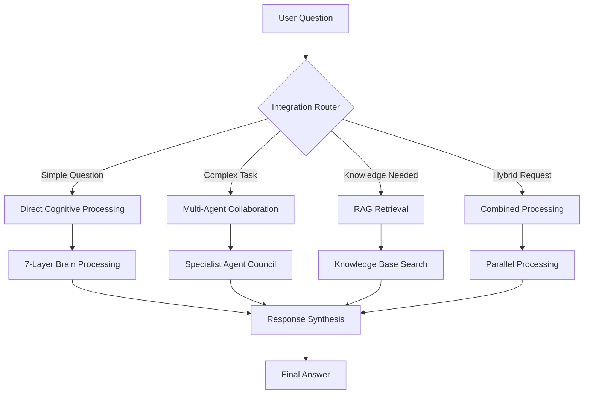

# 🏗️ Cognitive Agentic Intelligence (CAI) Platform - Build Guide

## 📋 Table of Contents

1. [Introduction](#introduction)
2. [Prerequisites](#prerequisites)
3. [Environment Setup](#environment-setup)
4. [Component Installation](#component-installation)
5. [System Integration](#system-integration)
6. [Configuration](#configuration)
7. [Testing](#testing)
8. [Deployment](#deployment)
9. [Troubleshooting](#troubleshooting)

## 🎯 Introduction

This guide will walk you through building the Cognitive Agentic Intelligence Platform from scratch. No prior programming experience is required - we'll explain everything step by step.

### What You'll Build

Think of this system like building a super-intelligent assistant that:
- **Thinks** like a human brain (7-layer cognitive processing)
- **Collaborates** like a team of experts (multi-agent system)
- **Knows** vast amounts of information (knowledge retrieval system)

## 🛠️ Prerequisites

### Hardware Requirements
- **Computer**: Mac, Windows, or Linux
- **RAM**: Minimum 8GB (16GB recommended)
- **Storage**: At least 10GB free space
- **Internet**: Stable connection for downloads

### Software Requirements
- **Operating System**: Any modern OS
- **Web Browser**: Chrome, Firefox, or Safari
- **Text Editor**: VS Code (recommended) or any code editor

### Knowledge Requirements
- **No programming experience needed**
- **Basic computer skills** (file management, copy/paste)
- **Willingness to learn** and follow instructions carefully

## 🌍 Environment Setup

### Step 1: Install Node.js

**What is Node.js?**
Node.js is like a translator that helps your computer understand JavaScript code.

**Installation:**
1. Go to [nodejs.org](https://nodejs.org)
2. Download the "LTS" version (Long Term Support)
3. Run the installer and follow the prompts
4. Restart your computer

**Verify Installation:**
1. Open Terminal (Mac/Linux) or Command Prompt (Windows)
2. Type: `node --version`
3. You should see a version number like `v18.17.0`

### Step 2: Install Python

**What is Python?**
Python is a programming language that's easy to read and powerful for AI applications.

**Installation:**
1. Go to [python.org](https://python.org)
2. Download Python 3.11 or newer
3. **Important**: Check "Add Python to PATH" during installation
4. Complete the installation

**Verify Installation:**
1. Open Terminal/Command Prompt
2. Type: `python --version`
3. You should see something like `Python 3.11.5`

### Step 3: Install Git

**What is Git?**
Git helps manage code versions and download projects from the internet.

**Installation:**
1. Go to [git-scm.com](https://git-scm.com)
2. Download for your operating system
3. Install with default settings

**Verify Installation:**
1. Open Terminal/Command Prompt
2. Type: `git --version`
3. You should see a version number

## 📦 Component Installation

### Phase 1: Download the Base Project

```bash
# Navigate to your desired folder
cd Desktop

# Clone the LLM Assembly project
git clone [your-repository-url]
cd "LLM Assembly"
```

### Phase 2: Install JavaScript Dependencies

**What are dependencies?**
Think of dependencies like ingredients for a recipe. Our AI system needs various "ingredients" (code libraries) to work.

```bash
# Install Node.js packages
npm install

# This downloads all required JavaScript libraries
# You'll see a progress bar and lots of text - this is normal!
```

### Phase 3: Install Python Dependencies

```bash
# Install Python packages
pip install -r requirements.txt

# This installs AI libraries like:
# - OpenAI for language models
# - LangChain for AI workflows
# - FAISS for vector storage
# - And many more!
```

### Phase 4: Set Up the AI Brain Package

**Understanding the AI Brain:**
The AI Brain mimics human thinking with 7 layers:
1. **Perception** - Understands input
2. **Attention** - Focuses on important parts
3. **Memory** - Remembers context
4. **Reasoning** - Thinks logically
5. **Emotion** - Understands feelings
6. **Decision** - Makes choices
7. **Action** - Produces responses

```bash
# Create the brain architecture folder
mkdir -p brain_package/layers

# Each layer will be a separate component
# We'll configure them in the next section
```

### Phase 5: Set Up the RAG System

**Understanding RAG (Retrieval-Augmented Generation):**
RAG is like giving the AI access to a vast library. When you ask a question, it:
1. **Searches** the library for relevant information
2. **Retrieves** the best matches
3. **Generates** an answer using that information

```bash
# Create RAG system folders
mkdir -p rag_system/vector_store
mkdir -p rag_system/embeddings
mkdir -p rag_system/retrieval
```

## 🔗 System Integration

### Understanding the Integration

Imagine three expert teams working together:
- **Team Brain** (Cognitive Processing): Deep thinkers who analyze everything carefully
- **Team Council** (Agent Assembly): Specialists who collaborate on complex tasks
- **Team Library** (RAG System): Researchers who find relevant information

Our integration layer coordinates all three teams.

### Integration Architecture



### Step 1: Create the Integration Layer

```bash
# Create integration folder
mkdir -p integration/

# This will contain:
# - Router logic (decides which system to use)
# - Synthesis engine (combines results)
# - Context manager (maintains conversation state)
```

### Step 2: Configure Communication Protocols

**What are protocols?**
Protocols are like rules for how different parts of the system talk to each other.

```bash
# Create configuration files
touch config/brain_config.json
touch config/agents_config.json
touch config/rag_config.json
touch config/integration_config.json
```

## ⚙️ Configuration

### Brain Configuration

**Purpose:** Set up how the 7-layer brain processes information.

**Key Settings:**
- **Processing Speed**: How fast each layer works
- **Memory Capacity**: How much the brain remembers
- **Emotional Sensitivity**: How much emotion affects responses
- **Decision Threshold**: When the brain is confident enough to decide

### Agent Configuration

**Purpose:** Define specialist agents and their roles.

**Agent Types:**
- **Knowledge Agent**: Finds and organizes information
- **Reasoning Agent**: Solves logical problems
- **Content Agent**: Creates written responses
- **Tool Agent**: Uses external tools and APIs
- **Decision Maker**: Coordinates all agents

### RAG Configuration

**Purpose:** Set up the knowledge retrieval system.

**Key Components:**
- **Vector Database**: Where knowledge is stored
- **Embedding Model**: Converts text to searchable format
- **Retrieval Strategy**: How to find relevant information
- **Ranking Algorithm**: How to order search results

### Integration Configuration

**Purpose:** Define how all systems work together.

**Processing Modes:**
- **Sequential**: One system at a time (slower but thorough)
- **Parallel**: Multiple systems simultaneously (faster)
- **Adaptive**: Automatically chooses the best approach

## 🧪 Testing

### Test Phase 1: Individual Components

**Brain Testing:**
```bash
# Test each brain layer
npm run test:brain:perception
npm run test:brain:attention
npm run test:brain:memory
# ... and so on for all 7 layers
```

**Agent Testing:**
```bash
# Test each specialist agent
npm run test:agents:knowledge
npm run test:agents:reasoning
npm run test:agents:content
npm run test:agents:tools
```

**RAG Testing:**
```bash
# Test knowledge retrieval
npm run test:rag:embedding
npm run test:rag:retrieval
npm run test:rag:ranking
```

### Test Phase 2: Integration Testing

**Simple Integration:**
```bash
# Test basic question-answer flow
npm run test:integration:simple
```

**Complex Integration:**
```bash
# Test multi-step reasoning
npm run test:integration:complex
```

**Full System Test:**
```bash
# Test everything working together
npm run test:integration:full
```

### Test Scenarios

1. **Simple Question**: "What is the capital of France?"
   - Expected: Direct answer from knowledge base
   - Tests: RAG retrieval + basic response

2. **Complex Reasoning**: "Plan a 7-day trip to Japan for a family of 4"
   - Expected: Detailed itinerary with reasoning
   - Tests: Multi-agent collaboration + cognitive processing

3. **Emotional Context**: "I'm feeling overwhelmed with work"
   - Expected: Empathetic response with helpful suggestions
   - Tests: Emotional layer + therapeutic reasoning

## 🚀 Deployment

### Local Deployment

**Step 1: Start the System**
```bash
# Start all components
npm run start:all

# This starts:
# - Brain processing server
# - Agent coordination server
# - RAG retrieval server
# - Integration layer
# - Web interface
```

**Step 2: Access the Interface**
1. Open your web browser
2. Go to `http://localhost:3000`
3. You should see the CAI Platform interface

### Production Deployment

**For Advanced Users:**
- Docker containerization
- Cloud deployment (AWS, Google Cloud, Azure)
- Load balancing for high traffic
- Database optimization
- Security hardening

## 🔧 Troubleshooting

### Common Issues

**Issue 1: "Command not found"**
- **Cause**: Software not installed or not in PATH
- **Solution**: Reinstall the software and restart terminal

**Issue 2: "Permission denied"**
- **Cause**: Insufficient file permissions
- **Solution**: Use `sudo` on Mac/Linux or run as administrator on Windows

**Issue 3: "Module not found"**
- **Cause**: Dependencies not installed
- **Solution**: Run `npm install` and `pip install -r requirements.txt` again

**Issue 4: "Port already in use"**
- **Cause**: Another application using the same port
- **Solution**: Stop other applications or change port in config

### Getting Help

1. **Check the logs**: Look for error messages in the terminal
2. **Read error messages carefully**: They often tell you exactly what's wrong
3. **Search online**: Copy the error message and search for solutions
4. **Ask for help**: Provide the full error message when asking for assistance

### Performance Optimization

**If the system is slow:**
1. **Increase memory allocation**
2. **Use faster storage** (SSD instead of HDD)
3. **Close unnecessary applications**
4. **Optimize configuration settings**

## 🎉 Congratulations!

You've successfully built the Cognitive Agentic Intelligence Platform! You now have:

- ✅ A 7-layer AI brain that thinks like humans
- ✅ A team of specialist AI agents
- ✅ A powerful knowledge retrieval system
- ✅ An integrated platform that combines all three

### Next Steps

1. **Experiment**: Try different types of questions and tasks
2. **Customize**: Adjust settings to match your needs
3. **Expand**: Add new agents or brain layers
4. **Share**: Show others what you've built!

### Learning Resources

- [System Architecture Guide](./ARCHITECTURE.md)
- [Component Details](./COMPONENTS.md)
- [User Guide](./USER_GUIDE.md)
- [Advanced Configuration](./ADVANCED_CONFIG.md)

---

*Remember: Building AI systems is like learning to cook - start with the recipe (this guide), practice regularly, and don't be afraid to experiment!*