# 🧩 Cognitive Agentic Intelligence (CAI) Platform - Component Guide

## 📋 Table of Contents

1. [Component Overview](#component-overview)
2. [Cognitive Brain Components](#cognitive-brain-components)
3. [Multi-Agent System Components](#multi-agent-system-components)
4. [RAG System Components](#rag-system-components)
5. [Integration Layer Components](#integration-layer-components)
6. [Supporting Infrastructure](#supporting-infrastructure)
7. [Component Interactions](#component-interactions)

## 🎯 Component Overview

The CAI Platform consists of three main subsystems, each with specialized components:


## 🧠 Cognitive Brain Components

### Layer 1: Perception Layer

**Purpose**: Initial processing and understanding of input data.

```mermaid
flowchart LR
    subgraph "Perception Layer Components"
        A[📥 Input Receiver] --> B[🔍 Format Detector]
        B --> C[📝 Text Processor]
        B --> D[🖼️ Image Processor]
        B --> E[🎵 Audio Processor]
        B --> F[📊 Data Processor]
        
        C --> G[🧹 Text Cleaner]
        D --> H[🔍 Image Analyzer]
        E --> I[🎧 Audio Transcriber]
        F --> J[📈 Data Validator]
        
        G --> K[📤 Structured Output]
        H --> K
        I --> K
        J --> K
    end
    
    style A fill:#ffcdd2
    style K fill:#c8e6c9
```

**Key Functions**:
- **Input Reception**: Accepts various input formats (text, images, audio, structured data)
- **Format Detection**: Automatically identifies input type and structure
- **Preprocessing**: Cleans and normalizes input data
- **Feature Extraction**: Identifies key characteristics and metadata
- **Validation**: Ensures input integrity and completeness

**Implementation Details**:
```typescript
class PerceptionLayer {
  private inputProcessor: InputProcessor;
  private formatDetector: FormatDetector;
  private multiModalProcessor: MultiModalProcessor;
  
  async process(input: any): Promise<PerceptionResult> {
    // Detect input format
    const format = await this.formatDetector.detect(input);
    
    // Process based on format
    const processed = await this.multiModalProcessor.process(input, format);
    
    // Extract features and metadata
    const features = await this.extractFeatures(processed);
    
    return {
      originalInput: input,
      processedInput: processed,
      format: format,
      features: features,
      metadata: this.extractMetadata(input)
    };
  }
}
```

### Layer 2: Attention Layer

**Purpose**: Focus on relevant information and filter out noise.

```mermaid
flowchart TD
    subgraph "Attention Mechanisms"
        A[📊 Relevance Scorer] --> B[🎯 Focus Selector]
        B --> C[📋 Priority Ranker]
        C --> D[🔍 Detail Extractor]
        D --> E[📤 Focused Output]
    end
    
    subgraph "Attention Types"
        F[🔍 Selective Attention]
        G[🌊 Sustained Attention]
        H[🔄 Divided Attention]
        I[⚡ Executive Attention]
    end
    
    A --> F
    B --> G
    C --> H
    D --> I
    
    style A fill:#f8bbd9
    style E fill:#c8e6c9
```

**Key Functions**:
- **Relevance Assessment**: Determines importance of different input elements
- **Focus Management**: Directs processing resources to critical information
- **Noise Filtering**: Removes irrelevant or distracting elements
- **Context Weighting**: Adjusts attention based on current context
- **Multi-modal Attention**: Coordinates attention across different input types

### Layer 3: Memory Layer

**Purpose**: Store, retrieve, and manage information across different time scales.

```mermaid
flowchart LR
    subgraph "Memory Systems"
        A[⚡ Short-term Memory] --> B[🔄 Working Memory]
        B --> C[💾 Long-term Memory]
        C --> D[❤️ Emotional Memory]
        
        subgraph "Memory Operations"
            E[💾 Store]
            F[📤 Retrieve]
            G[🔄 Update]
            H[🔗 Associate]
            I[🗑️ Forget]
        end
        
        A <--> E
        B <--> F
        C <--> G
        D <--> H
        
        subgraph "Memory Types"
            J[📚 Semantic Memory]
            K[📖 Episodic Memory]
            L[🎯 Procedural Memory]
            M[🏃 Motor Memory]
        end
        
        C --> J
        C --> K
        C --> L
        C --> M
    end
    
    style A fill:#e1bee7
    style C fill:#c8e6c9
```

**Key Functions**:
- **Information Storage**: Maintains different types of memory
- **Retrieval Mechanisms**: Accesses stored information efficiently
- **Memory Consolidation**: Transfers important information to long-term storage
- **Association Building**: Creates connections between related memories
- **Forgetting Mechanisms**: Removes outdated or irrelevant information

### Layer 4: Reasoning Layer

**Purpose**: Logical processing, problem-solving, and inference generation.

```mermaid
flowchart TD
    subgraph "Reasoning Types"
        A[🔍 Deductive Reasoning] --> B[💡 Inductive Reasoning]
        B --> C[🔄 Abductive Reasoning]
        C --> D[🧮 Analogical Reasoning]
        D --> E[🎯 Causal Reasoning]
    end
    
    subgraph "Reasoning Processes"
        F[📊 Pattern Recognition]
        G[🔗 Logical Inference]
        H[💭 Hypothesis Generation]
        I[✅ Validation]
        J[🎯 Conclusion Formation]
    end
    
    A --> F
    B --> G
    C --> H
    D --> I
    E --> J
    
    subgraph "Problem Solving"
        K[🎯 Problem Definition]
        L[🔍 Solution Search]
        M[⚖️ Option Evaluation]
        N[✅ Solution Selection]
    end
    
    F --> K
    G --> L
    H --> M
    I --> N
    
    style A fill:#c5cae9
    style J fill:#c8e6c9
```

**Key Functions**:
- **Logical Processing**: Applies formal logic rules and principles
- **Pattern Recognition**: Identifies recurring structures and relationships
- **Inference Generation**: Derives new knowledge from existing information
- **Problem Decomposition**: Breaks complex problems into manageable parts
- **Solution Synthesis**: Combines partial solutions into complete answers

### Layer 5: Emotion Layer

**Purpose**: Emotional understanding, empathy, and affective processing.

```mermaid
flowchart LR
    subgraph "Emotion Processing"
        A[😊 Emotion Detection] --> B[📊 Sentiment Analysis]
        B --> C[❤️ Empathy Modeling]
        C --> D[🎭 Emotional Context]
        D --> E[🎯 Emotional Response]
    end
    
    subgraph "Emotion Types"
        F[😊 Joy]
        G[😢 Sadness]
        H[😠 Anger]
        I[😨 Fear]
        J[😮 Surprise]
        K[🤢 Disgust]
    end
    
    subgraph "Emotional Intelligence"
        L[🧠 Self-Awareness]
        M[⚖️ Self-Regulation]
        N[💪 Motivation]
        O[❤️ Empathy]
        P[🤝 Social Skills]
    end
    
    A --> F
    A --> G
    A --> H
    A --> I
    A --> J
    A --> K
    
    C --> L
    C --> M
    C --> N
    C --> O
    C --> P
    
    style A fill:#bbdefb
    style E fill:#c8e6c9
```

**Key Functions**:
- **Emotion Recognition**: Identifies emotional content in input
- **Sentiment Analysis**: Determines overall emotional tone
- **Empathy Generation**: Creates appropriate emotional responses
- **Emotional Memory**: Stores and recalls emotional associations
- **Therapeutic Processing**: Provides supportive and healing responses

### Layer 6: Decision Layer

**Purpose**: Evaluate options and make informed decisions.

```mermaid
flowchart TD
    subgraph "Decision Process"
        A[📋 Option Generation] --> B[📊 Criteria Definition]
        B --> C[⚖️ Option Evaluation]
        C --> D[🎯 Decision Making]
        D --> E[✅ Decision Validation]
    end
    
    subgraph "Decision Types"
        F[⚡ Quick Decisions]
        G[🤔 Deliberative Decisions]
        H[🎲 Probabilistic Decisions]
        I[🎯 Strategic Decisions]
    end
    
    subgraph "Evaluation Criteria"
        J[🎯 Goal Alignment]
        K[⚖️ Risk Assessment]
        L[💰 Cost-Benefit]
        M[⏰ Time Constraints]
        N[🔍 Information Quality]
    end
    
    A --> F
    B --> G
    C --> H
    D --> I
    
    C --> J
    C --> K
    C --> L
    C --> M
    C --> N
    
    style A fill:#b2dfdb
    style E fill:#c8e6c9
```

**Key Functions**:
- **Option Generation**: Creates possible response alternatives
- **Multi-criteria Evaluation**: Assesses options against multiple factors
- **Risk Analysis**: Evaluates potential negative outcomes
- **Confidence Assessment**: Determines certainty level of decisions
- **Decision Explanation**: Provides reasoning for chosen options

### Layer 7: Action Layer

**Purpose**: Generate and execute responses based on decisions.

```mermaid
flowchart LR
    subgraph "Action Generation"
        A[📝 Response Planning] --> B[🎨 Content Creation]
        B --> C[📊 Format Selection]
        C --> D[✅ Quality Check]
        D --> E[📤 Response Delivery]
    end
    
    subgraph "Response Types"
        F[📝 Text Response]
        G[🖼️ Visual Response]
        H[🎵 Audio Response]
        I[📊 Data Response]
        J[🔧 Action Response]
    end
    
    subgraph "Quality Assurance"
        K[✅ Accuracy Check]
        L[🎯 Relevance Check]
        M[😊 Tone Check]
        N[📏 Completeness Check]
    end
    
    B --> F
    B --> G
    B --> H
    B --> I
    B --> J
    
    D --> K
    D --> L
    D --> M
    D --> N
    
    style A fill:#c8e6c9
    style E fill:#4caf50
```

**Key Functions**:
- **Response Generation**: Creates appropriate output based on decisions
- **Format Optimization**: Selects best presentation format
- **Quality Assurance**: Validates response quality and accuracy
- **Delivery Management**: Ensures proper response transmission
- **Feedback Integration**: Incorporates user feedback for improvement

## 👥 Multi-Agent System Components

### Decision Maker Agent

**Purpose**: Central coordinator that orchestrates all specialist agents.

```mermaid
flowchart TD
    subgraph "Decision Maker Core"
        A[📋 Task Analysis] --> B[👥 Agent Selection]
        B --> C[🎭 Coordination Strategy]
        C --> D[📊 Progress Monitoring]
        D --> E[🔄 Result Synthesis]
    end
    
    subgraph "Coordination Modes"
        F[📋 Sequential]
        G[⚡ Parallel]
        H[🏗️ Hierarchical]
        I[🤝 Consensus]
    end
    
    subgraph "Management Functions"
        J[📋 Task Delegation]
        K[⏰ Timeline Management]
        L[🔍 Quality Control]
        M[🚨 Conflict Resolution]
    end
    
    C --> F
    C --> G
    C --> H
    C --> I
    
    B --> J
    D --> K
    E --> L
    D --> M
    
    style A fill:#ff5722
    style E fill:#4caf50
```

**Key Responsibilities**:
- **Task Decomposition**: Breaks complex tasks into manageable subtasks
- **Agent Orchestration**: Coordinates multiple specialist agents
- **Resource Management**: Allocates computational resources efficiently
- **Quality Assurance**: Ensures output meets quality standards
- **Conflict Resolution**: Handles disagreements between agents

### Knowledge Agent

**Purpose**: Specializes in information retrieval and knowledge management.

```mermaid
flowchart LR
    subgraph "Knowledge Operations"
        A[🔍 Information Search] --> B[📊 Relevance Ranking]
        B --> C[📝 Knowledge Synthesis]
        C --> D[✅ Fact Verification]
        D --> E[📤 Knowledge Delivery]
    end
    
    subgraph "Knowledge Sources"
        F[📚 Internal Knowledge Base]
        G[🌐 External APIs]
        H[📄 Document Repositories]
        I[🗄️ Vector Databases]
    end
    
    subgraph "Processing Capabilities"
        J[🧠 Semantic Understanding]
        K[🔗 Relationship Mapping]
        L[📊 Information Filtering]
        M[🎯 Context Adaptation]
    end
    
    A --> F
    A --> G
    A --> H
    A --> I
    
    C --> J
    C --> K
    C --> L
    C --> M
    
    style A fill:#2196f3
    style E fill:#4caf50
```

**Key Capabilities**:
- **Multi-source Retrieval**: Accesses various knowledge repositories
- **Semantic Search**: Understands meaning beyond keyword matching
- **Knowledge Synthesis**: Combines information from multiple sources
- **Fact Checking**: Verifies accuracy of retrieved information
- **Context Awareness**: Adapts knowledge to current conversation context

### Reasoning Agent

**Purpose**: Handles logical processing, problem-solving, and analytical tasks.

```mermaid
flowchart TD
    subgraph "Reasoning Capabilities"
        A[🧮 Logical Analysis] --> B[🔍 Pattern Recognition]
        B --> C[💡 Hypothesis Generation]
        C --> D[✅ Validation]
        D --> E[🎯 Conclusion Formation]
    end
    
    subgraph "Problem Solving"
        F[🎯 Problem Definition]
        G[🔍 Solution Search]
        H[⚖️ Option Evaluation]
        I[✅ Solution Selection]
    end
    
    subgraph "Analytical Tools"
        J[📊 Statistical Analysis]
        K[🧮 Mathematical Modeling]
        L[🔄 Simulation]
        M[📈 Trend Analysis]
    end
    
    A --> F
    B --> G
    C --> H
    D --> I
    
    E --> J
    E --> K
    E --> L
    E --> M
    
    style A fill:#9c27b0
    style E fill:#4caf50
```

**Key Capabilities**:
- **Logical Reasoning**: Applies formal logic and inference rules
- **Mathematical Processing**: Handles quantitative analysis and calculations
- **Problem Decomposition**: Breaks complex problems into solvable parts
- **Strategy Development**: Creates systematic approaches to challenges
- **Validation**: Verifies logical consistency and correctness

### Content Agent

**Purpose**: Specializes in content creation, writing, and communication.

```mermaid
flowchart LR
    subgraph "Content Creation"
        A[📝 Writing] --> B[🎨 Styling]
        B --> C[📊 Formatting]
        C --> D[✅ Review]
        D --> E[📤 Publication]
    end
    
    subgraph "Content Types"
        F[📄 Articles]
        G[📧 Emails]
        H[📊 Reports]
        I[🎨 Creative Writing]
        J[📚 Documentation]
    end
    
    subgraph "Communication Skills"
        K[🎯 Audience Adaptation]
        L[😊 Tone Management]
        M[🔍 Clarity Optimization]
        N[🎨 Style Consistency]
    end
    
    A --> F
    A --> G
    A --> H
    A --> I
    A --> J
    
    B --> K
    B --> L
    B --> M
    B --> N
    
    style A fill:#4caf50
    style E fill:#2196f3
```

**Key Capabilities**:
- **Multi-format Writing**: Creates various types of content
- **Style Adaptation**: Adjusts writing style for different audiences
- **Tone Management**: Controls emotional tone and voice
- **Structure Optimization**: Organizes content for maximum clarity
- **Quality Enhancement**: Improves readability and engagement

### Tool Agent

**Purpose**: Manages external tools, APIs, and system integrations.

```mermaid
flowchart TD
    subgraph "Tool Management"
        A[🔧 Tool Discovery] --> B[🔌 Integration]
        B --> C[⚙️ Execution]
        C --> D[📊 Monitoring]
        D --> E[🔄 Result Processing]
    end
    
    subgraph "Tool Categories"
        F[🌐 Web APIs]
        G[💾 Database Tools]
        H[📊 Analytics Tools]
        I[🎨 Creative Tools]
        J[🔧 System Tools]
    end
    
    subgraph "Integration Features"
        K[🔐 Authentication]
        L[⚖️ Load Balancing]
        M[🚨 Error Handling]
        N[📈 Performance Optimization]
    end
    
    A --> F
    A --> G
    A --> H
    A --> I
    A --> J
    
    B --> K
    C --> L
    D --> M
    E --> N
    
    style A fill:#ff9800
    style E fill:#4caf50
```

**Key Capabilities**:
- **API Integration**: Connects with external services and tools
- **Tool Orchestration**: Coordinates multiple tool executions
- **Error Handling**: Manages failures and provides fallbacks
- **Performance Optimization**: Ensures efficient tool usage
- **Security Management**: Handles authentication and authorization

## 📚 RAG System Components

### Vector Database

**Purpose**: Stores and retrieves high-dimensional vector representations of knowledge.

```mermaid
flowchart LR
    subgraph "Vector Storage"
        A[📊 Vector Indexing] --> B[🔍 Similarity Search]
        B --> C[📋 Result Ranking]
        C --> D[📤 Vector Retrieval]
    end
    
    subgraph "Database Types"
        E[⚡ FAISS - Fast Search]
        F[☁️ Pinecone - Cloud]
        G[🔧 Qdrant - Production]
        H[💾 Milvus - Scalable]
    end
    
    subgraph "Operations"
        I[💾 Insert]
        J[🔍 Search]
        K[🔄 Update]
        L[🗑️ Delete]
        M[📊 Optimize]
    end
    
    A --> E
    A --> F
    A --> G
    A --> H
    
    B --> I
    B --> J
    B --> K
    B --> L
    B --> M
    
    style A fill:#fff3e0
    style D fill:#4caf50
```

**Key Features**:
- **High-Performance Search**: Efficient similarity search in high dimensions
- **Scalable Storage**: Handles millions of vectors efficiently
- **Multiple Backends**: Supports various vector database technologies
- **Real-time Updates**: Dynamic addition and modification of vectors
- **Metadata Filtering**: Combines vector search with metadata constraints

### Embedding Engine

**Purpose**: Converts text and other data into vector representations.

```mermaid
flowchart TD
    subgraph "Embedding Process"
        A[📝 Text Input] --> B[🧹 Preprocessing]
        B --> C[🧠 Model Processing]
        C --> D[📊 Vector Generation]
        D --> E[✅ Normalization]
    end
    
    subgraph "Model Types"
        F[🤖 OpenAI - ada-002]
        G[🤗 HuggingFace - Transformers]
        H[🔧 Custom - Domain Specific]
        I[🌐 Multilingual - Universal]
    end
    
    subgraph "Optimization"
        J[📦 Batch Processing]
        K[⚡ Caching]
        L[🔄 Async Processing]
        M[📈 Performance Monitoring]
    end
    
    C --> F
    C --> G
    C --> H
    C --> I
    
    D --> J
    D --> K
    D --> L
    D --> M
    
    style A fill:#f3e5f5
    style E fill:#4caf50
```

**Key Capabilities**:
- **Multi-Model Support**: Various embedding models for different use cases
- **Batch Processing**: Efficient processing of multiple texts
- **Caching**: Stores frequently used embeddings
- **Quality Optimization**: Ensures high-quality vector representations
- **Performance Monitoring**: Tracks embedding generation metrics

### Retrieval Manager

**Purpose**: Orchestrates the retrieval process and ranks results.

```mermaid
flowchart LR
    subgraph "Retrieval Pipeline"
        A[🔍 Query Processing] --> B[📊 Vector Search]
        B --> C[📋 Candidate Retrieval]
        C --> D[⚖️ Ranking]
        D --> E[📤 Result Delivery]
    end
    
    subgraph "Ranking Strategies"
        F[📊 Similarity Score]
        G[📈 Relevance Ranking]
        H[🕒 Recency Weighting]
        I[🎯 Context Matching]
    end
    
    subgraph "Optimization"
        J[🔍 Query Expansion]
        K[📊 Result Filtering]
        L[🔄 Re-ranking]
        M[📈 Performance Tuning]
    end
    
    D --> F
    D --> G
    D --> H
    D --> I
    
    A --> J
    C --> K
    D --> L
    E --> M
    
    style A fill:#e8f5e8
    style E fill:#4caf50
```

**Key Functions**:
- **Query Optimization**: Enhances queries for better retrieval
- **Multi-stage Ranking**: Applies multiple ranking criteria
- **Result Filtering**: Removes irrelevant or low-quality results
- **Context Integration**: Considers conversation context in ranking
- **Performance Optimization**: Ensures fast and accurate retrieval

## 🔗 Integration Layer Components

### Intelligent Router

**Purpose**: Analyzes requests and routes them to appropriate processing systems.

```mermaid
flowchart TD
    subgraph "Routing Logic"
        A[📥 Request Analysis] --> B{🔍 Complexity?}
        B -->|Simple| C[🧠 Cognitive Route]
        B -->|Complex| D[👥 Agent Route]
        B -->|Knowledge| E[📚 RAG Route]
        B -->|Hybrid| F[🔄 Combined Route]
    end
    
    subgraph "Analysis Factors"
        G[📊 Task Complexity]
        H[🎭 Context Type]
        I[⚡ Urgency Level]
        J[🎯 Resource Requirements]
    end
    
    subgraph "Routing Strategies"
        K[📋 Sequential Processing]
        L[⚡ Parallel Processing]
        M[🔄 Adaptive Processing]
        N[🎯 Optimized Processing]
    end
    
    A --> G
    A --> H
    A --> I
    A --> J
    
    C --> K
    D --> L
    E --> M
    F --> N
    
    style A fill:#ffeb3b
    style F fill:#4caf50
```

**Key Features**:
- **Intelligent Analysis**: Understands request characteristics
- **Dynamic Routing**: Selects optimal processing path
- **Load Balancing**: Distributes requests efficiently
- **Performance Optimization**: Minimizes response time
- **Adaptive Learning**: Improves routing decisions over time

### Response Synthesizer

**Purpose**: Combines outputs from multiple systems into coherent responses.

```mermaid
flowchart LR
    subgraph "Synthesis Process"
        A[📥 Multiple Inputs] --> B[🔍 Content Analysis]
        B --> C[🔄 Integration Strategy]
        C --> D[📝 Response Generation]
        D --> E[✅ Quality Check]
    end
    
    subgraph "Integration Methods"
        F[🔗 Concatenation]
        G[⚖️ Weighted Combination]
        H[🎯 Selective Integration]
        I[🧠 Intelligent Fusion]
    end
    
    subgraph "Quality Assurance"
        J[✅ Consistency Check]
        K[📊 Completeness Validation]
        L[🎯 Relevance Assessment]
        M[😊 Tone Harmonization]
    end
    
    C --> F
    C --> G
    C --> H
    C --> I
    
    E --> J
    E --> K
    E --> L
    E --> M
    
    style A fill:#4caf50
    style E fill:#2196f3
```

**Key Capabilities**:
- **Multi-source Integration**: Combines diverse input types
- **Intelligent Fusion**: Creates coherent unified responses
- **Quality Assurance**: Ensures output consistency and quality
- **Adaptive Synthesis**: Adjusts integration based on content type
- **Performance Optimization**: Efficient synthesis processing

## 🔄 Component Interactions

### Cross-System Communication


### Memory Synchronization

```mermaid
flowchart TD
    subgraph "Memory Sync Process"
        A[🔄 Memory Update Trigger] --> B{📊 Update Type?}
        B -->|Cognitive| C[🧠 Brain Memory]
        B -->|Agent| D[👥 Agent Memory]
        B -->|Knowledge| E[📚 RAG Memory]
        
        C --> F[🔄 Cross-System Sync]
        D --> F
        E --> F
        
        F --> G[⚖️ Conflict Resolution]
        G --> H[✅ Consistency Check]
        H --> I[💾 Persistent Storage]
    end
    
    subgraph "Sync Strategies"
        J[⚡ Real-time Sync]
        K[📦 Batch Sync]
        L[🎯 Selective Sync]
        M[🔄 Eventual Consistency]
    end
    
    F --> J
    F --> K
    F --> L
    F --> M
    
    style A fill:#ff9800
    style I fill:#4caf50
```

This comprehensive component guide provides detailed understanding of each system element, enabling effective implementation and maintenance of the Cognitive Agentic Intelligence Platform.