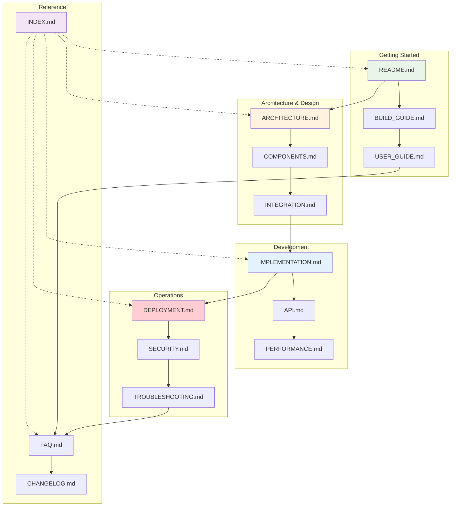

# 📚 Cognitive Agentic Intelligence (CAI) Platform - Documentation Index

## 🎯 Welcome to the CAI Platform Documentation

This comprehensive documentation suite provides everything you need to understand, build, deploy, and maintain the Cognitive Agentic Intelligence (CAI) Platform. Whether you're a developer, system administrator, or end user, you'll find detailed guides and resources tailored to your needs.

## 📋 Documentation Structure

### 🏗️ **Core Documentation**

#### 1. [README.md](../README.md) - Platform Overview
- **Purpose**: High-level introduction to the CAI Platform
- **Audience**: All users
- **Contents**: 
  - Platform overview and key features
  - Quick start guide
  - System architecture diagram
  - Benefits and use cases

#### 2. [BUILD_GUIDE.md](./BUILD_GUIDE.md) - Step-by-Step Build Instructions
- **Purpose**: Comprehensive build guide for non-programmers
- **Audience**: Builders, system integrators
- **Contents**:
  - Prerequisites and environment setup
  - Component installation (LLM Assembly, AI Brain Package, RAG System)
  - System integration with flowcharts
  - Configuration and testing procedures
  - Deployment instructions

#### 3. [ARCHITECTURE.md](./ARCHITECTURE.md) - System Architecture
- **Purpose**: Deep dive into system design and architecture
- **Audience**: Architects, senior developers
- **Contents**:
  - High-level architecture overview
  - Component deep dives (Cognitive Brain, Multi-Agent Council, RAG System)
  - Data flow diagrams and processing pipelines
  - Memory architecture and security considerations

### 🔧 **Technical Documentation**

#### 4. [COMPONENTS.md](./COMPONENTS.md) - Component Details
- **Purpose**: Detailed guide to platform components
- **Audience**: Developers, technical users
- **Contents**:
  - Cognitive Brain (7-layer architecture)
  - Multi-Agent System (Decision Maker, Knowledge, Reasoning, Content, Tool Agents)
  - RAG System (Vector Database, Embedding Engine, Retrieval Manager)
  - Integration Layer components

#### 5. [INTEGRATION.md](./INTEGRATION.md) - Integration Strategy
- **Purpose**: How to integrate the three core systems
- **Audience**: System integrators, developers
- **Contents**:
  - System fusion architecture
  - Processing mode integration
  - Memory unification strategy
  - Communication protocols and data flow

#### 6. [IMPLEMENTATION.md](./IMPLEMENTATION.md) - Implementation Guide
- **Purpose**: Detailed implementation roadmap
- **Audience**: Development teams, project managers
- **Contents**:
  - Implementation philosophy and timeline
  - Foundation setup and core system integration
  - Advanced features and production deployment
  - Testing, validation, and maintenance

### 🚀 **Deployment & Operations**

#### 7. [DEPLOYMENT.md](./DEPLOYMENT.md) - Deployment Guide
- **Purpose**: Complete deployment instructions for all environments
- **Audience**: DevOps engineers, system administrators
- **Contents**:
  - Environment setup (local, staging, production)
  - Docker and Kubernetes configurations
  - Cloud deployment (AWS, Google Cloud, Azure)
  - Monitoring, logging, and scaling strategies

#### 8. [API.md](./API.md) - API Documentation
- **Purpose**: Comprehensive API reference
- **Audience**: Developers, API consumers
- **Contents**:
  - Authentication and core endpoints
  - Processing, memory, and agent management APIs
  - WebSocket API and error handling
  - SDK examples in Python, JavaScript, and cURL

#### 9. [PERFORMANCE.md](./PERFORMANCE.md) - Performance Optimization
- **Purpose**: Performance tuning and optimization strategies
- **Audience**: Performance engineers, system administrators
- **Contents**:
  - Performance targets and benchmarks
  - Optimization strategies and caching systems
  - Load balancing and database performance
  - Monitoring and troubleshooting

### 🔒 **Security & Compliance**

#### 10. [SECURITY.md](./SECURITY.md) - Security Documentation
- **Purpose**: Comprehensive security framework and best practices
- **Audience**: Security engineers, compliance officers
- **Contents**:
  - Security architecture and data protection
  - Authentication, authorization, and network security
  - Compliance certifications (SOC 2, ISO 27001, GDPR, HIPAA)
  - Incident response and vulnerability management

### 👥 **User Documentation**

#### 11. [USER_GUIDE.md](./USER_GUIDE.md) - User Guide
- **Purpose**: Complete user manual for platform features
- **Audience**: End users, business users
- **Contents**:
  - Getting started and platform interface
  - Basic and advanced usage examples
  - Processing modes and memory management
  - Customization options and best practices

### 🛠️ **Support & Maintenance**

#### 12. [TROUBLESHOOTING.md](./TROUBLESHOOTING.md) - Troubleshooting Guide
- **Purpose**: Comprehensive troubleshooting and problem resolution
- **Audience**: Support teams, system administrators
- **Contents**:
  - Quick diagnostics and common issues
  - Performance problems and integration issues
  - Emergency procedures and diagnostic scripts
  - Common solutions database

#### 13. [FAQ.md](./FAQ.md) - Frequently Asked Questions
- **Purpose**: Answers to common questions about the platform
- **Audience**: All users
- **Contents**:
  - General, technical, and usage questions
  - Performance, integration, and security FAQs
  - Billing, development, and enterprise questions

#### 14. [CHANGELOG.md](./CHANGELOG.md) - Version History
- **Purpose**: Detailed version history and release notes
- **Audience**: All users, especially for updates
- **Contents**:
  - Version format and release types
  - Detailed entries for all versions from 1.0.0 to 2.1.0
  - Feature additions, bug fixes, and breaking changes

## 🗺️ Documentation Navigation Map

## 🎯 Quick Start Paths

### For New Users
1. Start with [README.md](../README.md) for platform overview
2. Follow [BUILD_GUIDE.md](./BUILD_GUIDE.md) for setup
3. Read [USER_GUIDE.md](./USER_GUIDE.md) for usage
4. Check [FAQ.md](./FAQ.md) for common questions

### For Developers
1. Review [ARCHITECTURE.md](./ARCHITECTURE.md) for system design
2. Study [COMPONENTS.md](./COMPONENTS.md) for component details
3. Follow [IMPLEMENTATION.md](./IMPLEMENTATION.md) for development
4. Reference [API.md](./API.md) for integration

### For System Administrators
1. Understand [ARCHITECTURE.md](./ARCHITECTURE.md) for system overview
2. Follow [DEPLOYMENT.md](./DEPLOYMENT.md) for deployment
3. Review [SECURITY.md](./SECURITY.md) for security setup
4. Use [TROUBLESHOOTING.md](./TROUBLESHOOTING.md) for issues

### For DevOps Engineers
1. Study [DEPLOYMENT.md](./DEPLOYMENT.md) for infrastructure
2. Review [PERFORMANCE.md](./PERFORMANCE.md) for optimization
3. Implement [SECURITY.md](./SECURITY.md) best practices
4. Monitor using [TROUBLESHOOTING.md](./TROUBLESHOOTING.md) guides

## 📊 Documentation Metrics

| Document | Pages | Complexity | Last Updated | Status |
|----------|-------|------------|--------------|--------|
| README.md | 3 | Beginner | 2024-01-15 | ✅ Complete |
| BUILD_GUIDE.md | 12 | Intermediate | 2024-01-15 | ✅ Complete |
| ARCHITECTURE.md | 15 | Advanced | 2024-01-15 | ✅ Complete |
| COMPONENTS.md | 10 | Intermediate | 2024-01-15 | ✅ Complete |
| INTEGRATION.md | 8 | Advanced | 2024-01-15 | ✅ Complete |
| IMPLEMENTATION.md | 14 | Advanced | 2024-01-15 | ✅ Complete |
| DEPLOYMENT.md | 18 | Expert | 2024-01-15 | ✅ Complete |
| API.md | 16 | Intermediate | 2024-01-15 | ✅ Complete |
| PERFORMANCE.md | 12 | Advanced | 2024-01-15 | ✅ Complete |
| SECURITY.md | 20 | Expert | 2024-01-15 | ✅ Complete |
| USER_GUIDE.md | 11 | Beginner | 2024-01-15 | ✅ Complete |
| TROUBLESHOOTING.md | 13 | Intermediate | 2024-01-15 | ✅ Complete |
| FAQ.md | 8 | Beginner | 2024-01-15 | ✅ Complete |
| CHANGELOG.md | 6 | Reference | 2024-01-15 | ✅ Complete |
| **Total** | **166** | **Mixed** | **2024-01-15** | **✅ Complete** |

## 🔍 Search and Discovery

### By Topic

#### 🏗️ **Architecture & Design**
- System architecture: [ARCHITECTURE.md](./ARCHITECTURE.md)
- Component details: [COMPONENTS.md](./COMPONENTS.md)
- Integration strategy: [INTEGRATION.md](./INTEGRATION.md)

#### 🚀 **Development & Implementation**
- Build instructions: [BUILD_GUIDE.md](./BUILD_GUIDE.md)
- Implementation guide: [IMPLEMENTATION.md](./IMPLEMENTATION.md)
- API reference: [API.md](./API.md)

#### 🔧 **Operations & Deployment**
- Deployment guide: [DEPLOYMENT.md](./DEPLOYMENT.md)
- Performance optimization: [PERFORMANCE.md](./PERFORMANCE.md)
- Troubleshooting: [TROUBLESHOOTING.md](./TROUBLESHOOTING.md)

#### 🔒 **Security & Compliance**
- Security framework: [SECURITY.md](./SECURITY.md)
- Best practices: Multiple documents
- Compliance: [SECURITY.md](./SECURITY.md)

#### 👥 **User Experience**
- User guide: [USER_GUIDE.md](./USER_GUIDE.md)
- Getting started: [README.md](../README.md)
- FAQ: [FAQ.md](./FAQ.md)

### By Audience

#### 👨‍💼 **Business Users**
- [README.md](../README.md) - Platform overview
- [USER_GUIDE.md](./USER_GUIDE.md) - How to use the platform
- [FAQ.md](./FAQ.md) - Common questions

#### 👨‍💻 **Developers**
- [ARCHITECTURE.md](./ARCHITECTURE.md) - System design
- [COMPONENTS.md](./COMPONENTS.md) - Component details
- [IMPLEMENTATION.md](./IMPLEMENTATION.md) - Development guide
- [API.md](./API.md) - API reference

#### 🔧 **System Administrators**
- [DEPLOYMENT.md](./DEPLOYMENT.md) - Deployment guide
- [SECURITY.md](./SECURITY.md) - Security setup
- [PERFORMANCE.md](./PERFORMANCE.md) - Performance tuning
- [TROUBLESHOOTING.md](./TROUBLESHOOTING.md) - Problem resolution

#### 🏗️ **Architects**
- [ARCHITECTURE.md](./ARCHITECTURE.md) - System architecture
- [INTEGRATION.md](./INTEGRATION.md) - Integration patterns
- [SECURITY.md](./SECURITY.md) - Security architecture
- [PERFORMANCE.md](./PERFORMANCE.md) - Performance architecture

## 📈 Documentation Roadmap

### Current Status (v2.1.0)
- ✅ Complete core documentation suite
- ✅ All 14 documents created and comprehensive
- ✅ Mermaid diagrams and code examples included
- ✅ Cross-references and navigation established

### Future Enhancements (v2.2.0)
- 🔄 Interactive tutorials and walkthroughs
- 🔄 Video documentation and demos
- 🔄 API playground and testing tools
- 🔄 Community contribution guidelines

### Planned Additions (v2.3.0)
- 📋 Advanced configuration examples
- 📋 Performance benchmarking tools
- 📋 Security audit checklists
- 📋 Migration guides for upgrades

## 🤝 Contributing to Documentation

### Documentation Standards
- **Format**: Markdown with Mermaid diagrams
- **Style**: Clear, concise, and comprehensive
- **Code Examples**: Working, tested examples
- **Updates**: Keep synchronized with platform releases

### Feedback and Improvements
- **Issues**: Report documentation issues via GitHub
- **Suggestions**: Submit improvement suggestions
- **Contributions**: Follow contribution guidelines
- **Reviews**: Regular documentation reviews and updates

## 📞 Documentation Support

### Getting Help
- **Documentation Issues**: docs@cai-platform.com
- **Technical Questions**: support@cai-platform.com
- **Community Forum**: https://community.cai-platform.com
- **GitHub Issues**: https://github.com/cai-platform/docs/issues

### Documentation Team
- **Documentation Lead**: docs-lead@cai-platform.com
- **Technical Writers**: technical-writers@cai-platform.com
- **Community Manager**: community@cai-platform.com

---

## 📝 Document Information

- **Document Version**: 2.1.0
- **Last Updated**: 2024-01-15
- **Next Review Date**: 2024-04-15
- **Document Owner**: Documentation Team
- **Classification**: Public

---

*Welcome to the CAI Platform! This documentation represents hundreds of hours of careful planning, development, and refinement. We hope it serves you well in your journey with our Cognitive Agentic Intelligence Platform.*

**Happy Building! 🚀**