# 🔗 Cognitive Agentic Intelligence (CAI) Platform - Integration Strategy

## 📋 Table of Contents

1. [Integration Overview](#integration-overview)
2. [System Fusion Architecture](#system-fusion-architecture)
3. [Processing Mode Integration](#processing-mode-integration)
4. [Memory Unification Strategy](#memory-unification-strategy)
5. [Communication Protocols](#communication-protocols)
6. [Data Flow Integration](#data-flow-integration)
7. [Performance Optimization](#performance-optimization)
8. [Error Handling & Resilience](#error-handling--resilience)

## 🎯 Integration Overview

The CAI Platform achieves unprecedented AI capabilities by seamlessly integrating three distinct but complementary systems:

- **🧠 AI Brain Package**: Deep, sequential cognitive processing
- **👥 LLM Assembly**: Collaborative, parallel agent processing
- **📚 RAG System**: Dynamic knowledge retrieval and integration

### Integration Philosophy


## 🏗️ System Fusion Architecture

### High-Level Integration Model

```mermaid
flowchart TB
    subgraph "User Interface Layer"
        UI[🖥️ Unified Interface]
        API[🔌 Unified API]
    end
    
    subgraph "Integration Orchestration Layer"
        Router[🎯 Intelligent Router]
        Orchestrator[🎭 Process Orchestrator]
        Synthesizer[🔄 Response Synthesizer]
        Monitor[📊 System Monitor]
    end
    
    subgraph "Processing Systems"
        subgraph "Cognitive System"
            Brain[🧠 7-Layer Brain]
            CogMem[💭 Cognitive Memory]
        end
        
        subgraph "Agent System"
            Council[👥 Agent Council]
            AgentMem[🤝 Shared Context]
        end
        
        subgraph "Knowledge System"
            RAG[📚 RAG Engine]
            KnowMem[🗄️ Knowledge Base]
        end
    end
    
    subgraph "Unified Memory Layer"
        MemoryHub[🧠 Memory Hub]
        ContextManager[📝 Context Manager]
        SyncEngine[🔄 Sync Engine]
    end
    
    UI --> Router
    API --> Router
    
    Router --> Orchestrator
    Orchestrator --> Brain
    Orchestrator --> Council
    Orchestrator --> RAG
    
    Brain --> Synthesizer
    Council --> Synthesizer
    RAG --> Synthesizer
    
    CogMem <--> MemoryHub
    AgentMem <--> MemoryHub
    KnowMem <--> MemoryHub
    
    MemoryHub --> ContextManager
    ContextManager --> SyncEngine
    
    Synthesizer --> Monitor
    Monitor --> UI
    
    style Router fill:#ff9999
    style Orchestrator fill:#99ccff
    style Synthesizer fill:#99ff99
    style MemoryHub fill:#ffcc99
```

### Integration Layers

#### 1. Orchestration Layer
**Purpose**: Coordinates all system interactions and manages processing workflows.


#### 2. Synthesis Layer
**Purpose**: Combines outputs from multiple systems into coherent responses.

```mermaid
flowchart TD
    subgraph "Synthesis Pipeline"
        A[📥 Multi-System Input] --> B[🔍 Content Analysis]
        B --> C[⚖️ Relevance Weighting]
        C --> D[🔄 Integration Strategy]
        D --> E[📝 Response Generation]
        E --> F[✅ Quality Assurance]
    end
    
    subgraph "Integration Strategies"
        G[🔗 Sequential Combination]
        H[⚡ Parallel Fusion]
        I[🎯 Selective Integration]
        J[🧠 Intelligent Synthesis]
    end
    
    subgraph "Quality Checks"
        K[✅ Consistency Validation]
        L[📊 Completeness Check]
        M[🎭 Tone Harmonization]
        N[🎯 Relevance Assessment]
    end
    
    D --> G
    D --> H
    D --> I
    D --> J
    
    F --> K
    F --> L
    F --> M
    F --> N
    
    style A fill:#2196f3
    style F fill:#4caf50
```

## 🔄 Processing Mode Integration

### Adaptive Processing Framework


### Processing Mode Details

#### Mode 1: Cognitive-Only Processing
**Use Case**: Simple questions, emotional support, basic reasoning

```mermaid
flowchart LR
    A[📥 Simple Request] --> B[🧠 7-Layer Brain]
    B --> C[👁️ Perception]
    C --> D[🎯 Attention]
    D --> E[💭 Memory]
    E --> F[🤔 Reasoning]
    F --> G[❤️ Emotion]
    G --> H[⚖️ Decision]
    H --> I[⚡ Action]
    I --> J[📤 Direct Response]
    
    style A fill:#e3f2fd
    style J fill:#c8e6c9
```

#### Mode 2: Hybrid Processing
**Use Case**: Knowledge-intensive tasks, moderate complexity

```mermaid
flowchart TD
    A[📥 Medium Request] --> B{🎯 Processing Router}
    
    B --> C[🧠 Cognitive Path]
    B --> D[📚 Knowledge Path]
    
    C --> E[🧠 Brain Processing]
    D --> F[📚 RAG Processing]
    
    E --> G[🔄 Result Synthesis]
    F --> G
    
    G --> H[📤 Hybrid Response]
    
    style A fill:#fff3e0
    style H fill:#c8e6c9
```

#### Mode 3: Full Collaboration
**Use Case**: Complex tasks, multi-step reasoning, comprehensive analysis

```mermaid
flowchart TB
    A[📥 Complex Request] --> B[🎭 Orchestrator]
    
    B --> C[🧠 Cognitive System]
    B --> D[👥 Agent System]
    B --> E[📚 Knowledge System]
    
    C --> F[🧠 Deep Analysis]
    D --> G[👥 Collaborative Processing]
    E --> H[📚 Knowledge Integration]
    
    F --> I[🔄 Comprehensive Synthesis]
    G --> I
    H --> I
    
    I --> J[📤 Complete Response]
    
    style A fill:#f3e5f5
    style J fill:#c8e6c9
```

## 🧠 Memory Unification Strategy

### Unified Memory Architecture

```mermaid
flowchart TB
    subgraph "Memory Systems"
        subgraph "Cognitive Memory"
            STM[⚡ Short-term Memory]
            LTM[💾 Long-term Memory]
            WM[🔄 Working Memory]
            EM[❤️ Emotional Memory]
        end
        
        subgraph "Agent Memory"
            SC[🤝 Shared Context]
            TM[📋 Task Memory]
            SM[🎯 Skill Memory]
            CH[👥 Collaboration History]
        end
        
        subgraph "Knowledge Memory"
            VS[🗄️ Vector Store]
            DC[📄 Document Cache]
            QH[🔍 Query History]
            CB[📝 Context Buffer]
        end
    end
    
    subgraph "Unified Memory Hub"
        MH[🧠 Memory Hub]
        CM[📝 Context Manager]
        SE[🔄 Sync Engine]
        CR[⚖️ Conflict Resolver]
    end
    
    STM <--> MH
    LTM <--> MH
    WM <--> MH
    EM <--> MH
    
    SC <--> MH
    TM <--> MH
    SM <--> MH
    CH <--> MH
    
    VS <--> MH
    DC <--> MH
    QH <--> MH
    CB <--> MH
    
    MH --> CM
    CM --> SE
    SE --> CR
    
    style MH fill:#ff9800
    style CM fill:#4caf50
```

### Memory Synchronization Protocol

```mermaid
sequenceDiagram
    participant C as 🧠 Cognitive
    participant A as 👥 Agents
    participant K as 📚 Knowledge
    participant H as 🧠 Memory Hub
    participant S as 🔄 Sync Engine
    
    Note over C,S: Memory Update Cycle
    
    C->>H: Update Cognitive Memory
    A->>H: Update Agent Context
    K->>H: Update Knowledge Cache
    
    H->>S: Trigger Synchronization
    S->>S: Detect Conflicts
    S->>S: Resolve Conflicts
    S->>S: Merge Updates
    
    S->>H: Synchronized State
    H->>C: Updated Cognitive Memory
    H->>A: Updated Agent Context
    H->>K: Updated Knowledge Cache
    
    Note over C,S: All systems now synchronized
```

### Context Propagation

```mermaid
flowchart LR
    subgraph "Context Flow"
        A[📥 New Context] --> B[📝 Context Parser]
        B --> C[🔍 Relevance Filter]
        C --> D[📊 Priority Scorer]
        D --> E[🎯 Target Selector]
        E --> F[📤 Context Distribution]
    end
    
    subgraph "Distribution Targets"
        G[🧠 Cognitive Layers]
        H[👥 Agent Council]
        I[📚 Knowledge Base]
        J[💾 Persistent Storage]
    end
    
    subgraph "Context Types"
        K[🎭 Conversational Context]
        L[📊 Task Context]
        M[🧠 Cognitive State]
        N[📚 Knowledge Context]
    end
    
    F --> G
    F --> H
    F --> I
    F --> J
    
    C --> K
    C --> L
    C --> M
    C --> N
    
    style A fill:#e3f2fd
    style F fill:#c8e6c9
```

## 📡 Communication Protocols

### Inter-System Communication

```mermaid
flowchart TD
    subgraph "Communication Layer"
        A[📨 Message Bus] --> B[🔄 Protocol Handler]
        B --> C[📊 Message Router]
        C --> D[✅ Delivery Confirmation]
    end
    
    subgraph "Message Types"
        E[📋 Task Messages]
        F[📊 Status Updates]
        G[📤 Result Messages]
        H[🚨 Error Messages]
        I[💾 Memory Sync]
    end
    
    subgraph "Communication Patterns"
        J[📞 Request-Response]
        K[📢 Publish-Subscribe]
        L[🔄 Event-Driven]
        M[📊 Stream Processing]
    end
    
    C --> E
    C --> F
    C --> G
    C --> H
    C --> I
    
    B --> J
    B --> K
    B --> L
    B --> M
    
    style A fill:#2196f3
    style D fill:#4caf50
```

### Protocol Specifications

#### 1. Task Delegation Protocol
```json
{
  "messageType": "TASK_DELEGATION",
  "taskId": "uuid",
  "source": "decision_maker",
  "target": "knowledge_agent",
  "priority": "high",
  "payload": {
    "task": "retrieve_information",
    "query": "user_query",
    "context": "conversation_context",
    "constraints": {
      "timeout": 5000,
      "maxResults": 10
    }
  },
  "timestamp": "2024-01-01T00:00:00Z"
}
```

#### 2. Memory Synchronization Protocol
```json
{
  "messageType": "MEMORY_SYNC",
  "syncId": "uuid",
  "source": "cognitive_system",
  "operation": "UPDATE",
  "payload": {
    "memoryType": "working_memory",
    "data": {
      "key": "current_task",
      "value": "task_data",
      "timestamp": "2024-01-01T00:00:00Z"
    },
    "propagate": ["agent_system", "knowledge_system"]
  }
}
```

#### 3. Result Synthesis Protocol
```json
{
  "messageType": "RESULT_SYNTHESIS",
  "synthesisId": "uuid",
  "inputs": [
    {
      "source": "cognitive_system",
      "result": "cognitive_analysis",
      "confidence": 0.85,
      "weight": 0.4
    },
    {
      "source": "agent_system",
      "result": "collaborative_result",
      "confidence": 0.92,
      "weight": 0.4
    },
    {
      "source": "knowledge_system",
      "result": "retrieved_knowledge",
      "confidence": 0.78,
      "weight": 0.2
    }
  ],
  "strategy": "weighted_combination"
}
```

## 🌊 Data Flow Integration

### Complete Data Flow Architecture

```mermaid
flowchart TB
    subgraph "Input Processing"
        A[📥 User Input] --> B[🔍 Input Analysis]
        B --> C[📊 Complexity Assessment]
        C --> D[🎯 Route Selection]
    end
    
    subgraph "Parallel Processing Streams"
        D --> E[🧠 Cognitive Stream]
        D --> F[👥 Agent Stream]
        D --> G[📚 Knowledge Stream]
        
        E --> H[🧠 7-Layer Processing]
        F --> I[👥 Multi-Agent Processing]
        G --> J[📚 RAG Processing]
    end
    
    subgraph "Result Integration"
        H --> K[🔄 Result Collector]
        I --> K
        J --> K
        
        K --> L[⚖️ Relevance Weighting]
        L --> M[🔄 Synthesis Engine]
        M --> N[✅ Quality Validation]
    end
    
    subgraph "Output Generation"
        N --> O[📝 Response Formatting]
        O --> P[🎨 Presentation Optimization]
        P --> Q[📤 Final Delivery]
    end
    
    subgraph "Feedback Loop"
        Q --> R[📊 Performance Metrics]
        R --> S[🔄 System Learning]
        S --> B
    end
    
    style A fill:#e3f2fd
    style Q fill:#c8e6c9
    style S fill:#fff3e0
```

### Stream Processing Details

#### Cognitive Stream


#### Agent Stream
```mermaid
flowchart TD
    A[📥 Task] --> B[👑 Decision Maker]
    B --> C[📋 Task Analysis]
    C --> D[👥 Agent Selection]
    
    D --> E[📚 Knowledge Agent]
    D --> F[🧮 Reasoning Agent]
    D --> G[✍️ Content Agent]
    D --> H[🔧 Tool Agent]
    
    E --> I[🔄 Result Synthesis]
    F --> I
    G --> I
    H --> I
    
    I --> J[📤 Collaborative Output]
    
    style A fill:#e1f5fe
    style J fill:#c8e6c9
```

#### Knowledge Stream
```mermaid
flowchart LR
    A[🔍 Query] --> B[🔄 Query Processing]
    B --> C[📊 Embedding]
    C --> D[🔍 Vector Search]
    D --> E[📋 Retrieval]
    E --> F[⚖️ Ranking]
    F --> G[📝 Context Assembly]
    G --> H[📤 Knowledge Output]
    
    style A fill:#fff3e0
    style H fill:#c8e6c9
```

## ⚡ Performance Optimization

### Optimization Strategies

```mermaid
flowchart TD
    subgraph "Performance Optimization"
        A[📊 Performance Monitoring] --> B[🔍 Bottleneck Detection]
        B --> C[⚖️ Load Balancing]
        C --> D[⚡ Caching Strategy]
        D --> E[🔄 Resource Optimization]
    end
    
    subgraph "Caching Layers"
        F[⚡ L1: Memory Cache]
        G[💾 L2: Redis Cache]
        H[🗄️ L3: Database Cache]
        I[☁️ L4: CDN Cache]
    end
    
    subgraph "Load Balancing"
        J[⚖️ Request Distribution]
        K[📊 Resource Monitoring]
        L[🔄 Auto Scaling]
        M[🎯 Intelligent Routing]
    end
    
    D --> F
    D --> G
    D --> H
    D --> I
    
    C --> J
    C --> K
    C --> L
    C --> M
    
    style A fill:#ff9800
    style E fill:#4caf50
```

### Parallel Processing Optimization


## 🛡️ Error Handling & Resilience

### Error Handling Strategy

```mermaid
flowchart TD
    subgraph "Error Detection"
        A[🚨 Error Detection] --> B{📊 Error Type?}
        B -->|System| C[🖥️ System Error]
        B -->|Network| D[🌐 Network Error]
        B -->|Data| E[📊 Data Error]
        B -->|Logic| F[🧮 Logic Error]
    end
    
    subgraph "Error Handling"
        C --> G[🔄 System Recovery]
        D --> H[🔁 Retry Logic]
        E --> I[🧹 Data Cleanup]
        F --> J[🔧 Logic Correction]
    end
    
    subgraph "Fallback Strategies"
        G --> K[🔄 Graceful Degradation]
        H --> L[⚡ Fast Fallback]
        I --> M[📊 Default Response]
        J --> N[🧠 Alternative Processing]
    end
    
    subgraph "Recovery Actions"
        K --> O[📊 Status Report]
        L --> O
        M --> O
        N --> O
        
        O --> P[🔄 System Restoration]
    end
    
    style A fill:#f44336
    style P fill:#4caf50
```

### Resilience Patterns

#### Circuit Breaker Pattern


#### Retry with Backoff
```mermaid
flowchart LR
    A[📞 Request] --> B{✅ Success?}
    B -->|Yes| C[📤 Return Result]
    B -->|No| D[⏰ Wait]
    D --> E[🔄 Retry]
    E --> F{📊 Max Retries?}
    F -->|No| B
    F -->|Yes| G[🚨 Fail]
    
    style A fill:#2196f3
    style C fill:#4caf50
    style G fill:#f44336
```

This comprehensive integration strategy ensures that the three systems work together seamlessly, providing users with a unified, intelligent, and resilient AI platform that combines the best of cognitive processing, collaborative intelligence, and knowledge retrieval.