# 🔒 Cognitive Agentic Intelligence (CAI) Platform - Security Documentation

## 📋 Table of Contents

1. [Security Overview](#security-overview)
2. [Security Architecture](#security-architecture)
3. [Data Protection](#data-protection)
4. [Authentication & Authorization](#authentication--authorization)
5. [Network Security](#network-security)
6. [Compliance & Certifications](#compliance--certifications)
7. [Security Best Practices](#security-best-practices)
8. [Incident Response](#incident-response)
9. [Security Configuration](#security-configuration)
10. [Vulnerability Management](#vulnerability-management)
11. [Security Monitoring](#security-monitoring)
12. [Enterprise Security Features](#enterprise-security-features)

## 🛡️ Security Overview

The Cognitive Agentic Intelligence (CAI) Platform is built with security as a foundational principle. Our comprehensive security framework protects data, ensures privacy, and maintains system integrity across all components.

### 🎯 Security Principles

```mermaid
flowchart TB
    subgraph "Core Security Principles"
        A[🔐 Confidentiality]
        B[🔒 Integrity]
        C[⚡ Availability]
        D[🔍 Accountability]
        E[🛡️ Non-repudiation]
        F[🎯 Least Privilege]
    end
    
    subgraph "Implementation"
        G[Encryption]
        H[Access Controls]
        I[Redundancy]
        J[Audit Logging]
        K[Digital Signatures]
        L[Role-Based Access]
    end
    
    A --> G
    B --> H
    C --> I
    D --> J
    E --> K
    F --> L
    
    style A fill:#e8f5e8
    style B fill:#e8f5e8
    style C fill:#e8f5e8
    style D fill:#fff3e0
    style E fill:#fff3e0
    style F fill:#fff3e0
```



### 🏆 Security Certifications

| Certification | Status | Scope | Renewal Date |
|---------------|--------|-------|-------------|
| **SOC 2 Type II** | ✅ Certified | Full Platform | 2024-12-31 |
| **ISO 27001** | ✅ Certified | Information Security | 2024-11-30 |
| **GDPR** | ✅ Compliant | Data Protection | Ongoing |
| **HIPAA** | ✅ Available | Healthcare Data | Enterprise Only |
| **PCI DSS** | ✅ Level 1 | Payment Processing | 2024-10-31 |
| **FedRAMP** | 🔄 In Progress | Government Use | 2024-06-30 |

## 🏗️ Security Architecture

### Multi-Layer Security Model

```mermaid
flowchart TB
    subgraph "Security Layers"
        A[🌐 Network Security]
        B[🔐 Application Security]
        C[💾 Data Security]
        D[🖥️ Infrastructure Security]
        E[👤 Identity Security]
        F[📊 Operational Security]
    end
    
    subgraph "Network Layer"
        G[WAF]
        H[DDoS Protection]
        I[VPN]
        J[Network Segmentation]
    end
    
    subgraph "Application Layer"
        K[Input Validation]
        L[Output Encoding]
        M[Session Management]
        N[Error Handling]
    end
    
    subgraph "Data Layer"
        O[Encryption at Rest]
        P[Encryption in Transit]
        Q[Data Classification]
        R[Access Controls]
    end
    
    A --> G
    A --> H
    A --> I
    A --> J
    
    B --> K
    B --> L
    B --> M
    B --> N
    
    C --> O
    C --> P
    C --> Q
    C --> R
    
    style A fill:#ffcdd2
    style B fill:#f8bbd9
    style C fill:#e1bee7
    style D fill:#c5cae9
    style E fill:#bbdefb
    style F fill:#b2dfdb
```



### Security Components

#### 🔐 Core Security Services

1. **Identity and Access Management (IAM)**
   - Multi-factor authentication (MFA)
   - Single Sign-On (SSO) integration
   - Role-based access control (RBAC)
   - Attribute-based access control (ABAC)

2. **Encryption Services**
   - AES-256 encryption at rest
   - TLS 1.3 for data in transit
   - End-to-end encryption for sensitive data
   - Hardware Security Module (HSM) integration

3. **Security Monitoring**
   - Real-time threat detection
   - Security Information and Event Management (SIEM)
   - Intrusion Detection System (IDS)
   - Vulnerability scanning

4. **Compliance Management**
   - Automated compliance checking
   - Policy enforcement
   - Audit trail generation
   - Regulatory reporting

## 🔐 Data Protection

### Data Classification

```mermaid
flowchart LR
    subgraph "Data Classification Levels"
        A[🔴 Highly Sensitive]
        B[🟡 Sensitive]
        C[🟢 Internal]
        D[🔵 Public]
    end
    
    subgraph "Protection Measures"
        E[End-to-End Encryption]
        F[Access Logging]
        G[Standard Encryption]
        H[Basic Controls]
    end
    
    subgraph "Examples"
        I[PII, PHI, Financial]
        J[Business Data]
        K[Internal Docs]
        L[Marketing Materials]
    end
    
    A --> E
    B --> F
    C --> G
    D --> H
    
    A --> I
    B --> J
    C --> K
    D --> L
    
    style A fill:#ffcdd2
    style B fill:#fff3e0
    style C fill:#e8f5e8
    style D fill:#e3f2fd
```



### Encryption Standards

#### Data at Rest
```yaml
encryption_at_rest:
  algorithm: "AES-256-GCM"
  key_management: "AWS KMS / Azure Key Vault"
  key_rotation: "Automatic (90 days)"
  backup_encryption: "Enabled"
  database_encryption: "Transparent Data Encryption (TDE)"
  file_system: "LUKS / BitLocker"
```

#### Data in Transit
```yaml
encryption_in_transit:
  protocol: "TLS 1.3"
  cipher_suites:
    - "TLS_AES_256_GCM_SHA384"
    - "TLS_CHACHA20_POLY1305_SHA256"
  certificate_authority: "Let's Encrypt / DigiCert"
  hsts: "Enabled (max-age=31536000)"
  certificate_pinning: "Enabled"
```

#### End-to-End Encryption
```python
# Example: Client-side encryption for sensitive data
from cryptography.fernet import Fernet
import os

class E2EEncryption:
    def __init__(self, user_key=None):
        self.user_key = user_key or self.generate_key()
        self.cipher = Fernet(self.user_key)
    
    def generate_key(self):
        """Generate a new encryption key for the user"""
        return Fernet.generate_key()
    
    def encrypt_data(self, data):
        """Encrypt data before sending to server"""
        if isinstance(data, str):
            data = data.encode('utf-8')
        return self.cipher.encrypt(data)
    
    def decrypt_data(self, encrypted_data):
        """Decrypt data received from server"""
        decrypted = self.cipher.decrypt(encrypted_data)
        return decrypted.decode('utf-8')

# Usage example
e2e = E2EEncryption()
sensitive_query = "Patient diagnosis: diabetes type 2"
encrypted_query = e2e.encrypt_data(sensitive_query)

# Send encrypted query to CAI Platform
response = client.process(
    query=encrypted_query.decode('utf-8'),
    encryption_enabled=True
)

# Decrypt response
decrypted_response = e2e.decrypt_data(response.encrypted_answer)
```

### Data Retention and Deletion


**Automated Data Deletion:**
```python
# Configure automatic data deletion
client.configure_data_retention({
    "query_logs": {
        "retention_days": 30,
        "auto_delete": True
    },
    "conversations": {
        "retention_policy": "user_controlled",
        "max_retention_days": 365
    },
    "knowledge_base": {
        "retention_policy": "manual",
        "backup_retention_days": 30
    }
})

# Request immediate data deletion
client.request_data_deletion({
    "scope": "all_user_data",
    "confirmation_required": True,
    "deletion_method": "secure_overwrite"
})
```

## 🔑 Authentication & Authorization

### Multi-Factor Authentication (MFA)

```mermaid
flowchart LR
    subgraph "Authentication Factors"
        A[🔑 Something You Know]
        B[📱 Something You Have]
        C[👤 Something You Are]
    end
    
    subgraph "Implementation"
        D[Password/PIN]
        E[SMS/TOTP/Hardware Token]
        F[Biometrics/Certificate]
    end
    
    subgraph "MFA Methods"
        G[TOTP Apps]
        H[SMS Codes]
        I[Hardware Keys]
        J[Push Notifications]
        K[Biometric Auth]
    end
    
    A --> D
    B --> E
    C --> F
    
    E --> G
    E --> H
    E --> I
    E --> J
    F --> K
    
    style A fill:#e3f2fd
    style B fill:#e8f5e8
    style C fill:#fff3e0
```



#### MFA Configuration
```python
# Enable MFA for user account
client.enable_mfa({
    "methods": ["totp", "sms", "hardware_key"],
    "backup_codes": True,
    "require_for_api": True,
    "session_timeout": 3600  # 1 hour
})

# Verify MFA token
mfa_token = input("Enter MFA code: ")
verification = client.verify_mfa(mfa_token)

if verification.valid:
    # Proceed with authenticated session
    session_token = verification.session_token
else:
    print("Invalid MFA code")
```

### Role-Based Access Control (RBAC)

```mermaid
flowchart TB
    subgraph "Roles"
        A[👑 Super Admin]
        B[🔧 Admin]
        C[👨‍💼 Manager]
        D[👤 User]
        E[👁️ Viewer]
    end
    
    subgraph "Permissions"
        F[System Management]
        G[User Management]
        H[Data Management]
        I[API Access]
        J[Read Only]
    end
    
    subgraph "Resources"
        K[Platform Settings]
        L[User Accounts]
        M[Knowledge Base]
        N[Conversations]
        O[Analytics]
    end
    
    A --> F
    B --> G
    C --> H
    D --> I
    E --> J
    
    F --> K
    G --> L
    H --> M
    I --> N
    J --> O
    
    style A fill:#ffcdd2
    style B fill:#fff3e0
    style C fill:#e8f5e8
    style D fill:#e3f2fd
    style E fill:#f3e5f5
```



#### RBAC Implementation
```python
# Define custom roles
custom_roles = {
    "data_scientist": {
        "permissions": [
            "knowledge_base.read",
            "knowledge_base.write",
            "analytics.read",
            "api.process"
        ],
        "restrictions": {
            "processing_modes": ["cognitive_only", "hybrid"],
            "max_requests_per_day": 1000
        }
    },
    "content_manager": {
        "permissions": [
            "knowledge_base.write",
            "conversations.read",
            "api.process"
        ],
        "restrictions": {
            "knowledge_domains": ["marketing", "content"],
            "max_file_size": "100MB"
        }
    }
}

# Assign role to user
client.assign_role(
    user_id="user123",
    role="data_scientist",
    expiry_date="2024-12-31"
)

# Check permissions
if client.check_permission("knowledge_base.write"):
    # User has permission to write to knowledge base
    client.add_knowledge_document(file_path="data.pdf")
else:
    print("Access denied: Insufficient permissions")
```

### Single Sign-On (SSO) Integration

```yaml
sso_providers:
  saml:
    - name: "Active Directory"
      entity_id: "https://company.com/adfs"
      sso_url: "https://adfs.company.com/adfs/ls/"
      certificate: "path/to/cert.pem"
    
  oidc:
    - name: "Google Workspace"
      client_id: "google_client_id"
      client_secret: "google_client_secret"
      discovery_url: "https://accounts.google.com/.well-known/openid_configuration"
    
    - name: "Azure AD"
      client_id: "azure_client_id"
      tenant_id: "azure_tenant_id"
      client_secret: "azure_client_secret"
  
  oauth2:
    - name: "GitHub Enterprise"
      client_id: "github_client_id"
      client_secret: "github_client_secret"
      authorization_url: "https://github.company.com/login/oauth/authorize"
      token_url: "https://github.company.com/login/oauth/access_token"
```

## 🌐 Network Security

### Network Architecture


### Web Application Firewall (WAF)

```yaml
waf_rules:
  # OWASP Top 10 Protection
  injection_attacks:
    - sql_injection
    - xss_attacks
    - command_injection
    - ldap_injection
  
  # Rate Limiting
  rate_limiting:
    - rule: "api_requests"
      limit: 1000
      window: 3600  # 1 hour
      action: "block"
    
    - rule: "login_attempts"
      limit: 5
      window: 300  # 5 minutes
      action: "captcha"
  
  # Geo-blocking
  geo_restrictions:
    blocked_countries: ["CN", "RU", "KP"]
    allowed_countries: ["US", "CA", "GB", "DE", "FR"]
  
  # Custom Rules
  custom_rules:
    - name: "block_suspicious_user_agents"
      condition: "user_agent contains 'bot' or 'crawler'"
      action: "challenge"
    
    - name: "protect_admin_endpoints"
      condition: "path starts_with '/admin'"
      action: "require_mfa"
```

### Network Segmentation


## 📋 Compliance & Certifications

### GDPR Compliance


#### GDPR Implementation
```python
# GDPR compliance features
class GDPRCompliance:
    def __init__(self, client):
        self.client = client
    
    def export_user_data(self, user_id):
        """Export all user data (Right of Access)"""
        return self.client.export_user_data(
            user_id=user_id,
            format="json",
            include_metadata=True
        )
    
    def delete_user_data(self, user_id, verification_code):
        """Delete all user data (Right to Erasure)"""
        return self.client.delete_user_data(
            user_id=user_id,
            verification_code=verification_code,
            deletion_method="secure_overwrite"
        )
    
    def restrict_processing(self, user_id, restrictions):
        """Restrict data processing (Right to Restrict Processing)"""
        return self.client.set_processing_restrictions(
            user_id=user_id,
            restrictions=restrictions
        )
    
    def update_consent(self, user_id, consent_settings):
        """Update user consent preferences"""
        return self.client.update_consent(
            user_id=user_id,
            consent=consent_settings
        )

# Usage example
gdpr = GDPRCompliance(client)

# Export user data
user_data = gdpr.export_user_data("user123")

# Update consent
gdpr.update_consent("user123", {
    "data_processing": True,
    "marketing": False,
    "analytics": True
})
```

### HIPAA Compliance (Enterprise)

```yaml
hipaa_controls:
  administrative_safeguards:
    - security_officer_assigned: true
    - workforce_training: "annual"
    - access_management: "role_based"
    - incident_response: "documented_procedures"
  
  physical_safeguards:
    - facility_access: "controlled"
    - workstation_security: "encrypted_storage"
    - device_controls: "mobile_device_management"
  
  technical_safeguards:
    - access_control: "unique_user_identification"
    - audit_controls: "comprehensive_logging"
    - integrity: "data_validation"
    - transmission_security: "end_to_end_encryption"
  
  business_associate_agreement:
    - signed: true
    - breach_notification: "60_hours"
    - subcontractor_agreements: "required"
```

## 🛡️ Security Best Practices

### For Developers

#### Secure API Usage
```python
# Best practices for secure API usage
import os
import hashlib
import hmac
from datetime import datetime, timedelta

class SecureCAIClient:
    def __init__(self):
        # Store API key securely
        self.api_key = os.getenv('CAI_API_KEY')
        if not self.api_key:
            raise ValueError("API key not found in environment variables")
        
        # Use secure session configuration
        self.session_config = {
            "timeout": 30,
            "max_retries": 3,
            "verify_ssl": True,
            "user_agent": "MyApp/1.0"
        }
    
    def create_secure_request(self, query, user_context=None):
        """Create a secure API request with proper validation"""
        
        # Input validation
        if not query or len(query.strip()) == 0:
            raise ValueError("Query cannot be empty")
        
        if len(query) > 10000:  # Reasonable limit
            raise ValueError("Query too long")
        
        # Sanitize user context
        if user_context:
            user_context = self.sanitize_context(user_context)
        
        # Create request with security headers
        request_data = {
            "query": query,
            "context": user_context,
            "timestamp": datetime.utcnow().isoformat(),
            "request_id": self.generate_request_id()
        }
        
        # Add request signature for integrity
        request_data["signature"] = self.sign_request(request_data)
        
        return request_data
    
    def sanitize_context(self, context):
        """Remove sensitive information from context"""
        sensitive_keys = ['password', 'token', 'key', 'secret']
        
        if isinstance(context, dict):
            return {
                k: v for k, v in context.items() 
                if k.lower() not in sensitive_keys
            }
        
        return context
    
    def sign_request(self, request_data):
        """Create HMAC signature for request integrity"""
        message = str(sorted(request_data.items()))
        return hmac.new(
            self.api_key.encode(),
            message.encode(),
            hashlib.sha256
        ).hexdigest()
    
    def generate_request_id(self):
        """Generate unique request ID for tracking"""
        return hashlib.sha256(
            f"{datetime.utcnow().isoformat()}{os.urandom(16)}".encode()
        ).hexdigest()[:16]

# Usage
client = SecureCAIClient()
request = client.create_secure_request(
    query="What are the latest security best practices?",
    user_context={"department": "security", "clearance": "high"}
)
```

#### Input Validation and Sanitization
```python
import re
import html
from typing import Any, Dict, List

class InputValidator:
    def __init__(self):
        # Define validation patterns
        self.patterns = {
            'email': r'^[a-zA-Z0-9._%+-]+@[a-zA-Z0-9.-]+\.[a-zA-Z]{2,}$',
            'phone': r'^\+?1?\d{9,15}$',
            'alphanumeric': r'^[a-zA-Z0-9\s]+$',
            'safe_text': r'^[a-zA-Z0-9\s\.,!?\-_]+$'
        }
        
        # Define dangerous patterns
        self.dangerous_patterns = [
            r'<script[^>]*>.*?</script>',  # Script tags
            r'javascript:',                # JavaScript URLs
            r'on\w+\s*=',                 # Event handlers
            r'\beval\s*\(',               # eval() calls
            r'\bexec\s*\(',               # exec() calls
        ]
    
    def validate_query(self, query: str) -> Dict[str, Any]:
        """Validate and sanitize user query"""
        result = {
            'is_valid': True,
            'sanitized_query': query,
            'warnings': [],
            'blocked_content': []
        }
        
        # Check for dangerous patterns
        for pattern in self.dangerous_patterns:
            matches = re.findall(pattern, query, re.IGNORECASE)
            if matches:
                result['blocked_content'].extend(matches)
                result['is_valid'] = False
        
        # Sanitize HTML
        sanitized = html.escape(query)
        
        # Remove potentially dangerous characters
        sanitized = re.sub(r'[<>"\']', '', sanitized)
        
        # Limit length
        if len(sanitized) > 10000:
            sanitized = sanitized[:10000]
            result['warnings'].append('Query truncated to 10000 characters')
        
        result['sanitized_query'] = sanitized
        
        return result
    
    def validate_file_upload(self, file_path: str, file_content: bytes) -> Dict[str, Any]:
        """Validate file uploads"""
        result = {
            'is_valid': True,
            'file_type': None,
            'warnings': [],
            'errors': []
        }
        
        # Check file extension
        allowed_extensions = ['.pdf', '.txt', '.docx', '.md', '.json']
        file_ext = os.path.splitext(file_path)[1].lower()
        
        if file_ext not in allowed_extensions:
            result['is_valid'] = False
            result['errors'].append(f'File type {file_ext} not allowed')
        
        # Check file size (10MB limit)
        if len(file_content) > 10 * 1024 * 1024:
            result['is_valid'] = False
            result['errors'].append('File size exceeds 10MB limit')
        
        # Check for malicious content
        if b'<script' in file_content.lower():
            result['warnings'].append('Potential script content detected')
        
        return result

# Usage
validator = InputValidator()

# Validate user query
query_result = validator.validate_query(user_input)
if query_result['is_valid']:
    response = client.process(query=query_result['sanitized_query'])
else:
    print(f"Blocked content: {query_result['blocked_content']}")
```

### For System Administrators

#### Security Configuration Checklist

```yaml
security_checklist:
  authentication:
    - [ ] MFA enabled for all admin accounts
    - [ ] Strong password policy enforced
    - [ ] Regular password rotation
    - [ ] Account lockout policies configured
    - [ ] SSO integration tested
  
  network_security:
    - [ ] WAF rules configured and tested
    - [ ] DDoS protection enabled
    - [ ] Network segmentation implemented
    - [ ] VPN access for remote administration
    - [ ] Regular penetration testing
  
  data_protection:
    - [ ] Encryption at rest enabled
    - [ ] Encryption in transit enforced
    - [ ] Backup encryption verified
    - [ ] Data retention policies configured
    - [ ] Secure deletion procedures tested
  
  monitoring:
    - [ ] Security event logging enabled
    - [ ] Real-time alerting configured
    - [ ] Log retention policies set
    - [ ] SIEM integration active
    - [ ] Regular security audits scheduled
  
  compliance:
    - [ ] Required certifications maintained
    - [ ] Policy documentation updated
    - [ ] Staff training completed
    - [ ] Incident response plan tested
    - [ ] Vendor security assessments current
```

#### Hardening Guidelines

```bash
#!/bin/bash
# Security hardening script for CAI Platform

# Update system packages
sudo apt update && sudo apt upgrade -y

# Configure firewall
sudo ufw default deny incoming
sudo ufw default allow outgoing
sudo ufw allow ssh
sudo ufw allow 443/tcp
sudo ufw allow 80/tcp
sudo ufw enable

# Secure SSH configuration
sudo sed -i 's/#PermitRootLogin yes/PermitRootLogin no/' /etc/ssh/sshd_config
sudo sed -i 's/#PasswordAuthentication yes/PasswordAuthentication no/' /etc/ssh/sshd_config
sudo sed -i 's/#PubkeyAuthentication yes/PubkeyAuthentication yes/' /etc/ssh/sshd_config
sudo systemctl restart ssh

# Install and configure fail2ban
sudo apt install fail2ban -y
sudo systemctl enable fail2ban
sudo systemctl start fail2ban

# Configure automatic security updates
sudo apt install unattended-upgrades -y
sudo dpkg-reconfigure -plow unattended-upgrades

# Set up log monitoring
sudo apt install logwatch -y
echo "logwatch --output mail --mailto admin@company.com --detail high" | sudo tee -a /etc/cron.daily/logwatch

# Configure file integrity monitoring
sudo apt install aide -y
sudo aideinit
sudo mv /var/lib/aide/aide.db.new /var/lib/aide/aide.db
echo "0 6 * * * /usr/bin/aide --check" | sudo crontab -

echo "Security hardening completed!"
```

## 🚨 Incident Response

### Incident Response Plan

```mermaid
flowchart TB
    A[🚨 Incident Detected] --> B{Severity Assessment}
    
    B -->|Critical| C[🔴 Critical Response]
    B -->|High| D[🟡 High Response]
    B -->|Medium| E[🟢 Medium Response]
    B -->|Low| F[🔵 Low Response]
    
    C --> G[Immediate Containment]
    D --> H[Rapid Response]
    E --> I[Standard Response]
    F --> J[Routine Response]
    
    G --> K[Incident Commander]
    H --> K
    I --> L[Security Team]
    J --> L
    
    K --> M[Stakeholder Notification]
    L --> N[Investigation]
    
    M --> O[Recovery Actions]
    N --> O
    
    O --> P[Post-Incident Review]
    P --> Q[Lessons Learned]
    Q --> R[Process Improvement]
    
    style A fill:#ffcdd2
    style C fill:#ffcdd2
    style D fill:#fff3e0
    style E fill:#e8f5e8
    style F fill:#e3f2fd
```



### Incident Classification

| Severity | Description | Response Time | Escalation |
|----------|-------------|---------------|------------|
| **Critical** | Data breach, system compromise, service outage | 15 minutes | CEO, CISO, Legal |
| **High** | Security vulnerability, unauthorized access | 1 hour | CISO, Security Team |
| **Medium** | Policy violation, suspicious activity | 4 hours | Security Team |
| **Low** | Minor security event, false positive | 24 hours | Security Analyst |

### Incident Response Procedures

```python
# Automated incident response system
class IncidentResponse:
    def __init__(self):
        self.severity_levels = {
            'critical': {'response_time': 15, 'escalation': ['ceo', 'ciso', 'legal']},
            'high': {'response_time': 60, 'escalation': ['ciso', 'security_team']},
            'medium': {'response_time': 240, 'escalation': ['security_team']},
            'low': {'response_time': 1440, 'escalation': ['security_analyst']}
        }
    
    def detect_incident(self, event_data):
        """Detect and classify security incidents"""
        incident = {
            'id': self.generate_incident_id(),
            'timestamp': datetime.utcnow(),
            'event_data': event_data,
            'severity': self.classify_severity(event_data),
            'status': 'detected'
        }
        
        # Immediate actions based on severity
        if incident['severity'] == 'critical':
            self.initiate_critical_response(incident)
        elif incident['severity'] == 'high':
            self.initiate_high_response(incident)
        
        return incident
    
    def classify_severity(self, event_data):
        """Classify incident severity based on event data"""
        critical_indicators = [
            'data_breach', 'system_compromise', 'unauthorized_admin_access'
        ]
        
        high_indicators = [
            'failed_login_attempts', 'suspicious_api_usage', 'malware_detected'
        ]
        
        if any(indicator in event_data.get('type', '') for indicator in critical_indicators):
            return 'critical'
        elif any(indicator in event_data.get('type', '') for indicator in high_indicators):
            return 'high'
        else:
            return 'medium'
    
    def initiate_critical_response(self, incident):
        """Initiate critical incident response"""
        # Immediate containment
        self.isolate_affected_systems(incident)
        
        # Notify stakeholders
        self.notify_stakeholders(incident, 'critical')
        
        # Start investigation
        self.start_investigation(incident)
        
        # Document incident
        self.log_incident(incident)
    
    def isolate_affected_systems(self, incident):
        """Isolate affected systems to prevent spread"""
        affected_systems = incident['event_data'].get('affected_systems', [])
        
        for system in affected_systems:
            # Disable system access
            self.disable_system_access(system)
            
            # Preserve evidence
            self.preserve_system_state(system)
            
            # Log isolation action
            self.log_action(f"Isolated system: {system}")
    
    def notify_stakeholders(self, incident, severity):
        """Notify relevant stakeholders based on severity"""
        escalation_list = self.severity_levels[severity]['escalation']
        
        notification = {
            'incident_id': incident['id'],
            'severity': severity,
            'description': incident['event_data'].get('description', ''),
            'timestamp': incident['timestamp'],
            'actions_taken': incident.get('actions_taken', [])
        }
        
        for stakeholder in escalation_list:
            self.send_notification(stakeholder, notification)

# Usage
ir = IncidentResponse()

# Detect incident from security event
event = {
    'type': 'unauthorized_admin_access',
    'source_ip': '192.168.1.100',
    'user_id': 'admin123',
    'timestamp': datetime.utcnow(),
    'affected_systems': ['api_server', 'database']
}

incident = ir.detect_incident(event)
print(f"Incident {incident['id']} detected with severity: {incident['severity']}")
```

## 🔧 Security Configuration

### Environment-Specific Security Settings

#### Development Environment
```yaml
development_security:
  authentication:
    mfa_required: false
    session_timeout: 8640  # 24 hours
    password_complexity: "medium"
  
  encryption:
    data_at_rest: "aes-128"  # Lighter encryption for dev
    data_in_transit: "tls-1.2"
  
  logging:
    level: "debug"
    retention_days: 7
    sensitive_data_logging: false
  
  network:
    allowed_ips: ["10.0.0.0/8", "192.168.0.0/16"]
    rate_limiting: "relaxed"
```

#### Production Environment
```yaml
production_security:
  authentication:
    mfa_required: true
    session_timeout: 3600  # 1 hour
    password_complexity: "high"
    account_lockout: 5  # attempts
  
  encryption:
    data_at_rest: "aes-256"
    data_in_transit: "tls-1.3"
    key_rotation: 90  # days
  
  logging:
    level: "info"
    retention_days: 2555  # 7 years
    sensitive_data_logging: false
    audit_logging: true
  
  network:
    allowed_ips: ["specific_ip_ranges"]
    rate_limiting: "strict"
    ddos_protection: true
  
  monitoring:
    real_time_alerts: true
    anomaly_detection: true
    threat_intelligence: true
```

### Security Headers Configuration

```nginx
# Nginx security headers configuration
server {
    listen 443 ssl http2;
    server_name api.cai-platform.com;
    
    # SSL Configuration
    ssl_certificate /path/to/certificate.crt;
    ssl_certificate_key /path/to/private.key;
    ssl_protocols TLSv1.2 TLSv1.3;
    ssl_ciphers ECDHE-RSA-AES256-GCM-SHA512:DHE-RSA-AES256-GCM-SHA512:ECDHE-RSA-AES256-GCM-SHA384:DHE-RSA-AES256-GCM-SHA384;
    ssl_prefer_server_ciphers off;
    
    # Security Headers
    add_header Strict-Transport-Security "max-age=31536000; includeSubDomains; preload" always;
    add_header X-Frame-Options "DENY" always;
    add_header X-Content-Type-Options "nosniff" always;
    add_header X-XSS-Protection "1; mode=block" always;
    add_header Referrer-Policy "strict-origin-when-cross-origin" always;
    add_header Content-Security-Policy "default-src 'self'; script-src 'self' 'unsafe-inline'; style-src 'self' 'unsafe-inline'; img-src 'self' data: https:; font-src 'self'; connect-src 'self' https://api.cai-platform.com; frame-ancestors 'none';" always;
    add_header Permissions-Policy "geolocation=(), microphone=(), camera=()" always;
    
    # Hide server information
    server_tokens off;
    
    # Rate limiting
    limit_req_zone $binary_remote_addr zone=api:10m rate=10r/s;
    limit_req zone=api burst=20 nodelay;
    
    location / {
        proxy_pass http://backend;
        proxy_set_header Host $host;
        proxy_set_header X-Real-IP $remote_addr;
        proxy_set_header X-Forwarded-For $proxy_add_x_forwarded_for;
        proxy_set_header X-Forwarded-Proto $scheme;
    }
}
```

## 🔍 Vulnerability Management

### Vulnerability Assessment Process

```mermaid
flowchart TB
    A[🔍 Vulnerability Scanning] --> B[📊 Risk Assessment]
    B --> C{Risk Level}
    
    C -->|Critical| D[🚨 Immediate Patch]
    C -->|High| E[⚡ 24h Patch]
    C -->|Medium| F[📅 7d Patch]
    C -->|Low| G[📆 30d Patch]
    
    D --> H[Emergency Deployment]
    E --> I[Priority Deployment]
    F --> J[Scheduled Deployment]
    G --> K[Regular Deployment]
    
    H --> L[Verification Testing]
    I --> L
    J --> L
    K --> L
    
    L --> M[Production Deployment]
    M --> N[Post-Deployment Monitoring]
    N --> O[Vulnerability Closure]
    
    style A fill:#e3f2fd
    style D fill:#ffcdd2
    style E fill:#fff3e0
    style F fill:#e8f5e8
    style G fill:#f3e5f5
```



### Automated Vulnerability Scanning

```python
# Automated vulnerability scanning system
import subprocess
import json
from datetime import datetime

class VulnerabilityScanner:
    def __init__(self):
        self.scan_tools = {
            'nmap': '/usr/bin/nmap',
            'nikto': '/usr/bin/nikto',
            'sqlmap': '/usr/bin/sqlmap',
            'owasp_zap': '/usr/bin/zap-cli'
        }
        
        self.severity_mapping = {
            'critical': 9.0,
            'high': 7.0,
            'medium': 4.0,
            'low': 1.0
        }
    
    def run_network_scan(self, target):
        """Run network vulnerability scan"""
        cmd = [
            self.scan_tools['nmap'],
            '-sV', '-sC', '--script=vuln',
            '-oX', f'/tmp/nmap_scan_{datetime.now().strftime("%Y%m%d_%H%M%S")}.xml',
            target
        ]
        
        result = subprocess.run(cmd, capture_output=True, text=True)
        return self.parse_nmap_results(result.stdout)
    
    def run_web_scan(self, target_url):
        """Run web application vulnerability scan"""
        cmd = [
            self.scan_tools['nikto'],
            '-h', target_url,
            '-Format', 'json',
            '-output', f'/tmp/nikto_scan_{datetime.now().strftime("%Y%m%d_%H%M%S")}.json'
        ]
        
        result = subprocess.run(cmd, capture_output=True, text=True)
        return self.parse_nikto_results(result.stdout)
    
    def assess_risk(self, vulnerabilities):
        """Assess risk level of discovered vulnerabilities"""
        risk_assessment = {
            'critical': [],
            'high': [],
            'medium': [],
            'low': []
        }
        
        for vuln in vulnerabilities:
            cvss_score = vuln.get('cvss_score', 0)
            
            if cvss_score >= 9.0:
                risk_assessment['critical'].append(vuln)
            elif cvss_score >= 7.0:
                risk_assessment['high'].append(vuln)
            elif cvss_score >= 4.0:
                risk_assessment['medium'].append(vuln)
            else:
                risk_assessment['low'].append(vuln)
        
        return risk_assessment
    
    def generate_report(self, scan_results, risk_assessment):
        """Generate vulnerability assessment report"""
        report = {
            'scan_date': datetime.now().isoformat(),
            'summary': {
                'total_vulnerabilities': len(scan_results),
                'critical': len(risk_assessment['critical']),
                'high': len(risk_assessment['high']),
                'medium': len(risk_assessment['medium']),
                'low': len(risk_assessment['low'])
            },
            'vulnerabilities': risk_assessment,
            'recommendations': self.generate_recommendations(risk_assessment)
        }
        
        return report
    
    def generate_recommendations(self, risk_assessment):
        """Generate remediation recommendations"""
        recommendations = []
        
        if risk_assessment['critical']:
            recommendations.append({
                'priority': 'immediate',
                'action': 'Patch critical vulnerabilities within 24 hours',
                'vulnerabilities': len(risk_assessment['critical'])
            })
        
        if risk_assessment['high']:
            recommendations.append({
                'priority': 'urgent',
                'action': 'Patch high-severity vulnerabilities within 7 days',
                'vulnerabilities': len(risk_assessment['high'])
            })
        
        return recommendations

# Usage
scanner = VulnerabilityScanner()

# Run scans
network_results = scanner.run_network_scan('10.0.0.0/24')
web_results = scanner.run_web_scan('https://api.cai-platform.com')

# Combine results
all_vulnerabilities = network_results + web_results

# Assess risk
risk_assessment = scanner.assess_risk(all_vulnerabilities)

# Generate report
report = scanner.generate_report(all_vulnerabilities, risk_assessment)

print(f"Found {report['summary']['total_vulnerabilities']} vulnerabilities")
print(f"Critical: {report['summary']['critical']}")
print(f"High: {report['summary']['high']}")
```

## 📊 Security Monitoring

### Real-time Security Monitoring


### Security Metrics and KPIs

```python
# Security metrics collection and analysis
class SecurityMetrics:
    def __init__(self):
        self.metrics = {
            'authentication': {
                'successful_logins': 0,
                'failed_logins': 0,
                'mfa_usage': 0,
                'password_resets': 0
            },
            'api_security': {
                'total_requests': 0,
                'blocked_requests': 0,
                'rate_limited_requests': 0,
                'suspicious_requests': 0
            },
            'vulnerabilities': {
                'critical_open': 0,
                'high_open': 0,
                'medium_open': 0,
                'low_open': 0,
                'patched_this_month': 0
            },
            'incidents': {
                'total_incidents': 0,
                'critical_incidents': 0,
                'mean_time_to_detection': 0,
                'mean_time_to_resolution': 0
            }
        }
    
    def calculate_security_score(self):
        """Calculate overall security score"""
        # Authentication score (0-25 points)
        auth_score = min(25, (
            self.metrics['authentication']['successful_logins'] / 
            max(1, self.metrics['authentication']['failed_logins']) * 5
        ))
        
        # API security score (0-25 points)
        api_score = min(25, (
            (self.metrics['api_security']['total_requests'] - 
             self.metrics['api_security']['blocked_requests']) /
            max(1, self.metrics['api_security']['total_requests']) * 25
        ))
        
        # Vulnerability management score (0-25 points)
        vuln_score = max(0, 25 - (
            self.metrics['vulnerabilities']['critical_open'] * 5 +
            self.metrics['vulnerabilities']['high_open'] * 2 +
            self.metrics['vulnerabilities']['medium_open'] * 1
        ))
        
        # Incident response score (0-25 points)
        incident_score = max(0, 25 - (
            self.metrics['incidents']['critical_incidents'] * 10 +
            max(0, self.metrics['incidents']['mean_time_to_detection'] - 60) / 60 * 5
        ))
        
        total_score = auth_score + api_score + vuln_score + incident_score
        
        return {
            'total_score': total_score,
            'grade': self.get_security_grade(total_score),
            'breakdown': {
                'authentication': auth_score,
                'api_security': api_score,
                'vulnerability_management': vuln_score,
                'incident_response': incident_score
            }
        }
    
    def get_security_grade(self, score):
        """Convert score to letter grade"""
        if score >= 90:
            return 'A'
        elif score >= 80:
            return 'B'
        elif score >= 70:
            return 'C'
        elif score >= 60:
            return 'D'
        else:
            return 'F'
    
    def generate_security_dashboard(self):
        """Generate security dashboard data"""
        score_data = self.calculate_security_score()
        
        dashboard = {
            'security_score': score_data,
            'key_metrics': {
                'failed_login_rate': (
                    self.metrics['authentication']['failed_logins'] /
                    max(1, self.metrics['authentication']['successful_logins'] + 
                        self.metrics['authentication']['failed_logins']) * 100
                ),
                'api_block_rate': (
                    self.metrics['api_security']['blocked_requests'] /
                    max(1, self.metrics['api_security']['total_requests']) * 100
                ),
                'critical_vulnerabilities': self.metrics['vulnerabilities']['critical_open'],
                'incident_response_time': self.metrics['incidents']['mean_time_to_resolution']
            },
            'trends': self.calculate_trends(),
            'alerts': self.generate_alerts()
        }
        
        return dashboard
    
    def generate_alerts(self):
        """Generate security alerts based on thresholds"""
        alerts = []
        
        # High failed login rate
        failed_rate = (
            self.metrics['authentication']['failed_logins'] /
            max(1, self.metrics['authentication']['successful_logins'] + 
                self.metrics['authentication']['failed_logins']) * 100
        )
        
        if failed_rate > 10:
            alerts.append({
                'severity': 'high',
                'message': f'High failed login rate: {failed_rate:.1f}%',
                'recommendation': 'Review authentication logs for potential brute force attacks'
            })
        
        # Critical vulnerabilities
        if self.metrics['vulnerabilities']['critical_open'] > 0:
            alerts.append({
                'severity': 'critical',
                'message': f'{self.metrics["vulnerabilities"]["critical_open"]} critical vulnerabilities open',
                'recommendation': 'Patch critical vulnerabilities immediately'
            })
        
        return alerts

# Usage
metrics = SecurityMetrics()

# Update metrics (would be done automatically in real system)
metrics.metrics['authentication']['successful_logins'] = 1000
metrics.metrics['authentication']['failed_logins'] = 50
metrics.metrics['vulnerabilities']['critical_open'] = 2

# Generate dashboard
dashboard = metrics.generate_security_dashboard()
print(f"Security Score: {dashboard['security_score']['total_score']:.1f} ({dashboard['security_score']['grade']})")
print(f"Alerts: {len(dashboard['alerts'])}")
```

## 🏢 Enterprise Security Features

### Advanced Threat Protection

```yaml
enterprise_security_features:
  advanced_threat_protection:
    - behavioral_analytics: "AI-powered user behavior analysis"
    - threat_intelligence: "Real-time threat feed integration"
    - zero_day_protection: "Signature-less malware detection"
    - advanced_persistent_threat: "APT detection and response"
  
  data_loss_prevention:
    - content_inspection: "Deep packet inspection"
    - data_classification: "Automatic sensitive data identification"
    - policy_enforcement: "Automated DLP policy enforcement"
    - incident_response: "Automated DLP incident handling"
  
  privileged_access_management:
    - just_in_time_access: "Temporary elevated privileges"
    - session_recording: "Full session audit trails"
    - password_vaulting: "Centralized credential management"
    - access_analytics: "Privileged access behavior analysis"
  
  security_orchestration:
    - automated_response: "SOAR platform integration"
    - playbook_execution: "Automated incident response playbooks"
    - threat_hunting: "Proactive threat hunting capabilities"
    - forensic_analysis: "Digital forensics and incident analysis"
```

### Custom Security Policies

```python
# Enterprise security policy engine
class SecurityPolicyEngine:
    def __init__(self):
        self.policies = {}
        self.policy_violations = []
    
    def create_policy(self, policy_name, policy_config):
        """Create a custom security policy"""
        policy = {
            'name': policy_name,
            'config': policy_config,
            'created_date': datetime.now(),
            'enabled': True,
            'violations': 0
        }
        
        self.policies[policy_name] = policy
        return policy
    
    def evaluate_request(self, request_data):
        """Evaluate request against all active policies"""
        violations = []
        
        for policy_name, policy in self.policies.items():
            if not policy['enabled']:
                continue
            
            violation = self.check_policy_compliance(request_data, policy)
            if violation:
                violations.append(violation)
                policy['violations'] += 1
        
        return violations
    
    def check_policy_compliance(self, request_data, policy):
        """Check if request complies with specific policy"""
        config = policy['config']
        
        # Check IP restrictions
        if 'allowed_ips' in config:
            client_ip = request_data.get('client_ip')
            if client_ip not in config['allowed_ips']:
                return {
                    'policy': policy['name'],
                    'violation': 'ip_restriction',
                    'details': f'IP {client_ip} not in allowed list'
                }
        
        # Check time restrictions
        if 'allowed_hours' in config:
            current_hour = datetime.now().hour
            if current_hour not in config['allowed_hours']:
                return {
                    'policy': policy['name'],
                    'violation': 'time_restriction',
                    'details': f'Access not allowed at hour {current_hour}'
                }
        
        # Check data sensitivity
        if 'max_sensitivity_level' in config:
            data_sensitivity = request_data.get('data_sensitivity', 0)
            if data_sensitivity > config['max_sensitivity_level']:
                return {
                    'policy': policy['name'],
                    'violation': 'data_sensitivity',
                    'details': f'Data sensitivity {data_sensitivity} exceeds limit'
                }
        
        return None

# Example enterprise security policies
enterprise_policies = {
    "financial_data_policy": {
        "allowed_ips": ["10.0.1.0/24", "10.0.2.0/24"],
        "allowed_hours": list(range(8, 18)),  # 8 AM to 6 PM
        "max_sensitivity_level": 3,
        "require_mfa": True,
        "audit_all_access": True
    },
    "healthcare_data_policy": {
        "allowed_ips": ["10.0.3.0/24"],
        "require_mfa": True,
        "max_sensitivity_level": 4,
        "encryption_required": True,
        "audit_all_access": True,
        "data_retention_days": 2555  # 7 years for HIPAA
    }
}

# Usage
policy_engine = SecurityPolicyEngine()

# Create policies
for name, config in enterprise_policies.items():
    policy_engine.create_policy(name, config)

# Evaluate request
request = {
    'client_ip': '10.0.1.50',
    'user_id': 'finance_user',
    'data_sensitivity': 3,
    'timestamp': datetime.now()
}

violations = policy_engine.evaluate_request(request)
if violations:
    print(f"Policy violations detected: {violations}")
else:
    print("Request complies with all security policies")
```

## 📞 Security Support and Contact

### Security Team Contacts

| Role | Contact | Availability |
|------|---------|-------------|
| **Chief Information Security Officer (CISO)** | ciso@cai-platform.com | 24/7 for critical issues |
| **Security Operations Center (SOC)** | soc@cai-platform.com | 24/7 |
| **Incident Response Team** | incident@cai-platform.com | 24/7 |
| **Vulnerability Management** | vuln@cai-platform.com | Business hours |
| **Compliance Team** | compliance@cai-platform.com | Business hours |

### Emergency Security Contacts

```yaml
emergency_contacts:
  critical_incidents:
    primary: "+1-555-SECURITY (1-555-732-8748)"
    secondary: "+1-555-SOC-HELP (1-555-762-4357)"
    escalation: "+1-555-CISO-911 (1-555-247-6911)"
  
  after_hours:
    on_call_engineer: "security-oncall@cai-platform.com"
    escalation_manager: "security-manager@cai-platform.com"
  
  law_enforcement:
    fbi_cyber: "+1-855-292-3937"
    local_police: "911"
    cyber_crime_unit: "+1-555-CYBER-CRIME"
```

### Security Resources

- **Security Portal**: https://security.cai-platform.com
- **Vulnerability Disclosure**: https://security.cai-platform.com/disclosure
- **Security Documentation**: https://docs.cai-platform.com/security
- **Compliance Certificates**: https://compliance.cai-platform.com
- **Security Training**: https://training.cai-platform.com/security

---

## 📝 Document Information

- **Document Version**: 2.1.0
- **Last Updated**: 2024-01-15
- **Next Review Date**: 2024-04-15
- **Document Owner**: Chief Information Security Officer
- **Classification**: Internal Use

### Document History

| Version | Date | Changes | Author |
|---------|------|---------|--------|
| 2.1.0 | 2024-01-15 | Added enterprise security features, updated compliance section | Security Team |
| 2.0.0 | 2023-12-01 | Major revision for CAI Platform v2.0 | CISO |
| 1.5.0 | 2023-09-15 | Added GDPR compliance section | Compliance Team |
| 1.0.0 | 2023-06-01 | Initial security documentation | Security Team |

---

*This document contains confidential and proprietary information. Distribution is restricted to authorized personnel only.*