# 🔧 Cognitive Agentic Intelligence (CAI) Platform - Troubleshooting Guide

## 📋 Table of Contents

1. [Quick Diagnostics](#quick-diagnostics)
2. [Common Issues](#common-issues)
3. [Performance Problems](#performance-problems)
4. [Integration Issues](#integration-issues)
5. [Memory & Context Problems](#memory--context-problems)
6. [Knowledge Base Issues](#knowledge-base-issues)
7. [Agent Collaboration Problems](#agent-collaboration-problems)
8. [API & SDK Issues](#api--sdk-issues)
9. [Deployment Problems](#deployment-problems)
10. [Monitoring & Logs](#monitoring--logs)
11. [Emergency Procedures](#emergency-procedures)
12. [Support Resources](#support-resources)

## 🩺 Quick Diagnostics

### System Health Check


### Automated Health Check Script

```python
#!/usr/bin/env python3
"""
CAI Platform Health Check Script
Run this script to perform comprehensive system diagnostics
"""

import requests
import time
from datetime import datetime
from cai_platform import CAIClient

def health_check():
    """Perform comprehensive health check"""
    print("🔍 CAI Platform Health Check")
    print("=" * 40)
    
    results = {
        "timestamp": datetime.now().isoformat(),
        "checks": {}
    }
    
    # 1. Network Connectivity
    print("\n1. Checking network connectivity...")
    try:
        response = requests.get("https://api.cai-platform.com/health", timeout=10)
        if response.status_code == 200:
            print("✅ Network connectivity: OK")
            results["checks"]["network"] = "OK"
        else:
            print(f"❌ Network connectivity: Failed ({response.status_code})")
            results["checks"]["network"] = f"Failed ({response.status_code})"
    except Exception as e:
        print(f"❌ Network connectivity: Error - {e}")
        results["checks"]["network"] = f"Error - {e}"
    
    # 2. API Authentication
    print("\n2. Checking API authentication...")
    try:
        client = CAIClient(api_key="your_api_key")
        auth_response = client.check_auth()
        if auth_response.valid:
            print("✅ API authentication: OK")
            results["checks"]["auth"] = "OK"
        else:
            print("❌ API authentication: Invalid")
            results["checks"]["auth"] = "Invalid"
    except Exception as e:
        print(f"❌ API authentication: Error - {e}")
        results["checks"]["auth"] = f"Error - {e}"
    
    # 3. Processing Pipeline
    print("\n3. Testing processing pipeline...")
    try:
        test_query = "Hello, this is a test query."
        start_time = time.time()
        response = client.process(
            query=test_query,
            processing_options={"mode": "cognitive_only"}
        )
        end_time = time.time()
        
        if response.answer:
            processing_time = end_time - start_time
            print(f"✅ Processing pipeline: OK ({processing_time:.2f}s)")
            results["checks"]["processing"] = f"OK ({processing_time:.2f}s)"
        else:
            print("❌ Processing pipeline: No response")
            results["checks"]["processing"] = "No response"
    except Exception as e:
        print(f"❌ Processing pipeline: Error - {e}")
        results["checks"]["processing"] = f"Error - {e}"
    
    # 4. Knowledge Base
    print("\n4. Testing knowledge base...")
    try:
        kb_response = client.search_knowledge(
            query="test search",
            limit=1
        )
        if kb_response:
            print("✅ Knowledge base: OK")
            results["checks"]["knowledge_base"] = "OK"
        else:
            print("⚠️ Knowledge base: Empty results")
            results["checks"]["knowledge_base"] = "Empty results"
    except Exception as e:
        print(f"❌ Knowledge base: Error - {e}")
        results["checks"]["knowledge_base"] = f"Error - {e}"
    
    # 5. Agent System
    print("\n5. Testing agent system...")
    try:
        agent_response = client.process(
            query="Test agent collaboration",
            processing_options={"mode": "full_collaboration"}
        )
        if agent_response.agent_contributions:
            print("✅ Agent system: OK")
            results["checks"]["agents"] = "OK"
        else:
            print("⚠️ Agent system: Limited functionality")
            results["checks"]["agents"] = "Limited functionality"
    except Exception as e:
        print(f"❌ Agent system: Error - {e}")
        results["checks"]["agents"] = f"Error - {e}"
    
    # Summary
    print("\n" + "=" * 40)
    print("📊 Health Check Summary")
    print("=" * 40)
    
    total_checks = len(results["checks"])
    passed_checks = sum(1 for status in results["checks"].values() if status.startswith("OK"))
    
    print(f"Total checks: {total_checks}")
    print(f"Passed: {passed_checks}")
    print(f"Failed: {total_checks - passed_checks}")
    print(f"Success rate: {(passed_checks/total_checks)*100:.1f}%")
    
    if passed_checks == total_checks:
        print("\n🎉 All systems operational!")
    elif passed_checks >= total_checks * 0.8:
        print("\n⚠️ Most systems operational, minor issues detected")
    else:
        print("\n🚨 Multiple system issues detected, investigation required")
    
    return results

if __name__ == "__main__":
    health_check()
```

## 🐛 Common Issues

### Processing Errors

#### Issue: Processing Timeout

**Symptoms:**
- Requests hang indefinitely
- `PROCESSING_TIMEOUT` error
- No response after extended wait

**Causes:**
- Query too complex for selected mode
- System overload
- Network connectivity issues
- Resource constraints

**Solutions:**

```python
# 1. Simplify the query
original_query = "Provide a comprehensive analysis of global economic trends, climate change impacts, technological disruptions, and their interconnected effects on future society"

# Break into smaller parts
queries = [
    "Analyze current global economic trends",
    "Examine climate change impacts on economy",
    "Assess technological disruptions in key industries",
    "Explore interconnections between economic, climate, and tech factors"
]

# 2. Adjust processing mode
response = client.process(
    query=query,
    processing_options={
        "mode": "cognitive_only",  # Use simpler mode
        "timeout": 120  # Increase timeout
    }
)

# 3. Use asynchronous processing
job_id = client.process_async(
    query=complex_query,
    processing_options={"mode": "full_collaboration"}
)

# Check status periodically
while True:
    status = client.get_job_status(job_id)
    if status.completed:
        result = client.get_job_result(job_id)
        break
    time.sleep(10)
```

#### Issue: Invalid Response Format

**Symptoms:**
- Malformed JSON responses
- Missing required fields
- Unexpected data types

**Solutions:**

```python
# Validate response structure
def validate_response(response):
    required_fields = ['answer', 'processing_mode', 'timestamp']
    
    for field in required_fields:
        if not hasattr(response, field):
            raise ValueError(f"Missing required field: {field}")
    
    if not response.answer:
        raise ValueError("Empty answer field")
    
    return True

# Use with error handling
try:
    response = client.process(query="Your query")
    validate_response(response)
    print(response.answer)
except ValueError as e:
    print(f"Response validation error: {e}")
    # Retry with different parameters
except Exception as e:
    print(f"Processing error: {e}")
```

### Authentication Issues

#### Issue: API Key Problems

**Symptoms:**
- `UNAUTHORIZED` errors
- `INVALID_API_KEY` messages
- Authentication failures

**Solutions:**

```python
# 1. Verify API key format
def validate_api_key(api_key):
    if not api_key:
        raise ValueError("API key is empty")
    
    if not api_key.startswith('cai_'):
        raise ValueError("Invalid API key format")
    
    if len(api_key) < 32:
        raise ValueError("API key too short")
    
    return True

# 2. Test authentication
def test_auth(api_key):
    try:
        client = CAIClient(api_key=api_key)
        auth_result = client.check_auth()
        return auth_result.valid
    except Exception as e:
        print(f"Authentication test failed: {e}")
        return False

# 3. Refresh API key if needed
if not test_auth(current_api_key):
    print("API key invalid, please generate a new one from the dashboard")
    # Guide user to dashboard for key regeneration
```

## ⚡ Performance Problems

### Slow Response Times

#### Diagnosis

```python
import time
from functools import wraps

def measure_performance(func):
    @wraps(func)
    def wrapper(*args, **kwargs):
        start_time = time.time()
        result = func(*args, **kwargs)
        end_time = time.time()
        
        print(f"Function {func.__name__} took {end_time - start_time:.2f} seconds")
        return result
    return wrapper

@measure_performance
def process_query(query):
    return client.process(query=query)

# Benchmark different modes
test_query = "Explain quantum computing"

print("Testing cognitive-only mode:")
response1 = client.process(
    query=test_query,
    processing_options={"mode": "cognitive_only"}
)

print("Testing hybrid mode:")
response2 = client.process(
    query=test_query,
    processing_options={"mode": "hybrid"}
)

print("Testing full collaboration mode:")
response3 = client.process(
    query=test_query,
    processing_options={"mode": "full_collaboration"}
)
```

#### Optimization Strategies

```mermaid
flowchart LR
    subgraph "Performance Optimization"
        A[🎯 Query Optimization] --> B[📊 Mode Selection]
        B --> C[💾 Caching]
        C --> D[⚡ Parallel Processing]
        D --> E[🔄 Connection Pooling]
    end
    
    subgraph "Optimization Techniques"
        F[Simplify Queries]
        G[Use Appropriate Mode]
        H[Cache Frequent Requests]
        I[Batch Similar Queries]
        J[Reuse Connections]
    end
    
    A --> F
    B --> G
    C --> H
    D --> I
    E --> J
    
    style A fill:#2196f3
    style B fill:#4caf50
    style C fill:#ff9800
    style D fill:#9c27b0
    style E fill:#f44336
```



### Memory Issues

#### High Memory Usage

**Monitoring Memory:**

```python
import psutil
import gc

def monitor_memory():
    """Monitor memory usage during processing"""
    process = psutil.Process()
    
    print(f"Memory usage: {process.memory_info().rss / 1024 / 1024:.2f} MB")
    print(f"Memory percent: {process.memory_percent():.2f}%")
    
    # Force garbage collection
    gc.collect()
    
    print(f"After GC: {process.memory_info().rss / 1024 / 1024:.2f} MB")

# Monitor before and after processing
monitor_memory()
response = client.process(query="Large query here")
monitor_memory()
```

**Memory Optimization:**

```python
# 1. Clear conversation history periodically
def cleanup_conversation(conversation_id, keep_last_n=10):
    history = client.get_conversation_history(conversation_id)
    
    if len(history.messages) > keep_last_n:
        # Keep only the last N messages
        client.trim_conversation_history(
            conversation_id=conversation_id,
            keep_last=keep_last_n
        )

# 2. Use streaming for large responses
def process_with_streaming(query):
    for chunk in client.process_stream(query=query):
        # Process chunk immediately instead of accumulating
        yield chunk

# 3. Limit context size
response = client.process(
    query=query,
    context_options={
        "max_context_length": 4000,  # Limit context size
        "context_compression": True   # Enable compression
    }
)
```

## 🔌 Integration Issues

### SDK Problems

#### Python SDK Issues

```python
# Common SDK troubleshooting

# 1. Version compatibility
import cai_platform
print(f"SDK Version: {cai_platform.__version__}")

# Check for updates
# pip install --upgrade cai-platform-sdk

# 2. Import errors
try:
    from cai_platform import CAIClient
except ImportError as e:
    print(f"Import error: {e}")
    print("Try: pip install cai-platform-sdk")

# 3. Configuration issues
try:
    client = CAIClient(
        api_key="your_api_key",
        base_url="https://api.cai-platform.com",  # Explicit base URL
        timeout=60,  # Explicit timeout
        max_retries=3  # Retry configuration
    )
except Exception as e:
    print(f"Client initialization error: {e}")
```

#### JavaScript SDK Issues

```javascript
// Common JavaScript SDK troubleshooting

// 1. Installation verification
const { CAIClient } = require('@cai-platform/sdk');
console.log('SDK loaded successfully');

// 2. Environment configuration
const client = new CAIClient({
    apiKey: process.env.CAI_API_KEY,
    baseURL: 'https://api.cai-platform.com',
    timeout: 60000,
    retries: 3
});

// 3. Error handling
client.process({
    query: 'Test query'
})
.then(response => {
    console.log('Success:', response.answer);
})
.catch(error => {
    console.error('Error details:', {
        message: error.message,
        status: error.status,
        code: error.code
    });
    
    // Specific error handling
    if (error.code === 'RATE_LIMIT_EXCEEDED') {
        console.log('Rate limit exceeded, retrying in 60 seconds...');
        setTimeout(() => {
            // Retry logic
        }, 60000);
    }
});
```

### Webhook Issues

#### Webhook Not Receiving Events

**Debugging Steps:**

```python
# 1. Verify webhook configuration
webhook_config = client.get_webhook_config()
print(f"Webhook URL: {webhook_config.url}")
print(f"Events: {webhook_config.events}")
print(f"Status: {webhook_config.status}")

# 2. Test webhook endpoint
import requests

test_payload = {
    "event": "processing.completed",
    "data": {"test": True},
    "timestamp": "2024-01-01T00:00:00Z"
}

response = requests.post(
    webhook_config.url,
    json=test_payload,
    headers={"Content-Type": "application/json"}
)

print(f"Webhook test response: {response.status_code}")

# 3. Check webhook logs
webhook_logs = client.get_webhook_logs(limit=10)
for log in webhook_logs:
    print(f"Event: {log.event}, Status: {log.status}, Error: {log.error}")
```

## 💭 Memory & Context Problems

### Context Loss

#### Issue: Conversation Context Not Maintained

**Symptoms:**
- Responses don't reference previous messages
- Context seems to reset unexpectedly
- Inconsistent behavior across messages

**Solutions:**

```python
# 1. Verify conversation ID usage
def maintain_context_properly():
    # Create conversation once
    conversation = client.create_conversation(
        title="Research Discussion",
        context={"domain": "technology"}
    )
    
    # Use same conversation ID for all messages
    response1 = client.send_message(
        conversation_id=conversation.id,  # Important: use same ID
        content="What are the benefits of quantum computing?"
    )
    
    response2 = client.send_message(
        conversation_id=conversation.id,  # Same ID maintains context
        content="How do these benefits apply to cryptography?"
    )
    
    return conversation.id

# 2. Check context limits
def check_context_limits(conversation_id):
    history = client.get_conversation_history(conversation_id)
    
    total_tokens = sum(msg.token_count for msg in history.messages)
    print(f"Total context tokens: {total_tokens}")
    
    if total_tokens > 8000:  # Approaching limit
        print("Context approaching limit, consider summarization")
        
        # Summarize older messages
        summary = client.summarize_conversation(
            conversation_id=conversation_id,
            keep_last_messages=5
        )
        print(f"Conversation summarized: {summary.summary}")

# 3. Explicit context management
def manage_context_explicitly():
    context = {
        "user_profile": {
            "expertise_level": "intermediate",
            "interests": ["technology", "science"]
        },
        "conversation_topic": "quantum computing",
        "previous_conclusions": []
    }
    
    response = client.process(
        query="Explain quantum entanglement",
        context=context
    )
    
    # Update context with new information
    context["previous_conclusions"].append(
        "Discussed quantum entanglement basics"
    )
    
    return context
```

### Memory Leaks

#### Detecting Memory Leaks

```python
import tracemalloc
import gc

def detect_memory_leaks():
    # Start tracing
    tracemalloc.start()
    
    # Take initial snapshot
    snapshot1 = tracemalloc.take_snapshot()
    
    # Perform operations
    for i in range(100):
        response = client.process(
            query=f"Test query {i}",
            processing_options={"mode": "cognitive_only"}
        )
        
        # Force cleanup
        del response
        gc.collect()
    
    # Take final snapshot
    snapshot2 = tracemalloc.take_snapshot()
    
    # Compare snapshots
    top_stats = snapshot2.compare_to(snapshot1, 'lineno')
    
    print("Top 10 memory differences:")
    for stat in top_stats[:10]:
        print(stat)

# Run periodically to detect leaks
detect_memory_leaks()
```

## 📚 Knowledge Base Issues

### Knowledge Retrieval Problems

#### Issue: Relevant Information Not Found

**Diagnosis:**

```python
# 1. Test knowledge base search
def diagnose_knowledge_retrieval(query):
    # Direct knowledge search
    search_results = client.search_knowledge(
        query=query,
        limit=10,
        include_metadata=True
    )
    
    print(f"Found {len(search_results)} results for: {query}")
    
    for i, result in enumerate(search_results):
        print(f"\nResult {i+1}:")
        print(f"  Title: {result.title}")
        print(f"  Relevance: {result.relevance_score}")
        print(f"  Source: {result.source}")
        print(f"  Content: {result.content[:200]}...")
    
    return search_results

# 2. Check knowledge base status
def check_knowledge_base_status():
    kb_status = client.get_knowledge_base_status()
    
    print(f"Total documents: {kb_status.total_documents}")
    print(f"Last updated: {kb_status.last_updated}")
    print(f"Index status: {kb_status.index_status}")
    
    if kb_status.index_status != "ready":
        print("⚠️ Knowledge base index not ready")
        return False
    
    return True

# 3. Test with different search strategies
def test_search_strategies(query):
    strategies = [
        {"strategy": "semantic", "description": "Semantic similarity search"},
        {"strategy": "keyword", "description": "Keyword-based search"},
        {"strategy": "hybrid", "description": "Combined semantic and keyword"}
    ]
    
    for strategy in strategies:
        print(f"\nTesting {strategy['description']}:")
        results = client.search_knowledge(
            query=query,
            search_strategy=strategy["strategy"],
            limit=5
        )
        print(f"  Found {len(results)} results")
        
        if results:
            print(f"  Top result relevance: {results[0].relevance_score}")
```

#### Issue: Outdated Information

**Solutions:**

```python
# 1. Check document freshness
def check_document_freshness():
    recent_docs = client.search_knowledge(
        query="",  # Empty query to get all
        filters={
            "date_range": {
                "start": "2024-01-01",
                "end": "2024-12-31"
            }
        },
        sort_by="date_desc",
        limit=10
    )
    
    print("Most recent documents:")
    for doc in recent_docs:
        print(f"  {doc.title} - {doc.date}")

# 2. Update knowledge sources
def update_knowledge_sources():
    # Trigger knowledge base update
    update_job = client.trigger_knowledge_update()
    
    print(f"Update job started: {update_job.job_id}")
    
    # Monitor update progress
    while True:
        status = client.get_update_job_status(update_job.job_id)
        print(f"Update status: {status.status} ({status.progress}%)")
        
        if status.status in ["completed", "failed"]:
            break
        
        time.sleep(30)
    
    if status.status == "completed":
        print("✅ Knowledge base updated successfully")
    else:
        print(f"❌ Update failed: {status.error}")

# 3. Add custom knowledge sources
def add_custom_knowledge():
    # Add recent research papers
    document_id = client.add_knowledge_document(
        file_path="path/to/recent_research.pdf",
        metadata={
            "title": "Latest Research Findings",
            "date": "2024-01-15",
            "priority": "high"  # Boost relevance
        }
    )
    
    print(f"Added document: {document_id}")
    
    # Wait for indexing
    while True:
        doc_status = client.get_document_status(document_id)
        if doc_status.indexed:
            break
        time.sleep(10)
    
    print("Document indexed and ready for search")
```

## 👥 Agent Collaboration Problems

### Agent Communication Issues

#### Issue: Agents Not Collaborating Effectively

**Diagnosis:**

```python
# 1. Check agent status
def check_agent_status():
    agent_status = client.get_agent_status()
    
    for agent_name, status in agent_status.items():
        print(f"{agent_name}: {status.status}")
        if status.status != "active":
            print(f"  ⚠️ Issue: {status.error}")
        else:
            print(f"  ✅ Response time: {status.avg_response_time}ms")

# 2. Test agent collaboration
def test_agent_collaboration():
    response = client.process(
        query="Analyze the economic impact of renewable energy adoption",
        processing_options={
            "mode": "full_collaboration",
            "include_agent_contributions": True,
            "debug_mode": True  # Enable detailed logging
        }
    )
    
    # Check agent participation
    contributions = response.agent_contributions
    
    expected_agents = ["knowledge_agent", "reasoning_agent", "content_agent"]
    
    for agent in expected_agents:
        if agent in contributions:
            print(f"✅ {agent}: Participated")
            print(f"   Contribution: {contributions[agent][:100]}...")
        else:
            print(f"❌ {agent}: Did not participate")
    
    # Check decision maker synthesis
    if hasattr(response, 'decision_process'):
        print(f"\nDecision process: {response.decision_process}")
    else:
        print("⚠️ No decision process information available")

# 3. Agent performance monitoring
def monitor_agent_performance():
    performance_metrics = client.get_agent_performance_metrics(
        time_range="24h"
    )
    
    for agent, metrics in performance_metrics.items():
        print(f"\n{agent} Performance:")
        print(f"  Success rate: {metrics.success_rate}%")
        print(f"  Avg response time: {metrics.avg_response_time}ms")
        print(f"  Error rate: {metrics.error_rate}%")
        
        if metrics.error_rate > 5:  # More than 5% errors
            print(f"  ⚠️ High error rate detected")
            
            # Get recent errors
            errors = client.get_agent_errors(agent, limit=5)
            for error in errors:
                print(f"    Error: {error.message} at {error.timestamp}")
```

### Agent Configuration Issues

```python
# 1. Validate agent configuration
def validate_agent_config():
    config = client.get_agent_configuration()
    
    required_agents = ["decision_maker", "knowledge_agent", "reasoning_agent", "content_agent"]
    
    for agent in required_agents:
        if agent not in config:
            print(f"❌ Missing agent configuration: {agent}")
        else:
            agent_config = config[agent]
            print(f"✅ {agent}: Configured")
            
            # Check required parameters
            if "model" not in agent_config:
                print(f"  ⚠️ Missing model configuration")
            if "max_tokens" not in agent_config:
                print(f"  ⚠️ Missing token limit")

# 2. Reset agent configuration
def reset_agent_config():
    # Reset to default configuration
    client.reset_agent_configuration()
    
    # Apply custom configuration
    custom_config = {
        "knowledge_agent": {
            "search_depth": "deep",
            "source_verification": True,
            "max_sources": 10
        },
        "reasoning_agent": {
            "reasoning_depth": "thorough",
            "logical_validation": True,
            "consider_alternatives": True
        }
    }
    
    client.update_agent_configuration(custom_config)
    print("Agent configuration updated")
```

## 🔗 API & SDK Issues

### Rate Limiting

#### Issue: Rate Limit Exceeded

**Solutions:**

```python
import time
from functools import wraps

# 1. Implement exponential backoff
def exponential_backoff(max_retries=5):
    def decorator(func):
        @wraps(func)
        def wrapper(*args, **kwargs):
            for attempt in range(max_retries):
                try:
                    return func(*args, **kwargs)
                except CAIRateLimitExceeded as e:
                    if attempt == max_retries - 1:
                        raise e
                    
                    wait_time = (2 ** attempt) + random.uniform(0, 1)
                    print(f"Rate limit exceeded, waiting {wait_time:.2f}s...")
                    time.sleep(wait_time)
                except Exception as e:
                    raise e
            
        return wrapper
    return decorator

# 2. Rate limiting with queue
class RateLimitedClient:
    def __init__(self, api_key, requests_per_minute=60):
        self.client = CAIClient(api_key=api_key)
        self.requests_per_minute = requests_per_minute
        self.request_times = []
    
    def _wait_if_needed(self):
        now = time.time()
        
        # Remove requests older than 1 minute
        self.request_times = [t for t in self.request_times if now - t < 60]
        
        # Check if we need to wait
        if len(self.request_times) >= self.requests_per_minute:
            wait_time = 60 - (now - self.request_times[0])
            if wait_time > 0:
                print(f"Rate limiting: waiting {wait_time:.2f}s")
                time.sleep(wait_time)
    
    @exponential_backoff()
    def process(self, **kwargs):
        self._wait_if_needed()
        self.request_times.append(time.time())
        return self.client.process(**kwargs)

# Usage
rate_limited_client = RateLimitedClient("your_api_key", requests_per_minute=30)
response = rate_limited_client.process(query="Your query")
```

### Connection Issues

#### Network Connectivity Problems

```python
import socket
import ssl
from urllib.parse import urlparse

def diagnose_connection_issues():
    """Diagnose network connectivity issues"""
    
    # 1. Test DNS resolution
    try:
        socket.gethostbyname("api.cai-platform.com")
        print("✅ DNS resolution: OK")
    except socket.gaierror as e:
        print(f"❌ DNS resolution failed: {e}")
        return False
    
    # 2. Test TCP connection
    try:
        sock = socket.socket(socket.AF_INET, socket.SOCK_STREAM)
        sock.settimeout(10)
        result = sock.connect_ex(("api.cai-platform.com", 443))
        sock.close()
        
        if result == 0:
            print("✅ TCP connection: OK")
        else:
            print(f"❌ TCP connection failed: {result}")
            return False
    except Exception as e:
        print(f"❌ TCP connection error: {e}")
        return False
    
    # 3. Test SSL/TLS
    try:
        context = ssl.create_default_context()
        with socket.create_connection(("api.cai-platform.com", 443), timeout=10) as sock:
            with context.wrap_socket(sock, server_hostname="api.cai-platform.com") as ssock:
                print(f"✅ SSL/TLS: OK (Protocol: {ssock.version()})")
    except Exception as e:
        print(f"❌ SSL/TLS error: {e}")
        return False
    
    # 4. Test HTTP request
    try:
        response = requests.get(
            "https://api.cai-platform.com/health",
            timeout=10,
            headers={"User-Agent": "CAI-Platform-Diagnostic"}
        )
        
        if response.status_code == 200:
            print("✅ HTTP request: OK")
        else:
            print(f"❌ HTTP request failed: {response.status_code}")
            return False
    except Exception as e:
        print(f"❌ HTTP request error: {e}")
        return False
    
    return True

# Run diagnostics
if not diagnose_connection_issues():
    print("\n🔧 Troubleshooting steps:")
    print("1. Check your internet connection")
    print("2. Verify firewall settings")
    print("3. Check proxy configuration")
    print("4. Try from a different network")
```

## 🚀 Deployment Problems

### Docker Issues

#### Container Startup Problems

```bash
#!/bin/bash
# Docker troubleshooting script

echo "🐳 Docker Troubleshooting"
echo "========================"

# 1. Check Docker status
echo "\n1. Checking Docker status..."
if ! docker --version > /dev/null 2>&1; then
    echo "❌ Docker not installed or not in PATH"
    exit 1
fi

if ! docker info > /dev/null 2>&1; then
    echo "❌ Docker daemon not running"
    echo "Try: sudo systemctl start docker"
    exit 1
fi

echo "✅ Docker is running"

# 2. Check container status
echo "\n2. Checking CAI Platform containers..."
containers=$(docker ps -a --filter "name=cai-" --format "table {{.Names}}\t{{.Status}}\t{{.Ports}}")

if [ -z "$containers" ]; then
    echo "❌ No CAI Platform containers found"
else
    echo "$containers"
fi

# 3. Check container logs
echo "\n3. Checking container logs..."
for container in $(docker ps -a --filter "name=cai-" --format "{{.Names}}"); do
    echo "\nLogs for $container:"
    docker logs --tail 20 "$container"
done

# 4. Check resource usage
echo "\n4. Checking resource usage..."
docker stats --no-stream --format "table {{.Container}}\t{{.CPUPerc}}\t{{.MemUsage}}\t{{.MemPerc}}"

# 5. Check network connectivity
echo "\n5. Testing network connectivity..."
if docker run --rm alpine ping -c 3 google.com > /dev/null 2>&1; then
    echo "✅ Container network connectivity: OK"
else
    echo "❌ Container network connectivity: Failed"
fi

# 6. Check disk space
echo "\n6. Checking disk space..."
docker system df

echo "\n🔧 Common solutions:"
echo "- Restart containers: docker-compose restart"
echo "- Rebuild images: docker-compose build --no-cache"
echo "- Clean up: docker system prune -f"
echo "- Check logs: docker-compose logs -f"
```

### Kubernetes Issues

#### Pod Startup Problems

```bash
#!/bin/bash
# Kubernetes troubleshooting script

echo "☸️ Kubernetes Troubleshooting"
echo "============================"

# 1. Check cluster status
echo "\n1. Checking cluster status..."
if ! kubectl cluster-info > /dev/null 2>&1; then
    echo "❌ Cannot connect to Kubernetes cluster"
    echo "Check your kubeconfig and cluster connectivity"
    exit 1
fi

echo "✅ Cluster connectivity: OK"

# 2. Check namespace
NAMESPACE="cai-platform"
echo "\n2. Checking namespace: $NAMESPACE"
if ! kubectl get namespace "$NAMESPACE" > /dev/null 2>&1; then
    echo "❌ Namespace $NAMESPACE not found"
    echo "Create with: kubectl create namespace $NAMESPACE"
    exit 1
fi

echo "✅ Namespace exists"

# 3. Check pods
echo "\n3. Checking pod status..."
kubectl get pods -n "$NAMESPACE" -o wide

# 4. Check failed pods
echo "\n4. Checking failed pods..."
failed_pods=$(kubectl get pods -n "$NAMESPACE" --field-selector=status.phase=Failed -o name)

if [ -n "$failed_pods" ]; then
    echo "❌ Failed pods found:"
    for pod in $failed_pods; do
        echo "\nLogs for $pod:"
        kubectl logs -n "$NAMESPACE" "$pod" --tail=20
    done
else
    echo "✅ No failed pods"
fi

# 5. Check services
echo "\n5. Checking services..."
kubectl get services -n "$NAMESPACE"

# 6. Check ingress
echo "\n6. Checking ingress..."
kubectl get ingress -n "$NAMESPACE"

# 7. Check resource usage
echo "\n7. Checking resource usage..."
kubectl top pods -n "$NAMESPACE" 2>/dev/null || echo "Metrics server not available"

# 8. Check events
echo "\n8. Recent events..."
kubectl get events -n "$NAMESPACE" --sort-by='.lastTimestamp' | tail -10

echo "\n🔧 Common solutions:"
echo "- Restart deployment: kubectl rollout restart deployment/cai-platform -n $NAMESPACE"
echo "- Check pod logs: kubectl logs -f deployment/cai-platform -n $NAMESPACE"
echo "- Describe pod: kubectl describe pod <pod-name> -n $NAMESPACE"
echo "- Check resources: kubectl describe nodes"
```

## 📊 Monitoring & Logs

### Log Analysis

#### Centralized Logging

```python
import logging
import json
from datetime import datetime

# Configure structured logging
class StructuredLogger:
    def __init__(self, name):
        self.logger = logging.getLogger(name)
        self.logger.setLevel(logging.INFO)
        
        # Create handler
        handler = logging.StreamHandler()
        
        # Create formatter
        formatter = logging.Formatter(
            '%(asctime)s - %(name)s - %(levelname)s - %(message)s'
        )
        handler.setFormatter(formatter)
        
        self.logger.addHandler(handler)
    
    def log_request(self, query, processing_mode, user_id=None):
        log_data = {
            "event": "request_started",
            "query": query[:100],  # Truncate for privacy
            "processing_mode": processing_mode,
            "user_id": user_id,
            "timestamp": datetime.utcnow().isoformat()
        }
        self.logger.info(json.dumps(log_data))
    
    def log_response(self, query, response_time, success, error=None):
        log_data = {
            "event": "request_completed",
            "query": query[:100],
            "response_time_ms": response_time * 1000,
            "success": success,
            "error": str(error) if error else None,
            "timestamp": datetime.utcnow().isoformat()
        }
        self.logger.info(json.dumps(log_data))
    
    def log_performance(self, metric_name, value, tags=None):
        log_data = {
            "event": "performance_metric",
            "metric": metric_name,
            "value": value,
            "tags": tags or {},
            "timestamp": datetime.utcnow().isoformat()
        }
        self.logger.info(json.dumps(log_data))

# Usage
logger = StructuredLogger("cai_platform")

# Log request
logger.log_request(
    query="What are the benefits of renewable energy?",
    processing_mode="hybrid",
    user_id="user123"
)

# Process request with timing
start_time = time.time()
try:
    response = client.process(query="Your query")
    end_time = time.time()
    
    logger.log_response(
        query="Your query",
        response_time=end_time - start_time,
        success=True
    )
except Exception as e:
    end_time = time.time()
    
    logger.log_response(
        query="Your query",
        response_time=end_time - start_time,
        success=False,
        error=e
    )
```

#### Log Analysis Tools

```python
import re
from collections import defaultdict, Counter
from datetime import datetime, timedelta

class LogAnalyzer:
    def __init__(self, log_file_path):
        self.log_file_path = log_file_path
        self.logs = self._parse_logs()
    
    def _parse_logs(self):
        logs = []
        with open(self.log_file_path, 'r') as f:
            for line in f:
                try:
                    # Parse JSON log entries
                    if '{' in line:
                        json_part = line[line.index('{'):]
                        log_entry = json.loads(json_part)
                        logs.append(log_entry)
                except json.JSONDecodeError:
                    continue
        return logs
    
    def analyze_errors(self, hours=24):
        """Analyze errors in the last N hours"""
        cutoff_time = datetime.utcnow() - timedelta(hours=hours)
        
        errors = []
        for log in self.logs:
            if log.get('success') is False:
                log_time = datetime.fromisoformat(log['timestamp'].replace('Z', '+00:00'))
                if log_time > cutoff_time:
                    errors.append(log)
        
        # Group errors by type
        error_types = Counter()
        for error in errors:
            error_msg = error.get('error', 'Unknown error')
            error_type = error_msg.split(':')[0] if ':' in error_msg else error_msg
            error_types[error_type] += 1
        
        print(f"\n📊 Error Analysis (Last {hours} hours)")
        print(f"Total errors: {len(errors)}")
        print("\nTop error types:")
        for error_type, count in error_types.most_common(10):
            print(f"  {error_type}: {count}")
        
        return errors
    
    def analyze_performance(self, hours=24):
        """Analyze performance metrics"""
        cutoff_time = datetime.utcnow() - timedelta(hours=hours)
        
        response_times = []
        processing_modes = defaultdict(list)
        
        for log in self.logs:
            if log.get('event') == 'request_completed' and log.get('success'):
                log_time = datetime.fromisoformat(log['timestamp'].replace('Z', '+00:00'))
                if log_time > cutoff_time:
                    response_time = log.get('response_time_ms', 0)
                    response_times.append(response_time)
                    
                    # Group by processing mode if available
                    mode = log.get('processing_mode', 'unknown')
                    processing_modes[mode].append(response_time)
        
        if response_times:
            avg_response_time = sum(response_times) / len(response_times)
            p95_response_time = sorted(response_times)[int(len(response_times) * 0.95)]
            
            print(f"\n⚡ Performance Analysis (Last {hours} hours)")
            print(f"Total requests: {len(response_times)}")
            print(f"Average response time: {avg_response_time:.2f}ms")
            print(f"95th percentile: {p95_response_time:.2f}ms")
            
            print("\nBy processing mode:")
            for mode, times in processing_modes.items():
                if times:
                    avg_time = sum(times) / len(times)
                    print(f"  {mode}: {avg_time:.2f}ms (n={len(times)})")
        
        return response_times
    
    def detect_anomalies(self, threshold_multiplier=3):
        """Detect performance anomalies"""
        response_times = []
        for log in self.logs:
            if log.get('event') == 'request_completed' and log.get('success'):
                response_times.append(log.get('response_time_ms', 0))
        
        if len(response_times) < 10:
            print("Not enough data for anomaly detection")
            return []
        
        # Calculate mean and standard deviation
        mean_time = sum(response_times) / len(response_times)
        variance = sum((x - mean_time) ** 2 for x in response_times) / len(response_times)
        std_dev = variance ** 0.5
        
        threshold = mean_time + (threshold_multiplier * std_dev)
        
        anomalies = []
        for log in self.logs:
            if (log.get('event') == 'request_completed' and 
                log.get('response_time_ms', 0) > threshold):
                anomalies.append(log)
        
        print(f"\n🚨 Performance Anomalies (>{threshold:.2f}ms)")
        print(f"Found {len(anomalies)} anomalous requests")
        
        for anomaly in anomalies[-5:]:  # Show last 5
            print(f"  {anomaly['timestamp']}: {anomaly['response_time_ms']:.2f}ms")
        
        return anomalies

# Usage
analyzer = LogAnalyzer("/var/log/cai-platform/app.log")
analyzer.analyze_errors(hours=24)
analyzer.analyze_performance(hours=24)
analyzer.detect_anomalies()
```

## 🚨 Emergency Procedures

### System Recovery

#### Complete System Restart

```bash
#!/bin/bash
# Emergency system restart procedure

echo "🚨 CAI Platform Emergency Restart"
echo "================================="

# 1. Stop all services gracefully
echo "\n1. Stopping services gracefully..."
docker-compose -f /opt/cai-platform/docker-compose.yml down --timeout 30

# 2. Check for stuck processes
echo "\n2. Checking for stuck processes..."
stuck_processes=$(ps aux | grep cai-platform | grep -v grep)
if [ -n "$stuck_processes" ]; then
    echo "⚠️ Found stuck processes:"
    echo "$stuck_processes"
    echo "Killing stuck processes..."
    pkill -f cai-platform
fi

# 3. Clean up resources
echo "\n3. Cleaning up resources..."
docker system prune -f
docker volume prune -f

# 4. Check disk space
echo "\n4. Checking disk space..."
disk_usage=$(df / | tail -1 | awk '{print $5}' | sed 's/%//')
if [ "$disk_usage" -gt 90 ]; then
    echo "⚠️ Disk usage high: ${disk_usage}%"
    echo "Cleaning up logs..."
    find /var/log/cai-platform -name "*.log" -mtime +7 -delete
fi

# 5. Restart services
echo "\n5. Restarting services..."
docker-compose -f /opt/cai-platform/docker-compose.yml up -d

# 6. Wait for services to be ready
echo "\n6. Waiting for services to be ready..."
sleep 30

# 7. Health check
echo "\n7. Performing health check..."
for i in {1..10}; do
    if curl -f http://localhost:8080/health > /dev/null 2>&1; then
        echo "✅ System is healthy"
        break
    else
        echo "⏳ Waiting for system to be ready... ($i/10)"
        sleep 10
    fi
done

echo "\n🎉 Emergency restart completed"
echo "Check logs: docker-compose logs -f"
```

#### Database Recovery

```bash
#!/bin/bash
# Database recovery procedure

echo "💾 Database Recovery Procedure"
echo "============================="

BACKUP_DIR="/opt/cai-platform/backups"
LATEST_BACKUP=$(ls -t $BACKUP_DIR/*.sql | head -1)

if [ -z "$LATEST_BACKUP" ]; then
    echo "❌ No backup files found in $BACKUP_DIR"
    exit 1
fi

echo "Latest backup: $LATEST_BACKUP"
echo "Backup date: $(stat -c %y "$LATEST_BACKUP")"

read -p "Do you want to restore from this backup? (y/N): " confirm
if [ "$confirm" != "y" ]; then
    echo "Recovery cancelled"
    exit 0
fi

# 1. Stop application
echo "\n1. Stopping application..."
docker-compose stop cai-platform

# 2. Backup current database
echo "\n2. Creating safety backup of current database..."
current_backup="$BACKUP_DIR/pre_recovery_$(date +%Y%m%d_%H%M%S).sql"
docker-compose exec -T postgres pg_dump -U cai_user cai_platform > "$current_backup"
echo "Current database backed up to: $current_backup"

# 3. Restore database
echo "\n3. Restoring database..."
docker-compose exec -T postgres psql -U cai_user -d cai_platform < "$LATEST_BACKUP"

if [ $? -eq 0 ]; then
    echo "✅ Database restored successfully"
else
    echo "❌ Database restoration failed"
    echo "Restoring from safety backup..."
    docker-compose exec -T postgres psql -U cai_user -d cai_platform < "$current_backup"
    exit 1
fi

# 4. Restart application
echo "\n4. Restarting application..."
docker-compose start cai-platform

# 5. Verify restoration
echo "\n5. Verifying restoration..."
sleep 10
if curl -f http://localhost:8080/health > /dev/null 2>&1; then
    echo "✅ Application is healthy after restoration"
else
    echo "⚠️ Application health check failed"
    echo "Check logs: docker-compose logs cai-platform"
fi

echo "\n🎉 Database recovery completed"
```

### Incident Response

#### Incident Response Checklist

```markdown
# 🚨 CAI Platform Incident Response Checklist

## Immediate Response (0-15 minutes)

- [ ] **Assess Severity**
  - [ ] System completely down?
  - [ ] Partial functionality affected?
  - [ ] Performance degradation?
  - [ ] Security incident?

- [ ] **Initial Communication**
  - [ ] Notify incident response team
  - [ ] Update status page
  - [ ] Inform key stakeholders

- [ ] **Immediate Stabilization**
  - [ ] Check system health dashboard
  - [ ] Review recent deployments
  - [ ] Check resource utilization
  - [ ] Implement immediate fixes if obvious

## Investigation Phase (15-60 minutes)

- [ ] **Gather Information**
  - [ ] Collect system logs
  - [ ] Review monitoring alerts
  - [ ] Check external dependencies
  - [ ] Interview users if needed

- [ ] **Root Cause Analysis**
  - [ ] Identify timeline of events
  - [ ] Correlate logs and metrics
  - [ ] Test hypotheses
  - [ ] Document findings

- [ ] **Communication Updates**
  - [ ] Provide status updates every 30 minutes
  - [ ] Update estimated resolution time
  - [ ] Communicate workarounds if available

## Resolution Phase (Variable)

- [ ] **Implement Fix**
  - [ ] Test fix in staging environment
  - [ ] Deploy fix to production
  - [ ] Monitor for improvement
  - [ ] Verify full functionality

- [ ] **Validation**
  - [ ] Run comprehensive health checks
  - [ ] Test critical user workflows
  - [ ] Monitor for 30 minutes post-fix
  - [ ] Confirm with affected users

## Post-Incident (24-48 hours)

- [ ] **Final Communication**
  - [ ] Announce resolution
  - [ ] Provide incident summary
  - [ ] Thank users for patience

- [ ] **Post-Mortem**
  - [ ] Schedule post-mortem meeting
  - [ ] Document lessons learned
  - [ ] Create action items
  - [ ] Update runbooks

- [ ] **Follow-up**
  - [ ] Implement preventive measures
  - [ ] Update monitoring
  - [ ] Review incident response process
```

## 📞 Support Resources

### Getting Help

#### Support Channels

1. **Documentation**: [docs.cai-platform.com](https://docs.cai-platform.com)
2. **Community Forum**: [community.cai-platform.com](https://community.cai-platform.com)
3. **Support Tickets**: support@cai-platform.com
4. **Emergency Support**: +1-800-CAI-HELP (Enterprise only)

#### Information to Include in Support Requests

```markdown
# Support Request Template

## Basic Information
- **Account ID**: [Your account ID]
- **Subscription Tier**: [Basic/Professional/Enterprise]
- **Environment**: [Production/Staging/Development]
- **Timestamp**: [When the issue occurred]

## Issue Description
- **Summary**: [Brief description of the issue]
- **Expected Behavior**: [What should happen]
- **Actual Behavior**: [What actually happens]
- **Impact**: [How this affects your operations]

## Technical Details
- **Error Messages**: [Exact error messages]
- **Request IDs**: [If available]
- **API Endpoints**: [Which endpoints are affected]
- **SDK Version**: [If using SDK]

## Reproduction Steps
1. [Step 1]
2. [Step 2]
3. [Step 3]

## Troubleshooting Attempted
- [ ] Checked system status page
- [ ] Reviewed documentation
- [ ] Ran health check script
- [ ] Checked logs
- [ ] Other: [Describe]

## Additional Context
[Any other relevant information]
```

### Self-Service Resources

#### Diagnostic Tools

```python
# Quick diagnostic script
def quick_diagnosis():
    """Run quick diagnosis and generate report"""
    
    report = {
        "timestamp": datetime.now().isoformat(),
        "system_info": {},
        "connectivity": {},
        "performance": {},
        "recommendations": []
    }
    
    # System information
    try:
        import platform
        import psutil
        
        report["system_info"] = {
            "platform": platform.platform(),
            "python_version": platform.python_version(),
            "cpu_count": psutil.cpu_count(),
            "memory_total": psutil.virtual_memory().total,
            "memory_available": psutil.virtual_memory().available,
            "disk_usage": psutil.disk_usage('/').percent
        }
    except Exception as e:
        report["system_info"]["error"] = str(e)
    
    # Connectivity test
    try:
        response = requests.get("https://api.cai-platform.com/health", timeout=10)
        report["connectivity"] = {
            "status": "ok" if response.status_code == 200 else "error",
            "status_code": response.status_code,
            "response_time": response.elapsed.total_seconds()
        }
    except Exception as e:
        report["connectivity"] = {
            "status": "error",
            "error": str(e)
        }
    
    # Performance test
    try:
        client = CAIClient(api_key="your_api_key")
        start_time = time.time()
        response = client.process(
            query="Test query",
            processing_options={"mode": "cognitive_only"}
        )
        end_time = time.time()
        
        report["performance"] = {
            "test_successful": True,
            "response_time": end_time - start_time,
            "response_length": len(response.answer) if response.answer else 0
        }
    except Exception as e:
        report["performance"] = {
            "test_successful": False,
            "error": str(e)
        }
    
    # Generate recommendations
    if report["connectivity"]["status"] == "error":
        report["recommendations"].append("Check network connectivity")
    
    if report["performance"].get("response_time", 0) > 30:
        report["recommendations"].append("Consider using simpler processing mode")
    
    if report["system_info"].get("memory_available", 0) < 1024*1024*1024:  # Less than 1GB
        report["recommendations"].append("System may be low on memory")
    
    return report

# Generate and save diagnostic report
diagnostic_report = quick_diagnosis()
with open("diagnostic_report.json", "w") as f:
    json.dump(diagnostic_report, f, indent=2)

print("Diagnostic report saved to diagnostic_report.json")
print("Please include this file when contacting support")
```

#### Common Solutions Database

| Issue | Symptoms | Solution |
|-------|----------|----------|
| Slow responses | High response times | Use cognitive-only mode, reduce context size |
| Memory errors | Out of memory exceptions | Clear conversation history, restart application |
| Rate limiting | 429 errors | Implement exponential backoff, reduce request frequency |
| Authentication | 401/403 errors | Regenerate API key, check permissions |
| Network timeouts | Connection timeouts | Check firewall, proxy settings |
| Knowledge retrieval | Empty search results | Update knowledge base, check indexing status |
| Agent errors | Agent collaboration failures | Reset agent configuration, check agent status |
| Processing timeouts | Long-running requests timeout | Simplify query, use async processing |

This comprehensive troubleshooting guide provides systematic approaches to diagnosing and resolving issues with the Cognitive Agentic Intelligence Platform, from basic connectivity problems to complex system failures.