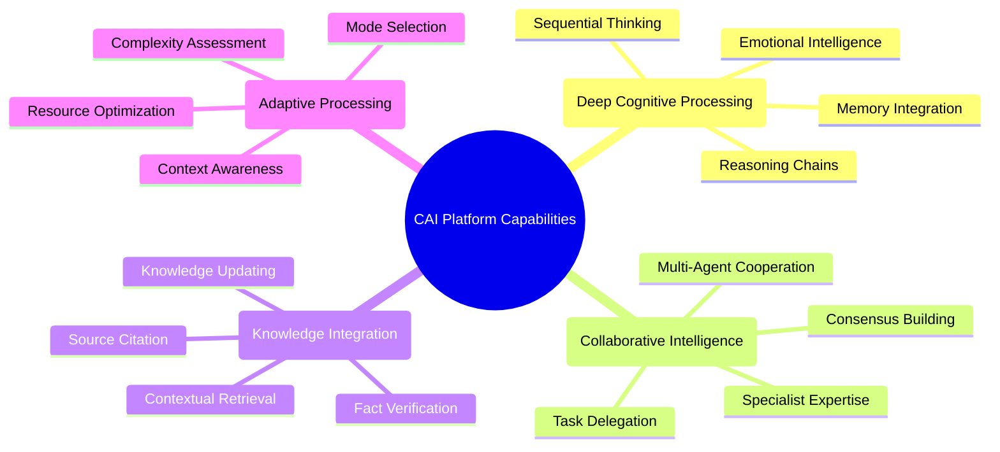

# 👤 Cognitive Agentic Intelligence (CAI) Platform - User Guide

## 📋 Table of Contents

1. [Introduction](#introduction)
2. [Getting Started](#getting-started)
3. [Platform Interface](#platform-interface)
4. [Basic Usage](#basic-usage)
5. [Advanced Features](#advanced-features)
6. [Processing Modes](#processing-modes)
7. [Memory & Context](#memory--context)
8. [Knowledge Management](#knowledge-management)
9. [Agent Collaboration](#agent-collaboration)
10. [Customization](#customization)
11. [Best Practices](#best-practices)
12. [Troubleshooting](#troubleshooting)
13. [FAQ](#faq)

## 📚 Introduction

### What is the CAI Platform?

The Cognitive Agentic Intelligence (CAI) Platform is a revolutionary AI system that combines three powerful technologies:

1. **🧠 AI Brain Package**: A 7-layer cognitive architecture that processes information sequentially through perception, attention, memory, reasoning, emotion, decision, and action layers.

2. **👥 LLM Assembly**: A collaborative multi-agent system where specialist agents work together to solve complex problems.

3. **📚 RAG System**: A knowledge retrieval system that provides relevant information from a vast knowledge base.

This unified platform delivers unprecedented AI capabilities, combining deep thinking, collaborative problem-solving, and extensive knowledge access.

### Key Capabilities



## 🚀 Getting Started

### Account Setup

1. **Registration**: Visit [cai-platform.com/register](https://cai-platform.com/register) to create your account.

2. **Subscription Selection**: Choose from available subscription tiers:
   - **Basic**: Limited access to cognitive processing
   - **Professional**: Full access to all processing modes
   - **Enterprise**: Custom integration and dedicated resources

3. **API Key Generation**: After registration, generate your API key from the dashboard.

### Installation Options

#### Web Interface
No installation required. Access the platform at [app.cai-platform.com](https://app.cai-platform.com) using your credentials.

#### API Integration
```bash
# Python SDK Installation
pip install cai-platform-sdk

# JavaScript SDK Installation
npm install @cai-platform/sdk
```

#### Local Deployment
For enterprise users with on-premises requirements, follow the [Deployment Guide](DEPLOYMENT.md).

## 🖥️ Platform Interface

### Dashboard Overview

```mermaid
flowchart TB
    subgraph "Main Dashboard"
        A[🏠 Home] --> B[📊 Usage Statistics]
        A --> C[🔄 Recent Interactions]
        A --> D[📚 Knowledge Base]
        A --> E[⚙️ Settings]
    end
    
    subgraph "Interaction Panel"
        F[💬 Chat Interface]
        G[📝 Query Builder]
        H[📤 Batch Processing]
        I[📊 Results Viewer]
    end
    
    subgraph "Settings Panel"
        J[👤 Account Management]
        K[🔑 API Keys]
        L[⚙️ Preferences]
        M[🔌 Integrations]
    end
    
    A --> F
    F --> I
    
    style A fill:#ff9800
    style F fill:#2196f3
    style I fill:#4caf50
```



### Interface Components

#### Main Dashboard


The main dashboard provides an overview of your account, including:
- **Usage Statistics**: Track your API calls, processing time, and subscription limits
- **Recent Interactions**: Quick access to your recent conversations and queries
- **Knowledge Base**: Manage your custom knowledge sources
- **Settings**: Configure your account and platform preferences

#### Interaction Panel


The interaction panel is where you engage with the CAI Platform:
- **Chat Interface**: Natural conversation with the platform
- **Query Builder**: Structured query creation for complex requests
- **Batch Processing**: Upload multiple queries for processing
- **Results Viewer**: View and export processing results

## 🎯 Basic Usage

### Simple Queries

#### Chat Interface
```
User: What are the implications of quantum computing on cybersecurity?

CAI: Quantum computing represents a paradigm shift that will significantly impact cybersecurity. The most immediate concern is that quantum computers could break widely-used encryption algorithms like RSA and ECC through Shor's algorithm, which can efficiently factor large numbers.

Key implications include:

1. **Encryption Vulnerability**: Current public-key cryptography will become vulnerable, requiring transition to quantum-resistant algorithms.

2. **Post-Quantum Cryptography**: Development of new cryptographic methods that can withstand quantum attacks is already underway.

3. **Data Harvesting Concerns**: Sensitive data encrypted today could be stored by adversaries and decrypted later when quantum computers become more powerful.

4. **Quantum Key Distribution**: Quantum mechanics principles can create theoretically unhackable communication channels.

5. **Authentication Challenges**: Digital signatures and identity verification systems will need redesigning.

Organizations should begin quantum risk assessments and develop migration strategies to quantum-resistant cryptography.
```

#### API Request
```python
from cai_platform import CAIClient

# Initialize client
client = CAIClient(api_key="your_api_key")

# Process a simple query
response = client.process(
    query="What are the implications of quantum computing on cybersecurity?",
    mode="cognitive_only"  # Use cognitive processing for simple queries
)

print(response.answer)
```

### Structured Queries

#### Query Builder
The Query Builder allows you to create structured queries with specific parameters:

1. **Query Type**: Choose from Analysis, Comparison, Explanation, etc.
2. **Domain**: Specify the knowledge domain (Technology, Medicine, Finance, etc.)
3. **Detail Level**: Select from Brief, Standard, or Comprehensive
4. **Processing Mode**: Choose how the platform processes your request
5. **Additional Context**: Provide relevant background information

#### API Request with Parameters
```python
response = client.process(
    query="Compare renewable energy sources for residential use",
    context={
        "location": "California",
        "budget": "medium",
        "priority": "efficiency"
    },
    processing_options={
        "mode": "hybrid",
        "detail_level": "comprehensive",
        "include_sources": True
    }
)
```

## 🚀 Advanced Features

### Multi-turn Conversations

#### Conversation Management
```python
# Start a conversation
conversation = client.create_conversation(
    title="Renewable Energy Discussion",
    context={"domain": "energy"}
)

# First message
response1 = client.send_message(
    conversation_id=conversation.id,
    content="What are the most efficient renewable energy sources?"
)

# Follow-up question (maintains context)
response2 = client.send_message(
    conversation_id=conversation.id,
    content="How do installation costs compare between these options?"
)

# Get conversation history
history = client.get_conversation_history(conversation.id)
```

### Document Analysis

#### Analyzing Documents
```python
# Analyze a document
response = client.analyze_document(
    document_path="path/to/research_paper.pdf",
    analysis_type="comprehensive",
    questions=[
        "What are the key findings?",
        "What methodology was used?",
        "What are the limitations of this research?"
    ]
)

# Access structured analysis
print(f"Key Findings: {response.findings}")
print(f"Methodology: {response.methodology}")
print(f"Limitations: {response.limitations}")
```

### Batch Processing

#### Processing Multiple Queries
```python
# Define batch of queries
queries = [
    {"query": "Summarize recent advancements in renewable energy", "mode": "hybrid"},
    {"query": "Compare solar and wind energy efficiency", "mode": "full_collaboration"},
    {"query": "Explain energy storage technologies", "mode": "knowledge_focused"}
]

# Submit batch job
batch_job = client.create_batch_job(queries=queries)

# Check status
status = client.get_batch_job_status(batch_job.id)

# Retrieve results when complete
if status.status == "completed":
    results = client.get_batch_job_results(batch_job.id)
    for result in results:
        print(f"Query: {result.query}")
        print(f"Answer: {result.answer}")
        print("---")
```

## 🔄 Processing Modes

### Available Modes

```mermaid
flowchart LR
    subgraph "Processing Modes"
        A[🧠 Cognitive-Only] --> D[Simple Questions]
        B[🔄 Hybrid] --> E[Knowledge-Intensive Tasks]
        C[👥 Full Collaboration] --> F[Complex Problems]
    end
    
    subgraph "Mode Selection Factors"
        G[📊 Query Complexity]
        H[⏱️ Response Time]
        I[💰 Processing Cost]
        J[📚 Knowledge Needs]
    end
    
    G --> A
    G --> B
    G --> C
    
    style A fill:#e3f2fd
    style B fill:#fff3e0
    style C fill:#f3e5f5
```



#### Cognitive-Only Mode
**Best for**: Simple questions, emotional support, basic reasoning

This mode utilizes only the 7-layer cognitive brain for processing. It's fast and efficient for straightforward queries that don't require extensive knowledge retrieval or collaborative problem-solving.

```python
response = client.process(
    query="What are effective ways to manage stress?",
    processing_options={"mode": "cognitive_only"}
)
```

#### Hybrid Mode
**Best for**: Knowledge-intensive tasks, research questions, moderate complexity

This mode combines cognitive processing with knowledge retrieval. It's ideal for questions that require factual information and some reasoning.

```python
response = client.process(
    query="Explain the current state of quantum computing research",
    processing_options={"mode": "hybrid"}
)
```

#### Full Collaboration Mode
**Best for**: Complex analysis, multi-step reasoning, comprehensive tasks

This mode utilizes all systems: cognitive, agents, and knowledge. It's designed for complex problems that benefit from multiple specialist perspectives and deep analysis.

```python
response = client.process(
    query="Develop a comprehensive strategy for transitioning a manufacturing company to renewable energy",
    processing_options={"mode": "full_collaboration"}
)
```

### Automatic Mode Selection

The platform can automatically select the optimal processing mode based on query analysis:

```python
response = client.process(
    query="Your query here",
    processing_options={"mode": "auto"}
)

# The response includes the selected mode
print(f"Processing mode used: {response.processing_mode}")
```

## 💭 Memory & Context

### Memory Types

```mermaid
flowchart TB
    subgraph "Memory Systems"
        subgraph "Short-Term Memory"
            A[⚡ Conversation Context]
            B[🔄 Working Memory]
            C[📝 Task Memory]
        end
        
        subgraph "Long-Term Memory"
            D[👤 User Preferences]
            E[📚 Knowledge Base]
            F[🧠 Cognitive Patterns]
        end
    end
    
    subgraph "Memory Operations"
        G[💾 Store]
        H[🔍 Retrieve]
        I[🔄 Update]
        J[🧹 Clear]
    end
    
    A --> G
    A --> H
    D --> I
    D --> J
    
    style A fill:#e3f2fd
    style D fill:#f3e5f5
```



### Managing Conversation Context

#### Maintaining Context
```python
# Create a conversation with initial context
conversation = client.create_conversation(
    title="Financial Planning",
    context={
        "domain": "finance",
        "user_profile": {
            "risk_tolerance": "moderate",
            "investment_horizon": "long-term",
            "financial_goals": ["retirement", "home_purchase"]
        }
    }
)

# The context is maintained throughout the conversation
response1 = client.send_message(
    conversation_id=conversation.id,
    content="What investment strategies should I consider?"
)

# Follow-up questions maintain the financial planning context
response2 = client.send_message(
    conversation_id=conversation.id,
    content="How would these change if I'm planning to retire in 10 years?"
)
```

#### Updating Context
```python
# Update conversation context
client.update_conversation_context(
    conversation_id=conversation.id,
    context_updates={
        "user_profile": {
            "risk_tolerance": "conservative",  # Changed from "moderate"
            "investment_horizon": "medium-term"  # Changed from "long-term"
        }
    }
)

# Subsequent messages will use the updated context
response3 = client.send_message(
    conversation_id=conversation.id,
    content="Given my updated profile, what adjustments should I make?"
)
```

### User Preferences

#### Setting Preferences
```python
# Set global user preferences
client.set_user_preferences({
    "response_style": "concise",
    "detail_level": "high",
    "citation_style": "academic",
    "default_processing_mode": "hybrid"
})

# These preferences apply to all requests unless overridden
response = client.process(
    query="Explain quantum entanglement"
    # No need to specify processing mode or detail level
)
```

## 📚 Knowledge Management

### Custom Knowledge Sources

#### Adding Knowledge Sources
```python
# Add a document to your knowledge base
document_id = client.add_knowledge_document(
    file_path="path/to/document.pdf",
    metadata={
        "title": "Renewable Energy Trends 2024",
        "author": "Energy Research Institute",
        "date": "2024-01-15",
        "tags": ["renewable", "energy", "trends", "solar", "wind"]
    }
)

# Add a website to your knowledge base
website_id = client.add_knowledge_website(
    url="https://example.com/research/energy-efficiency",
    crawl_depth=2,  # How many links to follow
    update_frequency="weekly"  # How often to refresh
)
```

#### Managing Knowledge Collections
```python
# Create a knowledge collection
collection_id = client.create_knowledge_collection(
    name="Renewable Energy Research",
    description="Collection of research papers and articles on renewable energy"
)

# Add documents to collection
client.add_to_collection(
    collection_id=collection_id,
    document_ids=[document_id, website_id]
)

# Use specific collection for processing
response = client.process(
    query="What are the latest trends in solar energy efficiency?",
    knowledge_options={
        "collections": [collection_id],
        "recency_boost": 0.8  # Prioritize recent information
    }
)
```

### Knowledge Retrieval

#### Searching Knowledge Base
```python
# Search your knowledge base
search_results = client.search_knowledge(
    query="solar panel efficiency improvements",
    filters={
        "date_range": {
            "start": "2023-01-01",
            "end": "2024-01-01"
        },
        "tags": ["solar", "efficiency"],
        "document_types": ["research_paper", "article"]
    },
    limit=10
)

# Process results
for result in search_results:
    print(f"Title: {result.title}")
    print(f"Relevance: {result.relevance_score}")
    print(f"Content: {result.content_snippet}")
    print("---")
```

## 👥 Agent Collaboration

### Available Agents


### Customizing Agent Behavior

#### Agent Configuration
```python
# Configure agent behavior for a request
response = client.process(
    query="Analyze the impact of AI on healthcare",
    agent_options={
        "knowledge_agent": {
            "sources": ["academic_journals", "medical_databases"],
            "recency_weight": 0.9,
            "verification_level": "high"
        },
        "reasoning_agent": {
            "reasoning_depth": "deep",
            "consideration_factors": ["ethical", "practical", "economic"]
        },
        "content_agent": {
            "style": "academic",
            "structure": "analytical",
            "detail_level": "comprehensive"
        }
    },
    processing_options={"mode": "full_collaboration"}
)
```

### Viewing Agent Contributions

#### Accessing Agent Insights
```python
# Process with agent contribution tracking
response = client.process(
    query="Develop a strategy for implementing AI in a healthcare setting",
    processing_options={
        "mode": "full_collaboration",
        "include_agent_contributions": True
    }
)

# Access individual agent contributions
contributions = response.agent_contributions

print(f"Knowledge Agent: {contributions['knowledge_agent']}")
print(f"Reasoning Agent: {contributions['reasoning_agent']}")
print(f"Content Agent: {contributions['content_agent']}")
print(f"Tool Agent: {contributions['tool_agent']}")

# Access decision maker's synthesis process
print(f"Decision Process: {response.decision_process}")
```

## ⚙️ Customization

### Response Formatting

#### Output Format Options
```python
# Request specific output format
response = client.process(
    query="Compare solar, wind, and hydroelectric power",
    output_options={
        "format": "comparison_table",
        "include_pros_cons": True,
        "include_cost_analysis": True,
        "include_charts": True
    }
)

# Get response in markdown format
markdown_response = response.to_markdown()

# Get response in HTML format
html_response = response.to_html()

# Get response as structured data
json_response = response.to_json()
```

### Integration Options

#### Webhooks
```python
# Configure webhook for asynchronous processing
client.configure_webhook(
    webhook_url="https://your-server.com/webhook",
    events=["processing.completed", "processing.failed"]
)

# Submit asynchronous request
job_id = client.process_async(
    query="Generate a comprehensive market analysis for renewable energy sector",
    processing_options={"mode": "full_collaboration"}
)

# Your webhook will receive a POST request when processing completes
```

#### Custom Tools
```python
# Register a custom tool
client.register_custom_tool(
    name="weather_data",
    description="Retrieves current weather data for a location",
    parameters={
        "location": {"type": "string", "description": "City name or coordinates"},
        "units": {"type": "string", "enum": ["metric", "imperial"], "default": "metric"}
    },
    endpoint="https://your-weather-api.com/data",
    auth_header="X-API-Key",
    auth_token="your-weather-api-key"
)

# Use custom tool in processing
response = client.process(
    query="How will tomorrow's weather affect solar panel efficiency in Boston?",
    tool_options={
        "enabled_tools": ["weather_data"],
        "tool_parameters": {
            "weather_data": {"location": "Boston, MA"}
        }
    }
)
```

## 🏆 Best Practices

### Query Optimization

#### Effective Query Formulation

**Do:**
- Be specific and clear in your requests
- Provide relevant context
- Break complex questions into manageable parts
- Specify the desired output format

**Don't:**
- Use vague or ambiguous language
- Ask multiple unrelated questions in one query
- Provide excessive irrelevant information

**Examples:**

❌ **Poor Query**: "Tell me about energy."

✅ **Improved Query**: "Provide a comparison of solar and wind energy technologies, focusing on efficiency, cost, and environmental impact for residential applications in coastal regions."

### Performance Optimization

#### Efficient Processing

1. **Choose the Right Mode**:
   - Use cognitive-only mode for simple questions
   - Use hybrid mode for knowledge-intensive tasks
   - Reserve full collaboration for truly complex problems

2. **Optimize Context**:
   - Include only relevant context
   - Clear conversation history when starting new topics
   - Use structured context for better results

3. **Batch Processing**:
   - Group related queries into batch jobs
   - Schedule batch processing during off-peak hours
   - Use webhooks for notification when complete

## 🔧 Troubleshooting

### Common Issues

#### Processing Errors

| Error | Possible Cause | Solution |
|-------|---------------|----------|
| `PROCESSING_TIMEOUT` | Query too complex | Simplify query or increase timeout |
| `KNOWLEDGE_NOT_FOUND` | Missing relevant knowledge | Add sources or broaden search |
| `RATE_LIMIT_EXCEEDED` | Too many requests | Reduce request frequency or upgrade plan |
| `INVALID_PARAMETERS` | Incorrect API parameters | Check documentation for correct format |
| `CONTEXT_TOO_LARGE` | Excessive context provided | Reduce context size or split into multiple requests |

#### Resolving Issues

```python
# Handling errors
try:
    response = client.process(query="Your query here")
    print(response.answer)
except CAIProcessingTimeout:
    print("Processing timed out. Try simplifying your query.")
except CAIRateLimitExceeded:
    print("Rate limit exceeded. Please try again later.")
except CAIError as e:
    print(f"An error occurred: {e}")
```

### Getting Support

#### Support Options

1. **Documentation**: Visit [docs.cai-platform.com](https://docs.cai-platform.com) for comprehensive guides

2. **Community Forum**: Join discussions at [community.cai-platform.com](https://community.cai-platform.com)

3. **Support Tickets**: Submit issues through your dashboard or email support@cai-platform.com

4. **Office Hours**: Enterprise customers can schedule support calls with our team

## ❓ FAQ

### Frequently Asked Questions

#### General Questions

**Q: How does the CAI Platform differ from other AI systems?**

A: The CAI Platform uniquely combines three powerful systems: a 7-layer cognitive brain for deep sequential thinking, a multi-agent council for collaborative problem-solving, and a RAG system for knowledge retrieval. This integration enables more comprehensive, nuanced, and accurate responses than systems that rely on a single approach.

**Q: What types of tasks is the CAI Platform best suited for?**

A: The platform excels at:
- Complex analysis requiring deep thinking
- Research tasks needing extensive knowledge
- Creative projects benefiting from multiple perspectives
- Problem-solving requiring both reasoning and factual information
- Emotional intelligence applications

#### Technical Questions

**Q: How is my data handled and stored?**

A: Your queries and conversations are stored securely and used only to provide the service. Enterprise customers can opt for data isolation and custom retention policies. See our [Privacy Policy](https://cai-platform.com/privacy) for details.

**Q: Can I deploy the CAI Platform on-premises?**

A: Yes, enterprise customers can deploy the platform on-premises or in their private cloud environment. Contact our sales team for deployment options.

**Q: How frequently is the knowledge base updated?**

A: The core knowledge base is updated monthly with new information. Custom knowledge sources can be updated on your preferred schedule, from real-time to monthly.

#### Usage Questions

**Q: How do I choose the right processing mode?**

A: If you're unsure, use the "auto" mode to let the platform select the optimal processing strategy. For more control, choose "cognitive_only" for simple questions, "hybrid" for knowledge-intensive tasks, or "full_collaboration" for complex problems.

**Q: Can I customize the specialist agents?**

A: Enterprise customers can customize agent behavior, priorities, and even add domain-specific specialist agents. Standard users can adjust agent parameters for individual requests.

**Q: How can I improve response quality?**

A: Provide clear, specific queries with relevant context. For knowledge-intensive tasks, add custom knowledge sources. Use the appropriate processing mode and adjust detail level settings to match your needs.

This comprehensive user guide provides everything needed to effectively utilize the Cognitive Agentic Intelligence Platform, from basic usage to advanced features and customization options.