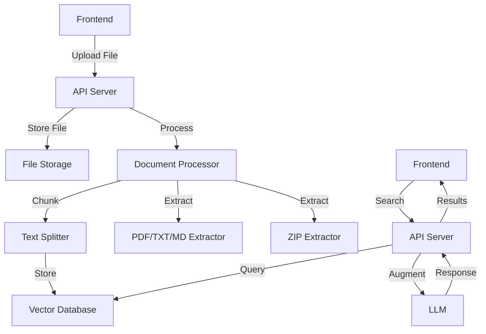

# Knowledge Base Integration

This document provides an overview of the Knowledge Base integration in the Cognitive Agentic Intelligence Platform, including architecture, API endpoints, and usage examples.

## Table of Contents

- [Overview](#overview)
- [Architecture](#architecture)
- [API Endpoints](#api-endpoints)
- [Frontend Integration](#frontend-integration)
- [File Processing Pipeline](#file-processing-pipeline)
- [Search and Retrieval](#search-and-retrieval)
- [Error Handling](#error-handling)
- [Security Considerations](#security-considerations)
- [Scaling and Performance](#scaling-and-performance)

## Overview

The Knowledge Base integration allows users to upload documents (PDF, TXT, MD, ZIP), which are then processed, chunked, and stored in a vector database for semantic search and retrieval-augmented generation (RAG).

## Architecture



## API Endpoints

### Upload a File

```http
POST /api/rag/upload
Content-Type: multipart/form-data
Authorization: Bearer <token>

<file data>
```

**Response**
```json
{
  "id": "550e8400-e29b-41d4-a716-446655440000",
  "name": "document.pdf",
  "type": "pdf",
  "size": 12345,
  "status": "processing",
  "created_at": "2025-06-29T05:00:00.000Z"
}
```

### List Files

```http
GET /api/rag/files
Authorization: Bearer <token>
```

**Response**
```json
[
  {
    "id": "550e8400-e29b-41d4-a716-446655440000",
    "name": "document.pdf",
    "type": "pdf",
    "size": 12345,
    "status": "processed",
    "chunks_count": 5,
    "created_at": "2025-06-29T05:00:00.000Z",
    "updated_at": "2025-06-29T05:01:30.000Z"
  }
]
```

### Search Knowledge Base

```http
POST /api/rag/query
Content-Type: application/json
Authorization: Bearer <token>

{
  "query": "search query",
  "k": 4
}
```

**Response**
```json
{
  "results": [
    {
      "content": "Relevant text from the document",
      "metadata": {
        "source": "document.pdf",
        "page": 1,
        "chunk": 2
      },
      "score": 0.92
    }
  ]
}
```

## Frontend Integration

### Uploading Files

```tsx
import { useFileUpload } from '@/lib/api/rag';

function FileUploader() {
  const { mutate: uploadFile, isLoading } = useFileUpload();
  
  const handleFileChange = (e) => {
    const file = e.target.files[0];
    if (!file) return;
    
    uploadFile(
      { file },
      {
        onSuccess: () => {
          // Handle success
        },
        onError: (error) => {
          // Handle error
        },
      }
    );
  };
  
  return (
    <div>
      <input type="file" onChange={handleFileChange} disabled={isLoading} />
      {isLoading && <div>Uploading...</div>}
    </div>
  );
}
```

### Searching the Knowledge Base

```tsx
import { useSearchKnowledge } from '@/lib/api/rag';

function SearchBar() {
  const [query, setQuery] = useState('');
  const { data, isLoading, error } = useSearchKnowledge(query, 5);
  
  return (
    <div>
      <input
        type="text"
        value={query}
        onChange={(e) => setQuery(e.target.value)}
        placeholder="Search knowledge base..."
      />
      
      {isLoading && <div>Searching...</div>}
      
      {error && <div>Error: {error.message}</div>}
      
      {data?.results.map((result, index) => (
        <div key={index} className="result-item">
          <h4>{result.metadata.source}</h4>
          <p>{result.content}</p>
          <small>Relevance: {Math.round(result.score * 100)}%</small>
        </div>
      ))}
    </div>
  );
}
```

## File Processing Pipeline

1. **File Upload**
   - Client uploads a file via the `/api/rag/upload` endpoint
   - File is saved to the server's file system
   - A database record is created with status "uploading"

2. **File Processing**
   - Based on file type, appropriate processor is selected
   - File is converted to plain text
   - Text is split into chunks with overlapping sections
   - Each chunk is embedded using the configured embedding model
   - Embeddings are stored in the vector database
   - Database record is updated with status "processed" and chunk count

3. **Error Handling**
   - If processing fails, status is updated to "failed" with error details
   - Failed processing can be retried by re-uploading the file

## Search and Retrieval

1. **Query Processing**
   - User submits a search query
   - Query is embedded using the same model as the documents
   - Vector similarity search is performed against stored embeddings

2. **Result Ranking**
   - Results are ranked by similarity score (cosine similarity)
   - Top-k results are returned with their scores

3. **RAG Integration**
   - Retrieved documents can be used as context for LLM queries
   - Context is injected into the LLM prompt along with the user's query

## Error Handling

### Common Errors

| Status Code | Error Code | Description |
|-------------|------------|-------------|
| 400 | INVALID_FILE_TYPE | Unsupported file type |
| 400 | FILE_TOO_LARGE | File exceeds maximum size |
| 400 | INVALID_QUERY | Missing or invalid search query |
| 404 | FILE_NOT_FOUND | Requested file not found |
| 500 | PROCESSING_ERROR | Error during file processing |

### Retry Logic

- Failed uploads should be retried with exponential backoff
- Processing failures are automatically retried once
- Users can manually retry failed uploads

## Security Considerations

1. **Authentication**
   - All endpoints require a valid JWT token
   - File uploads are associated with the authenticated user

2. **File Validation**
   - File types are strictly validated
   - Maximum file size is enforced (100MB by default)
   - Malware scanning can be integrated

3. **Data Isolation**
   - User data is isolated by tenant ID
   - File access is restricted to the uploading user

## Scaling and Performance

### Caching

- Search results are cached based on query hash
- Vector embeddings are cached to avoid recomputation

### Performance Tuning

- Batch processing for large files
- Async processing with queue management
- Horizontal scaling of processing workers

### Monitoring

- File processing metrics (count, duration, success rate)
- Search performance metrics (latency, result quality)
- Storage usage and cleanup jobs

## Troubleshooting

### Common Issues

1. **File Processing Stuck**
   - Check worker logs for errors
   - Verify storage permissions
   - Check vector database connection

2. **Poor Search Results**
   - Verify document was processed successfully
   - Check for relevant chunks in the vector store
   - Adjust chunk size and overlap parameters

3. **Upload Failures**
   - Verify file size limits
   - Check network connectivity
   - Verify authentication token is valid

## Support

For additional support, contact the platform administrators or refer to the system logs for detailed error information.
